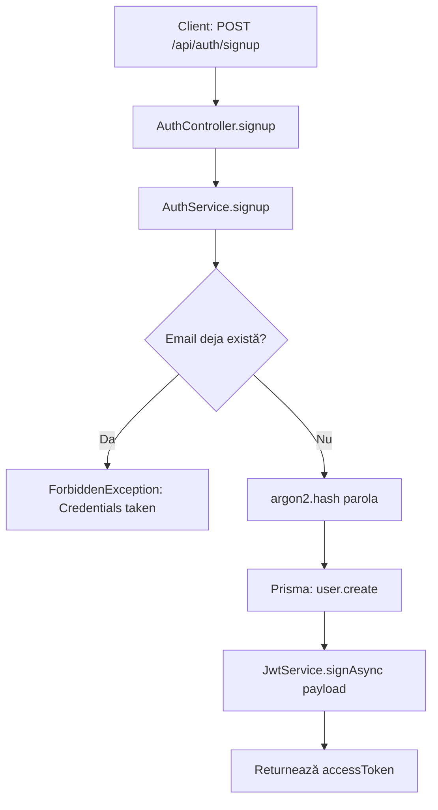
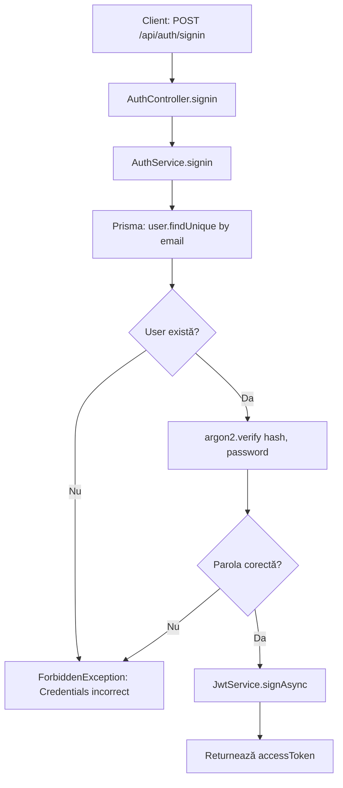
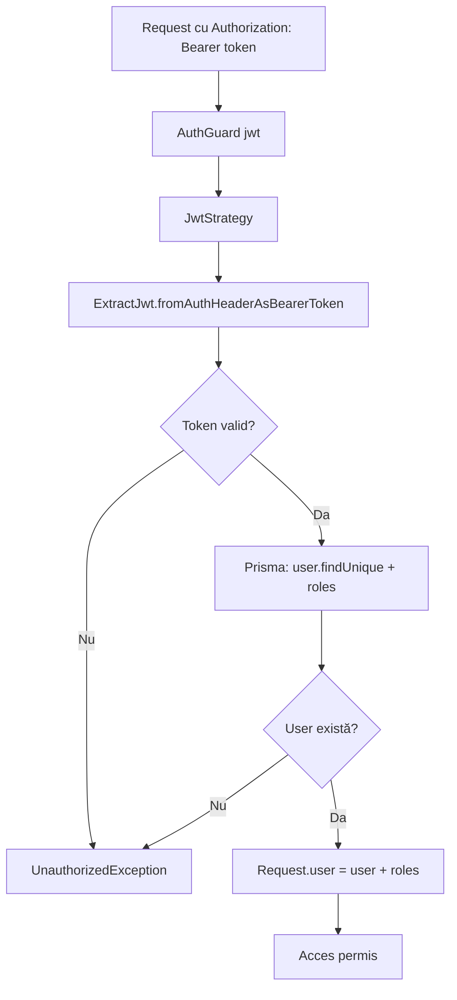
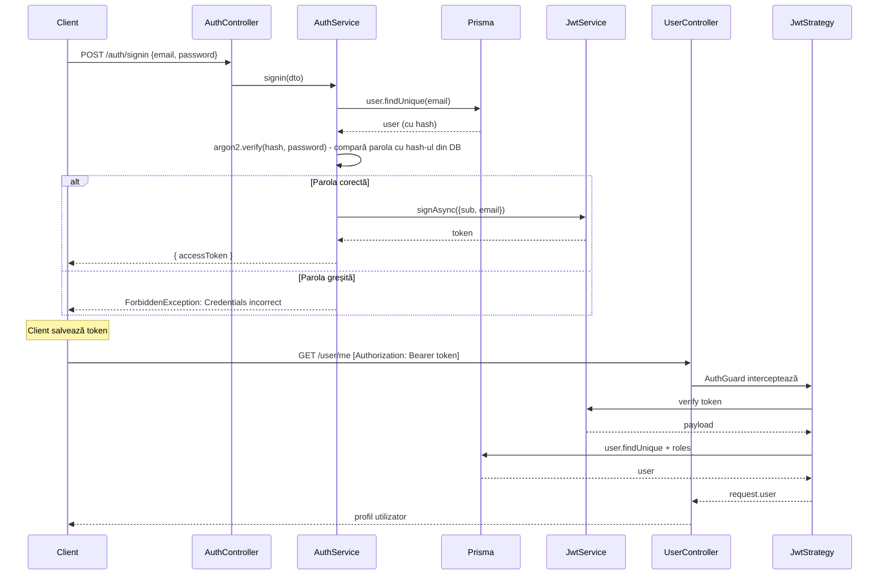

# Diagrama flux de autentificare (Auth)

Acest document descrie fluxul de autentificare din backend-ul CRM: înregistrare, autentificare, validare JWT și protecția rutelor.

---

## 1. Flux Signup (Înregistrare)



**Pași:**
1. Client trimite `email` și `password` în body
2. `AuthService` verifică dacă emailul există (P2002 → Conflict)
3. Parola este hashuită cu **argon2**
4. Utilizatorul este creat în baza de date
5. Se generează JWT cu payload `{ sub: userId, email }`
6. Răspuns: `{ accessToken: string }`

**Fișiere:** `auth.controller.ts`, `auth.service.ts`

---

## 2. Flux Signin (Autentificare)



**Pași:**
1. Client trimite `email` și `password`
2. Se caută utilizatorul după email
3. **argon2.verify** – compară parola introdusă cu hash-ul din DB (nu se face hash la signin)
4. Dacă parola nu corespunde → `ForbiddenException: Credentials incorrect`
5. Dacă parola e corectă → JWT generat și returnat

**Fișiere:** `auth.controller.ts`, `auth.service.ts`

---

## 3. Flux validare JWT (rute protejate)



**Pași:**
1. Rutele protejate folosesc `@UseGuards(AuthGuard('jwt'))`
2. `JwtStrategy` extrage tokenul din header
3. Verifică semnătura cu `JWT_SECRET`
4. Încarcă userul din DB cu rolurile (`user.roles` = array de slug-uri)
5. Adaugă `user` în `request` pentru handler

**Fișiere:** `jwt.strategy.ts`, `auth.module.ts`

---

## 4. Flux RolesGuard (rute admin)

```mermaid
flowchart TD
    A[Request după AuthGuard] --> B[RolesGuard]
    B --> C{@Roles decorator există?}
    C -->|Nu| D[Permite acces]
    C -->|Da| E{user.roles include admin?}
    E -->|Da| D
    E -->|Nu| F{user.roles include rol cerut?}
    F -->|Da| D
    F -->|Nu| G[ForbiddenException: Rol insuficient]
```

**Reguli:**
- Dacă nu există `@Roles()`, accesul este permis
- Rolul `admin` are acces la toate rutele admin
- Altfel, utilizatorul trebuie să aibă cel puțin unul dintre rolurile cerute

**Fișiere:** `roles.guard.ts`, `roles.decorator.ts`

---

## 5. Diagramă secvență – flux complet Signin + request protejat



---

## 6. Clasificare rute după protecție

| Tip rute | Guard | Exemple |
| -------- | ----- | ------- |
| **Publice** | — | `/auth/signup`, `/auth/signin`, `/auth/signout`, `/v1/schema/:entitySlug` |
| **JWT** | `AuthGuard('jwt')` | `/user/me`, `/v1/data/:entitySlug` (CRUD) |
| **JWT + Admin** | `AuthGuard('jwt')` + `RolesGuard` + `@Roles('admin')` | `/v1/admin/modules`, `/v1/admin/entities`, `/v1/admin/entities/:id/fields` |

---

## 7. Fișiere relevante

| Fișier | Rol |
| ------ | --- |
| `server/src/auth/auth.controller.ts` | Endpoint-uri signup, signin, signout |
| `server/src/auth/auth.service.ts` | Logică hash, verificare parolă, generare JWT |
| `server/src/auth/strategy/jwt.strategy.ts` | Validare token, încărcare user + roles |
| `server/src/guards/roles.guard.ts` | Verificare rol pentru rute admin |
| `server/src/guards/roles.decorator.ts` | Decorator `@Roles('admin')` |
