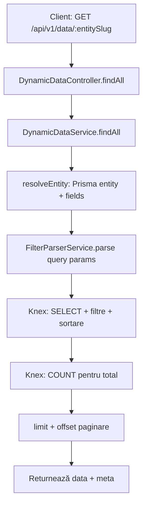
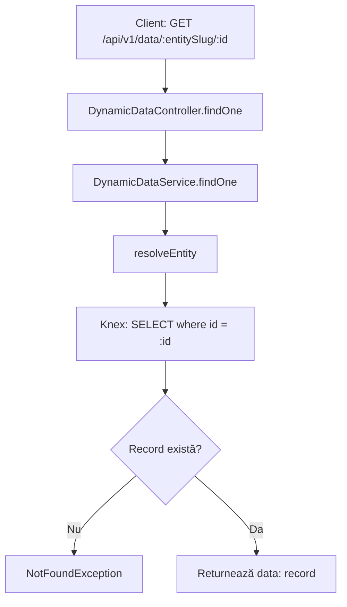
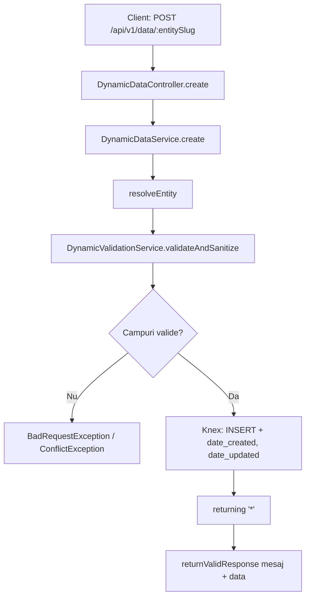
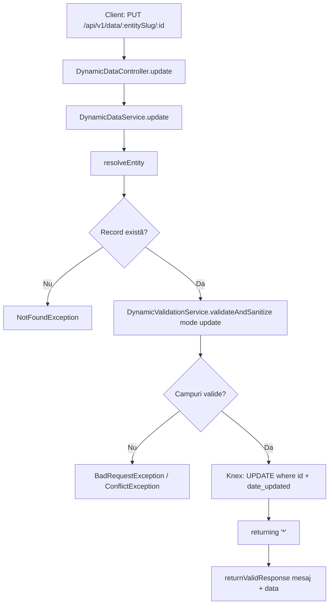
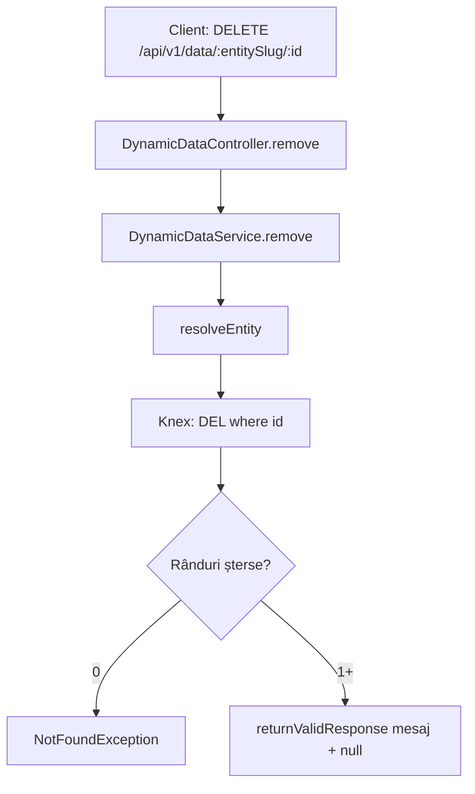
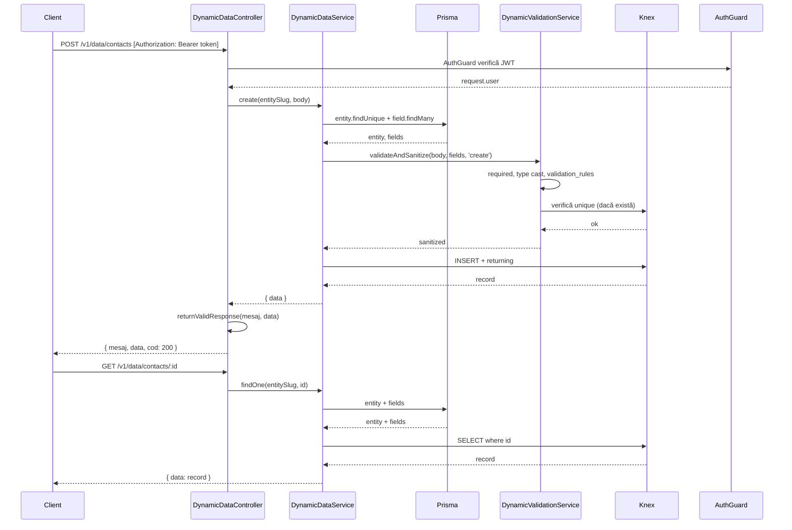

# Diagrama flux CRUD date dinamice

Acest document descrie fluxul datelor din backend-ul CRM: cum ajung datele de la client la baza de date și înapoi, pentru operațiunile CRUD pe entități dinamice (contacts, companies etc.).

---

## 1. Flux GET – Listă (findAll)

**Pași:**
1. Client trimite `GET /api/v1/data/contacts` cu query params opționali: `page`, `limit`, `sort`, `filter[camp]`
2. `resolveEntity` încarcă din Prisma metadata entității și câmpurilor (slug → `table_name`)
3. `FilterParserService` parsează `filter[name]=Alex` sau `filter[age][gt]=18` în obiecte `{ column, operator, value }`
4. Query-ul Knex selectează coloanele sistem (`id`, `date_created`, `date_updated`, `id_owner`) + câmpurile cu `visible_in_table`
5. Se aplică filtre, sortare (default: `date_created` desc), paginare
6. Răspuns: `{ data: [...], meta: { total, page, limit, totalPages } }`

**Fișiere:** `dynamic-data.controller.ts`, `dynamic-data.service.ts`, `filter-parser.service.ts`

---

## 2. Flux GET – Un singur record (findOne)

**Pași:**
1. Client trimite `GET /api/v1/data/contacts/abc-123`
2. Se rezolvă entitatea și se construiește query-ul Knex pe `table_name`
3. Se selectează recordul după `id`
4. Dacă nu există → `NotFoundException`
5. Răspuns: `{ data: record }`

**Fișiere:** `dynamic-data.controller.ts`, `dynamic-data.service.ts`

---

## 3. Flux POST – Creare (create)

**Pași:**
1. Client trimite `POST /api/v1/data/contacts` cu body `{ name: "Alex", email: "..." }`
2. `validateAndSanitize` verifică: câmpuri obligatorii (`is_required`), tipuri de date, reguli (`min_length`, `max`, `pattern`), unicitate (`is_unique`)
3. Valorile sunt castate după `data_type` (integer, numeric, boolean)
4. Dacă validarea eșuează → `BadRequestException` sau `ConflictException`
5. Knex face `INSERT` cu date sanitizate + `date_created`, `date_updated`
6. Răspuns: `{ mesaj, data, cod: 200 }` via `returnValidResponse`

**Fișiere:** `dynamic-data.controller.ts`, `dynamic-data.service.ts`, `dynamic-validation.service.ts`, `crud.utils.ts`

---

## 4. Flux PUT – Actualizare (update)

**Pași:**
1. Client trimite `PUT /api/v1/data/contacts/abc-123` cu body parțial sau complet
2. Se verifică existența recordului
3. La `update`, câmpurile `required` nu sunt obligatorii dacă nu sunt trimise; se validează doar câmpurile trimise
4. La verificarea unicității, se exclude recordul curent (`whereNot('id', recordId)`)
5. Knex face `UPDATE` cu date sanitizate + `date_updated`
6. Răspuns: `{ mesaj, data, cod: 200 }`

**Fișiere:** `dynamic-data.controller.ts`, `dynamic-data.service.ts`, `dynamic-validation.service.ts`, `crud.utils.ts`

---

## 5. Flux DELETE – Ștergere (remove)

**Pași:**
1. Client trimite `DELETE /api/v1/data/contacts/abc-123`
2. Knex execută `DEL` pe tabela entității
3. Dacă `deleted === 0` → `NotFoundException`
4. Răspuns: `{ mesaj, data: null, cod: 200 }`

**Fișiere:** `dynamic-data.controller.ts`, `dynamic-data.service.ts`, `crud.utils.ts`

---

## 6. Diagramă secvență – flux complet Create + Get

---

## 7. Resurse și dependențe

| Resursă | Rol |
| ------- | --- |
| **Prisma** | Metadata: `Entity` (slug, table_name), `Field` (column_name, data_type, validation_rules, is_required, is_unique) |
| **Knex** | Acces la tabelele fizice (INSERT, UPDATE, DELETE, SELECT) – datele reale |
| **AuthGuard** | Toate rutele `/v1/data/*` necesită JWT valid |

---

## 8. Fișiere relevante

| Fișier | Rol |
| ------ | --- |
| `server/src/dynamic-data/dynamic-data.controller.ts` | Endpoint-uri CRUD: GET, POST, PUT, DELETE |
| `server/src/dynamic-data/dynamic-data.service.ts` | Logică principală: resolveEntity, findAll, findOne, create, update, remove |
| `server/src/dynamic-data/filter-parser.service.ts` | Parsează query params `filter[camp]` și aplică filtre pe Knex |
| `server/src/dynamic-data/dynamic-validation.service.ts` | Validare și sanitizare body: required, tipuri, reguli, unicitate |
| `server/src/utils/crud.utils.ts` | `returnValidResponse` – format standard răspuns succes |
