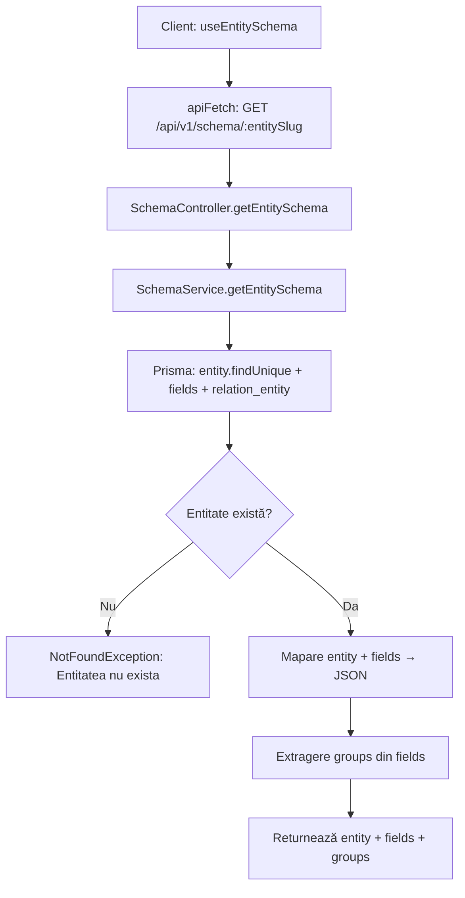
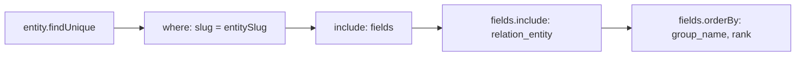
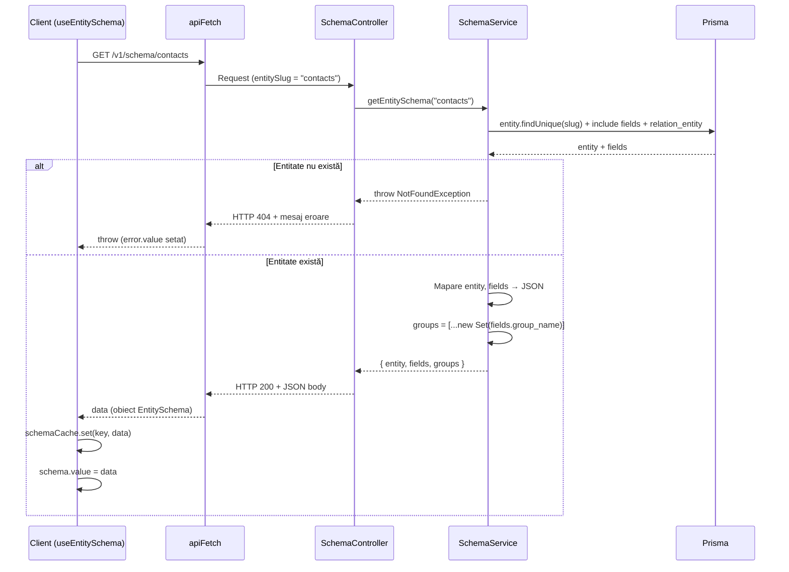

# Diagrama flux obținere schema pentru frontend

Acest document descrie cum frontend-ul primește structura entității pentru **DynamicForm** și **DynamicTable**: fluxul de la composable `useEntitySchema` până la răspunsul JSON cu metadata și câmpuri.

---
## 1. Flux principal – GET schema



**Pași:**
1. Client apelează `useEntitySchema('contacts')` – composable Vue/Nuxt
2. `apiFetch` face `GET /api/v1/schema/contacts`
3. `SchemaController` primește request-ul și delegă la `SchemaService.getEntitySchema(entitySlug)`
4. `SchemaService` interoghează Prisma: `entity.findUnique` cu `include: { fields, relation_entity }`
5. Dacă entitatea nu există → `NotFoundException`
6. Câmpurile sunt sortate după `group_name` și `rank`
7. Se extrage lista unică de grupuri din `fields.group_name`
8. Răspuns: obiect JSON cu `entity`, `fields`, `groups`

**Fișiere:** `useEntitySchema.ts`, `schema.controller.ts`, `schema.service.ts`

---

## 2. Interogare Prisma – structura include



**Include Prisma:**
- `entity` – metadata entității (slug, table_name, label_singular, label_plural, icon, etc.)
- `fields` – metadata câmpurilor. Se include și `relation_entity: { select: { slug: true } }` pentru câmpurile de tip relation
- Sortare: `group_name` asc, apoi `rank` asc

---

## 3. Structura răspunsului JSON

```json
{
  "entity": {
    "id_entity": "uuid",
    "slug": "contacts",
    "name": "Contacte",
    "table_name": "ent_contacts",
    "label_singular": "Contact",
    "label_plural": "Contacte",
    "icon": "i-heroicons-user",
    "is_system": false,
    "module": "uuid-modul"
  },
  "fields": [
    {
      "id_field": "uuid",
      "slug": "name",
      "name": "Nume",
      "column_name": "cf_name",
      "data_type": "varchar",
      "ui_type": "text",
      "default_value": null,
      "placeholder": "Introduceti numele",
      "help_text": null,
      "options": null,
      "is_required": true,
      "is_unique": false,
      "is_filterable": true,
      "is_sortable": true,
      "visible_in_table": true,
      "visible_in_form": true,
      "is_system": false,
      "validation_rules": null,
      "id_relation_entity": null,
      "relation_display_field": null,
      "relation_entity_slug": null,
      "group_name": "general",
      "rank": 0
    }
  ],
  "groups": ["general", "contact_info"]
}
```

**Câmpuri cheie pentru frontend:**
- `entity` – metadata pentru header, titluri, icon
- `fields` – fiecare câmp cu `ui_type` (text, select, relation, datepicker, etc.), `options`, `groups`, `validation_rules`
- `groups` – lista de grupuri pentru organizarea câmpurilor în formular (tab-uri/secțiuni)

---

## 4. Diagramă secvență – flux complet



---

## 5. Cache și utilizare în frontend

| Aspect | Detalii |
| ------ | ------- |
| **Cache** | `useEntitySchema` păstrează schema în `schemaCache` (Map) – nu reface request la reutilizare |
| **Invalidare** | `invalidateCache(key?)` – șterge cache-ul pentru o entitate sau tot |
| **Computed** | `tableFields`, `formFields`, `filterFields` – câmpuri filtrate după `visible_in_table`, `visible_in_form`, `is_filterable` |
| **Componente** | `DynamicForm` folosește `formFields` + `groups`; `DynamicTable` folosește `tableFields` |

---

## 6. Protecție rută

| Endpoint | Guard | Note |
| -------- | ----- | ---- |
| `GET /api/v1/schema/:entitySlug` | `AuthGuard('jwt')` | **Necesită JWT** – request-ul trebuie trimis cu header `Authorization: Bearer <token>`. `useEntitySchema` folosește `apiFetch` care include automat tokenul dacă utilizatorul este autentificat. |

---

## 7. Fișiere relevante

| Fișier | Rol |
| ------ | --- |
| `client/app/composables/useEntitySchema.ts` | Composable: fetch schema, cache, computed pentru tableFields/formFields/groups |
| `client/app/types/schema.ts` | Tipuri TypeScript: `EntitySchema`, `EntityMeta`, `Field` |
| `server/src/schema/schema.controller.ts` | Endpoint `GET :entitySlug` |
| `server/src/schema/schema.service.ts` | Logică: Prisma query, mapare JSON, extragere groups |
| `server/prisma/schema.prisma` | Modele: `Entity`, `Field`, relația `relation_entity` |
