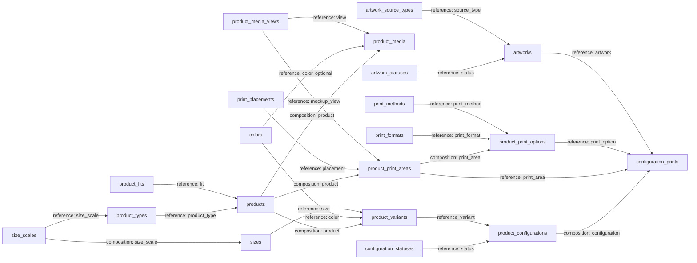
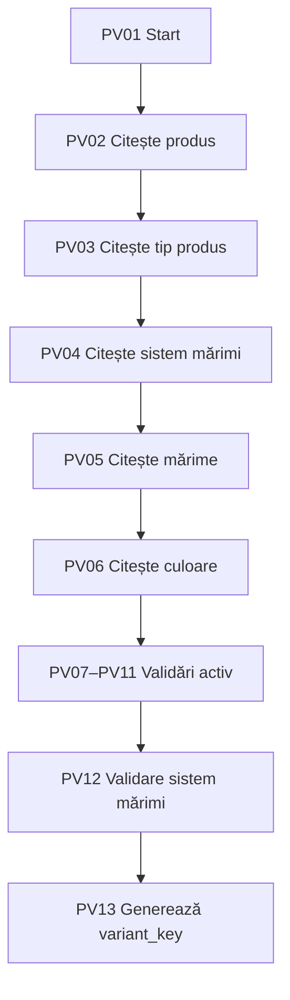
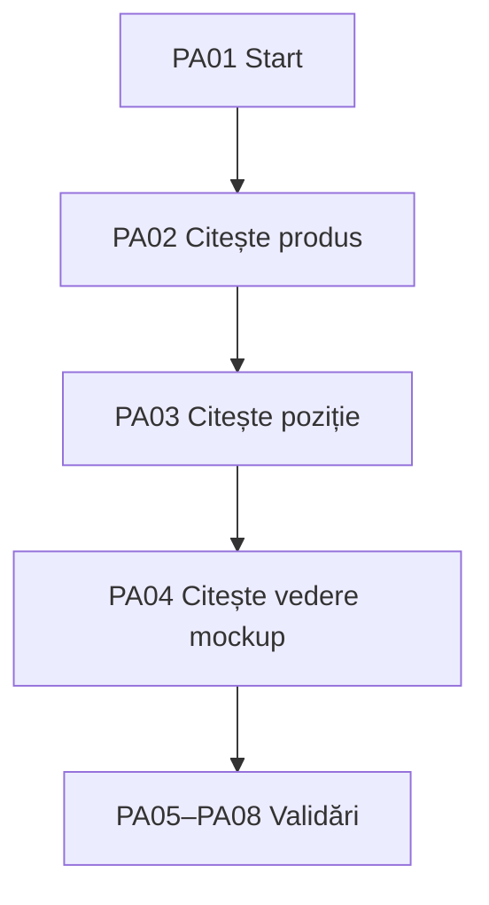
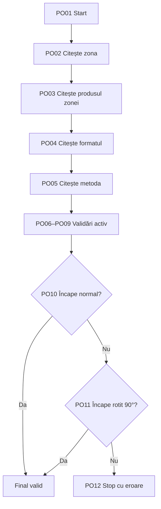
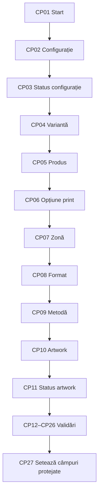
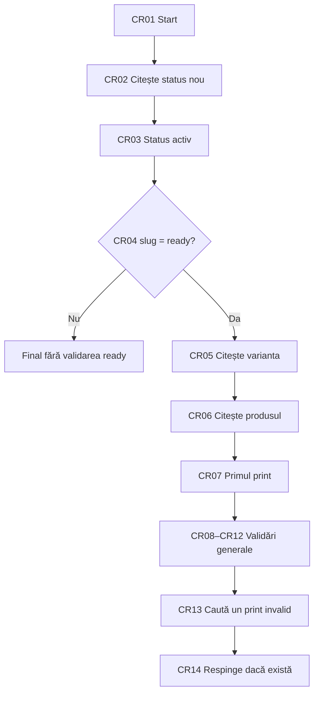
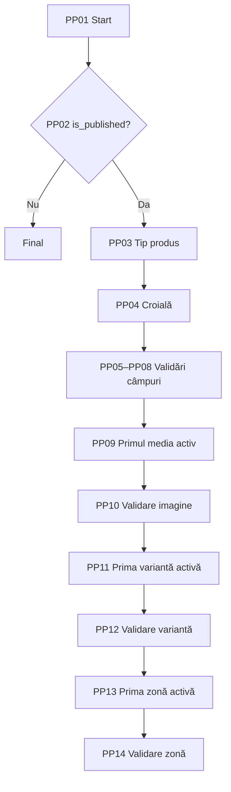
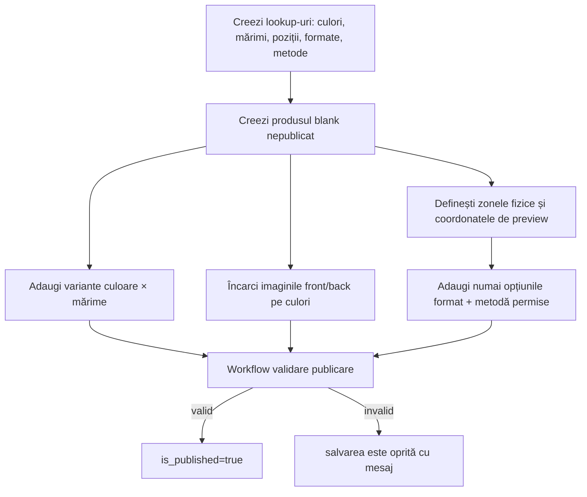

# Faza 1 — Catalog și configurator de print în Moduvis

Acest document acoperă numai prima bucată funcțională:

1. afișarea produselor blank publicate;
2. alegerea culorii și mărimii;
3. alegerea poziției, formatului și metodei de print permise pentru produs;
4. încărcarea uneia sau mai multor imagini de către client;
5. salvarea unei configurații și calcularea prețului ei.

Nu se creează încă entități pentru clienți, AI, coș, comenzi, Stripe, producție, livrare sau stoc cu istoric. `stock_quantity` și `reserved_quantity` există doar pentru a putea afișa disponibilitatea variantei; registrul de stoc va veni într-o fază ulterioară.

## 1. Convenții

- Slugurile se introduc exact cum sunt scrise mai jos.
- Moduvis creează automat tabela `ent_<slug>` și coloana `cf_<slug>`.
- În requesturile CRUD trimitem slugul logic al câmpului, de exemplu `base_price`; în răspunsurile de date valoarea apare ca `cf_base_price`.
- Pentru prețuri folosim `data_type=numeric`, `ui_type=currency`; în PostgreSQL rezultă `NUMERIC(15,2)`.
- Relațiile folosesc `data_type=uuid`, `ui_type=relation`.
- Fișierele folosesc `data_type=uuid`, `ui_type=file`. Moduvis acceptă momentan un singur fișier pe câmp, deci o galerie este o colecție de înregistrări `product_media`.
- `composition` este relația părinte–copil. Copilul nu există fără părinte și o entitate poate avea un singur părinte composition.
- `reference` este o referință reutilizabilă și nu implică ownership de tip părinte–copil.

Notația din tabele:

- `R` = `is_required=true`;
- `U` = `is_unique=true`;
- `F` = `is_filterable=true`;
- `T-` = `visible_in_table=false`;
- `RO` = `is_readonly=true` în UI-ul Moduvis;
- `D=...` = `default_value`;
- `VR=...` = `validation_rules`;
- `REL=target.display (kind)` = configurația relației.

Pentru câmpurile fără marcaje: `is_required=false`, `is_unique=false`, `is_filterable=false`, `is_sortable=true`, `visible_in_table=true`, `visible_in_form=true`, `is_readonly=false`.

Important: câmpurile pe care Nuxt trebuie să le scrie prin API rămân `visible_in_form=true`, chiar dacă sunt `RO`. Backendul dinamic validează și mapează doar câmpurile vizibile în formular. Câmpurile `file` nu trebuie marcate `RO`, deoarece Moduvis refuză crearea sesiunii de upload pentru un câmp read-only.

## 2. Module și entități de creat acum

### x 2.1. Module

| Rank | Nume | Slug | Icon | Activ |
|---:|---|---|---|---|
|x 1 | Catalog magazin | `store_catalog` | `i-lucide-shirt` | Da |
|x 2 | Personalizări magazin | `store_customization` | `i-lucide-palette` | Da |

### 2.2. Entități

| Ordine | Modul | Rank | Nume | Slug | Singular | Icon |
|---:|---|---:|---|---|---|---|
|x  1 | `Catalog magazin` | 1 | Sisteme de mărimi | `size_scales` | Sistem de mărimi | `i-lucide-ruler` |
|x  2 | `Catalog magazin` | 2 | Tipuri de produs | `product_types` | Tip de produs | `i-lucide-tags` |
|x  3 | `Catalog magazin` | 3 | Mărimi | `sizes` | Mărime | `i-lucide-scaling` |
|x  4 | `Catalog magazin` | 4 | Culori | `colors` | Culoare | `i-lucide-palette` |
|x  5 | `Catalog magazin` | 5 | Metode de print | `print_methods` | Metodă de print | `i-lucide-printer` |
|x  6 | `Catalog magazin` | 6 | Poziții de print | `print_placements` | Poziție de print | `i-lucide-move` |
|x  7 | `Catalog magazin` | 7 | Formate de print | `print_formats` | Format de print | `i-lucide-frame` |
|x  8 | `Catalog magazin` | 8 | Croieli produs | `product_fits` | Croială produs | `i-lucide-shapes` |
|x  9 | `Catalog magazin` | 9 | Produse | `products` | Produs | `i-lucide-shirt` |
|x  10 | `Catalog magazin` | 10 | Variante produs | `product_variants` | Variantă produs | `i-lucide-boxes` |
|x  11 | `Catalog magazin` | 11 | Tipuri vedere produs | `product_media_views` | Tip vedere produs | `i-lucide-eye` |
|x  12 | `Catalog magazin` | 12 | Media produs | `product_media` | Fișier media produs | `i-lucide-images` |
|x  13 | `Catalog magazin` | 13 | Zone de print produs | `product_print_areas` | Zonă de print | `i-lucide-scan` |
|x  14 | `Catalog magazin` | 14 | Opțiuni de print produs | `product_print_options` | Opțiune de print | `i-lucide-printer-check` |
|x  15 | `Clienți și personalizări` | 1 | Statusuri artwork | `artwork_statuses` | Status artwork | `i-lucide-image-check` |
|x  16 | `Clienți și personalizări` | 2 | Statusuri configurație | `configuration_statuses` | Status configurație | `i-lucide-list-checks` |
|x  17 | `Clienți și personalizări` | 3 | Tipuri sursă artwork | `artwork_source_types` | Tip sursă artwork | `i-lucide-file-input` |
|x  18 | `Clienți și personalizări` | 4 | Imagini client | `artworks` | Imagine client | `i-lucide-image` |
|x  19 | `Clienți și personalizări` | 5 | Configurații produs | `product_configurations` | Configurație produs | `i-lucide-wand-sparkles` |
|x 20 | `Clienți și personalizări` | 6 | Printuri configurație | `configuration_prints` | Print configurație | `i-lucide-layers` |

## 3. Proprietățile exacte

### x 3.1. `size_scales`

| Slug | Etichetă | Tip | Configurație |
|---|---|---|---|
| x `slug` | Slug | `varchar/text` | `R, U, F`, `VR={"pattern":"^[a-z][a-z0-9_]{1,50}$"}` |
| x `name` | Nume | `varchar/text` | `R, U, F`; display pentru relații |
| x `description` | Descriere | `text/textarea` | `T-` |
| x `rank` | Ordine | `integer/number` | `R, F, D=1`, `VR={"min":1}` |
| x `is_active` | Activ | `boolean/checkbox` | `R, F, D=true` |

### x 3.2. `product_types`

| Slug | Etichetă | Tip | Configurație |
|---|---|---|---|
| x `slug` | Slug | `varchar/text` | `R, U, F`, `VR={"pattern":"^[a-z][a-z0-9_]{1,50}$"}` |
| x `name` | Nume | `varchar/text` | `R, U, F`; display pentru relații |
| x `size_scale` | Sistem de mărimi | `uuid/relation` | `R, F`, `REL=size_scales.name (reference)` |
| x `description` | Descriere | `text/textarea` | `T-` |
| x `rank` | Ordine | `integer/number` | `R, F, D=1`, `VR={"min":1}` |
| x `is_active` | Activ | `boolean/checkbox` | `R, F, D=true` |

### x 3.3. `sizes`

| Slug | Etichetă | Tip | Configurație |
|---|---|---|---|
|x  `size_scale` | Sistem de mărimi | `uuid/relation` | `R, F`, `REL=size_scales.name (composition)` |
|x  `slug` | Slug global | `varchar/text` | `R, U, F`; exemplu `clothing_m`, nu doar `m` |
|x  `label` | Etichetă | `varchar/text` | `R, F`; display pentru relații, de exemplu `M` |
|x `rank` | Ordine | `integer/number` | `R, F, D=1`, `VR={"min":1}` |
|x `is_active` | Activ | `boolean/checkbox` | `R, F, D=true` |

### x  3.4. `colors`

| Slug | Etichetă | Tip | Configurație |
|---|---|---|---|
|x  `slug` | Slug | `varchar/text` | `R, U, F` |
|x  `name` | Nume | `varchar/text` | `R, U, F`; display pentru relații |
|x  `hex_code` | Cod HEX | `varchar/text` | `R`, `VR={"pattern":"^#[0-9A-Fa-f]{6}$"}` |
|x  `swatch_image` | Imagine mostră | `uuid/file` | `T-`, `VR={"allowed_mime_types":["image/png","image/jpeg","image/webp"],"max_file_size_bytes":5000000,"max_files":1}` |
|x  `rank` | Ordine | `integer/number` | `R, F, D=1`, `VR={"min":1}` |
|x  `is_active` | Activ | `boolean/checkbox` | `R, F, D=true` |

### x 3.5. `print_methods`

| Slug | Etichetă | Tip | Configurație |
|---|---|---|---|
|x `slug` | Slug | `varchar/text` | `R, U, F` |
|x `name` | Nume | `varchar/text` | `R, U, F`; display pentru relații |
|x `description` | Descriere | `text/textarea` | `T-` |
|x `rank` | Ordine | `integer/number` | `R, F, D=1`, `VR={"min":1}` |
|x `is_active` | Activ | `boolean/checkbox` | `R, F, D=true` |

### x 3.6. `print_placements`

| Slug | Etichetă | Tip | Configurație |
|---|---|---|---|
|x `slug` | Slug | `varchar/text` | `R, U, F`; exemple `front`, `back`, `left_chest` |
|x `name` | Nume | `varchar/text` | `R, U, F`; display pentru relații |
|x `description` | Descriere | `text/textarea` | `T-` |
|x `rank` | Ordine | `integer/number` | `R, F, D=1`, `VR={"min":1}` |
|x `is_active` | Activ | `boolean/checkbox` | `R, F, D=true` |

### x 3.7. `print_formats`

| Slug | Etichetă | Tip | Configurație |
|---|---|---|---|
|x `slug` | Slug | `varchar/text` | `R, U, F`; exemple `a4`, `a3`, `cap_10x5` |
|x `name` | Nume | `varchar/text` | `R, U, F`; display pentru relații |
|x `width_mm` | Lățime (mm) | `numeric/number` | `R`, `VR={"min":1}` |
|x `height_mm` | Înălțime (mm) | `numeric/number` | `R`, `VR={"min":1}` |
|x `description` | Descriere | `text/textarea` | `T-` |
|x `rank` | Ordine | `integer/number` | `R, F, D=1`, `VR={"min":1}` |
|x `is_active` | Activ | `boolean/checkbox` | `R, F, D=true` |

### x 3.8. `product_fits`

Catalog controlat pentru croieli. Metadate: nume `Croieli produs`, singular `Croială produs`, plural `Croieli produs`, icon `i-lucide-shapes`, rank `8`.

| Slug | Etichetă | Tip | Configurație |
|---|---|---|---|
|x `slug` | Slug | `varchar/text` | `R, U, F`, `VR={"pattern":"^[a-z][a-z0-9_]{1,50}$"}` |
|x `name` | Nume | `varchar/text` | `R, U, F`; display pentru relații |
|x `description` | Descriere | `text/textarea` | `T-` |
|x `rank` | Ordine | `integer/number` | `R, F, D=1`, `VR={"min":1}` |
|x `is_active` | Activ | `boolean/checkbox` | `R, F, D=true` |

Valori inițiale recomandate: `regular` și `oversized`. Adaugă `slim_fit`, `relaxed_fit` sau `boxy_fit` numai când ai efectiv produse cu acele croieli.

### x 3.9. `products`

Un `product` este modelul blank concret, de exemplu „Tricou Regular 120g” sau „Tricou Oversized 280g”. Culoarea și mărimea nu schimbă prețul.

| Slug | Etichetă | Tip | Configurație |
|---|---|---|---|
|x `product_type` | Tip produs | `uuid/relation` | `R, F`, `REL=product_types.name (reference)` |
|x `slug` | Slug URL | `varchar/text` | `R, U, F`, `VR={"pattern":"^[a-z0-9]+(?:-[a-z0-9]+)*$","max_length":100}` |
|x `name` | Nume | `varchar/text` | `R, F`; display pentru relații |
|x `short_description` | Descriere scurtă | `varchar/text` | `VR={"max_length":255}` |
|x `description` | Descriere | `text/textarea` | `T-` |
|x `fit` | Croială | `uuid/relation` | `R, F`, `REL=product_fits.name (reference)` |
|x `fabric_weight_gsm` | Gramaj (g/m²) | `integer/number` | `F`, `VR={"min":1}` |
|x `material` | Material | `varchar/text` | `F` |
|x `base_price` | Preț blank | `numeric/currency` | `R, F`, `VR={"min":0,"currency_code":"RON"}` |
|x `cost_price` | Cost blank | `numeric/currency` | `T-`, `VR={"min":0,"currency_code":"RON"}`; nu se trimite browserului |
|x `primary_image` | Imagine principală | `uuid/file` | `VR={"allowed_mime_types":["image/png","image/jpeg","image/webp"],"max_file_size_bytes":15000000,"max_files":1}` |
|x `is_published` | Publicat în magazin | `boolean/checkbox` | `R, F, D=false` |
|x `is_featured` | Recomandat | `boolean/checkbox` | `R, F, D=false` |
|x `is_active` | Activ | `boolean/checkbox` | `R, F, D=true` |
|x `rank` | Ordine | `integer/number` | `R, F, D=1`, `VR={"min":1}` |

### x 3.10. `product_variants`

Varianta este combinația produs + culoare + mărime. Nu are preț propriu.

| Slug | Etichetă | Tip | Configurație |
|---|---|---|---|
|x `product` | Produs | `uuid/relation` | `R, F`, `REL=products.name (composition)` |
|x `color` | Culoare | `uuid/relation` | `R, F`, `REL=colors.name (reference)` |
|x `size` | Mărime | `uuid/relation` | `R, F`, `REL=sizes.label (reference)` |
|x `variant_key` | Cheie combinație | `varchar/text` | `U, T-, RO`; completat de workflow cu `${productId}:${colorId}:${sizeId}`; **nu bifa Required** |
|x `sku` | SKU intern | `varchar/text` | `R, U, F`; display pentru relații |
|x `supplier_sku` | SKU furnizor | `varchar/text` | `F` |
|x `barcode` | Cod de bare | `varchar/text` | `U, F`; nullable |
|x `stock_quantity` | Stoc fizic | `integer/number` | `R, F, D=0, RO`, `VR={"min":0}` |
|x `reserved_quantity` | Stoc rezervat | `integer/number` | `R, F, D=0, RO`, `VR={"min":0}` |
|x `low_stock_threshold` | Prag stoc minim | `integer/number` | `R, D=0`, `VR={"min":0}` |
|x `is_active` | Activ | `boolean/checkbox` | `R, F, D=true` |

`variant_key` transformă unicitatea compusă `product + color + size` într-o unicitate simplă pe care Moduvis o poate impune acum.

### x 3.11. `product_media_views`

Catalog controlat pentru perspectiva imaginii produsului. Metadate: nume `Tipuri vedere produs`, singular `Tip vedere produs`, plural `Tipuri vedere produs`, icon `i-lucide-eye`, rank `11`.

| Slug | Etichetă | Tip | Configurație |
|---|---|---|---|
|x `slug` | Slug | `varchar/text` | `R, U, F`, `VR={"pattern":"^[a-z][a-z0-9_]{1,50}$"}` |
|x `name` | Nume | `varchar/text` | `R, U, F`; display pentru relații |
|x `description` | Descriere | `text/textarea` | `T-` |
|x `is_mockup` | Utilizabil în configurator | `boolean/checkbox` | `R, F, D=false` |
|x `rank` | Ordine | `integer/number` | `R, F, D=1`, `VR={"min":1}` |
|x `is_active` | Activ | `boolean/checkbox` | `R, F, D=true` |

Valori inițiale: `front→Față` și `back→Spate` cu `is_mockup=true`; `detail→Detaliu` și `lifestyle→Lifestyle` cu `is_mockup=false`.

### 3.12. `product_media`

| Slug | Etichetă | Tip | Configurație |
|---|---|---|---|
|x `product` | Produs | `uuid/relation` | `R, F`, `REL=products.name (composition)` |
|x `color` | Culoare | `uuid/relation` | `F`, `REL=colors.name (reference)`; null înseamnă imagine comună tuturor culorilor |
|x `name` | Nume intern | `varchar/text` | `R, F`; display pentru relații |
|x `file` | Fișier | `uuid/file` | `R`, `VR={"allowed_mime_types":["image/png","image/jpeg","image/webp"],"max_file_size_bytes":20000000,"max_files":1}` |
|x `view` | Tip vedere | `uuid/relation` | `R, F`, `REL=product_media_views.name (reference)` |
|x `alt_text` | Text alternativ | `varchar/text` | — |
|x `rank` | Ordine | `integer/number` | `R, F, D=1`, `VR={"min":1}` |
|x `is_active` | Activ | `boolean/checkbox` | `R, F, D=true` |

### x 3.13. `product_print_areas`

O zonă este locul fizic configurabil pe un produs concret. Poziția `front` poate exista pe tricou, iar `cap_front` pe șapcă. Dacă produsul nu are o zonă, ea nu poate fi aleasă.

| Slug | Etichetă | Tip | Configurație |
|---|---|---|---|
|x `product` | Produs | `uuid/relation` | `R, F`, `REL=products.name (composition)` |
|x `placement` | Poziție | `uuid/relation` | `R, F`, `REL=print_placements.name (reference)` |
|x `name` | Nume | `varchar/text` | `R, F`; display, de exemplu `Față — Tricou Regular` |
|x `code` | Cod unic | `varchar/text` | `R, U, F`; exemplu `regular_120_front` |
|x `mockup_view` | Vedere mockup | `uuid/relation` | `R, F`, `REL=product_media_views.name (reference)` |
|x `max_width_mm` | Lățime maximă (mm) | `numeric/number` | `R`, `VR={"min":1}` |
|x `max_height_mm` | Înălțime maximă (mm) | `numeric/number` | `R`, `VR={"min":1}` |
|x `preview_x_pct` | X preview (%) | `numeric/number` | `R, T-`, `VR={"min":0,"max":100}` |
|x `preview_y_pct` | Y preview (%) | `numeric/number` | `R, T-`, `VR={"min":0,"max":100}` |
|x `preview_width_pct` | Lățime preview (%) | `numeric/number` | `R, T-`, `VR={"min":0,"max":100}` |
|x `preview_height_pct` | Înălțime preview (%) | `numeric/number` | `R, T-`, `VR={"min":0,"max":100}` |
|x `rank` | Ordine | `integer/number` | `R, F, D=1`, `VR={"min":1}` |
|x `is_active` | Activ | `boolean/checkbox` | `R, F, D=true` |

La schimbarea culorii, Nuxt caută întâi `product_media` cu același produs, culoarea selectată și `view=mockup_view`; dacă nu găsește, folosește media aceluiași produs și aceeași vedere care nu are culoare setată.

### x 3.14. `product_print_options`

O opțiune este combinația permisă zonă + format + metodă + preț. De exemplu, o șapcă nu acceptă A3 dacă nu există o opțiune activă A3 sub zona șepcii.

| Slug | Etichetă | Tip | Configurație |
|---|---|---|---|
|x `print_area` | Zonă de print | `uuid/relation` | `R, F`, `REL=product_print_areas.name (composition)` |
|x `print_format` | Format | `uuid/relation` | `R, F`, `REL=print_formats.name (reference)` |
|x `print_method` | Metodă | `uuid/relation` | `R, F`, `REL=print_methods.name (reference)` |
|x `name` | Nume opțiune | `varchar/text` | `R, F`; display pentru relații |
|x `code` | Cod unic | `varchar/text` | `R, U, F`; exemplu `regular_front_a3_dtf` |
|x `sale_price` | Preț client | `numeric/currency` | `R, F`, `VR={"min":0,"currency_code":"RON"}` |
|x `cost_price` | Cost intern | `numeric/currency` | `T-`, `VR={"min":0,"currency_code":"RON"}`; nu se trimite browserului |
|x `min_dpi` | DPI minim | `integer/number` | `R, D=300`, `VR={"min":72,"max":1200}` |
|x `rank` | Ordine | `integer/number` | `R, F, D=1`, `VR={"min":1}` |
|x `is_active` | Activ | `boolean/checkbox` | `R, F, D=true` |
 
### x 3.15. `artwork_statuses` și `configuration_statuses`

Ambele folosesc aceleași câmpuri:

| Slug | Etichetă | Tip | Configurație |
|---|---|---|---|
|x `slug` | Slug | `varchar/text` | `R, U, F` |
|x `name` | Nume | `varchar/text` | `R, U, F`; display pentru relații |
|x `rank` | Ordine | `integer/number` | `R, F, D=1`, `VR={"min":1}` |
|x `is_final` | Stare finală | `boolean/checkbox` | `R, F, D=false` |
|x `is_active` | Activ | `boolean/checkbox` | `R, F, D=true` |

x În `artwork_statuses` se introduc:

| Rank | Slug | Nume | Final |
|---:|---|---|---|
|x 1 | `uploaded` | Încărcat | Nu |
|x 2 | `validating` | În validare | Nu |
|x 3 | `ready` | Pregătit | Da |
|x 4 | `rejected` | Respins | Da |

x În `configuration_statuses` se introduc acum numai:

| Rank | Slug | Nume | Final |
|---:|---|---|---|
|x 1 | `draft` | Ciornă | Nu |
|x 2 | `ready` | Pregătită | Da |

Statusurile `in_cart` și `ordered` se adaugă în fazele coșului și comenzii.

### x 3.16. `artwork_source_types`

Catalog controlat pentru proveniența imaginii. Nu este composition: tipurile sunt reutilizabile și nu se șterg împreună cu un artwork.

| Slug | Etichetă | Tip | Configurație |
|---|---|---|---|
|x `slug` | Slug | `varchar/text` | `R, U, F`, `VR={"pattern":"^[a-z][a-z0-9_]{1,50}$"}` |
|x `name` | Nume | `varchar/text` | `R, U, F`; display pentru relații |
|x `description` | Descriere | `text/textarea` | `T-` |
|x `rank` | Ordine | `integer/number` | `R, F, D=1`, `VR={"min":1}` |
|x `is_active` | Activ | `boolean/checkbox` | `R, F, D=true` |

Valori inițiale:

| Rank | Slug | Nume | Descriere |
|---:|---|---|---|
|x 1 | `user_upload` | Încărcată de utilizator | Imagine încărcată direct de client |
|x 2 | `ai_generated` | Generată cu AI | Imagine rezultată din fluxul de generare AI |

Serverul Nuxt stabilește tipul sursei din flux și trimite UUID-ul corespunzător. Browserul nu alege liber această valoare.

### x 3.17. `artworks`

Fiecare imagine încărcată devine o înregistrare separată. Astfel, clientul poate folosi o imagine pe față și alta pe spate.

| Slug | Etichetă | Tip | Configurație |
|---|---|---|---|
|x `name` | Nume | `varchar/text` | `R, F`; display pentru relații |
|x `session_key_hash` | Hash sesiune anonimă | `varchar/text` | `R, F, T-`, `VR={"pattern":"^[a-f0-9]{64}$","min_length":64,"max_length":64}` |
|x `status` | Status | `uuid/relation` | `R, F`, `REL=artwork_statuses.name (reference)` |
|x `source_type` | Tip sursă | `uuid/relation` | `R, F`, `REL=artwork_source_types.name (reference)` |
|x `original_file` | Fișier original | `uuid/file` | `R`, `VR={"allowed_mime_types":["image/png","image/jpeg","image/webp"],"max_file_size_bytes":50000000,"max_files":1}` |
|x `preview_file` | Preview optimizat | `uuid/file` | `T-`, `VR={"allowed_mime_types":["image/png","image/jpeg","image/webp"],"max_file_size_bytes":15000000,"max_files":1}` |
|x `width_px` | Lățime (px) | `integer/number` | `R, RO`, `VR={"min":1}` |
|x `height_px` | Înălțime (px) | `integer/number` | `R, RO`, `VR={"min":1}` |
|x `mime_type` | Tip MIME detectat | `varchar/text` | `R, T-, RO` |
|x `has_transparency` | Are transparență | `boolean/checkbox` | `R, D=false, RO` |
|x `sha256` | SHA-256 | `varchar/text` | `R, F, T-, RO`, `VR={"pattern":"^[a-f0-9]{64}$"}` |
|x `validation_message` | Mesaj validare | `text/textarea` | `T-, RO` |
|x `is_locked` | Blocat | `boolean/checkbox` | `R, F, D=false, RO` |

Nu stocăm un singur „DPI al imaginii” ca adevăr absolut. DPI-ul relevant depinde de dimensiunea fizică aleasă și este calculat pe `configuration_prints`.

### x 3.18. `product_configurations`

| Slug | Etichetă | Tip | Configurație |
|---|---|---|---|
|x `configuration_code` | Număr configurație | `varchar/text` | `U, RO`; secvență `key=store_configuration`, `scope=entity`, `reset=none`, `format={prefix}{number}`, `prefix=CFG-`, `padding=8`, `start_value=1` |
|x `session_key_hash` | Hash sesiune anonimă | `varchar/text` | `R, F, T-`, `VR={"pattern":"^[a-f0-9]{64}$","min_length":64,"max_length":64}` |
|x `variant` | Variantă produs | `uuid/relation` | `R, F`, `REL=product_variants.sku (reference)` |
|x `status` | Status | `uuid/relation` | `R, F`, `REL=configuration_statuses.name (reference)` |
|x `preview_file` | Preview configurație | `uuid/file` | `T-`, `VR={"allowed_mime_types":["image/png","image/jpeg","image/webp"],"max_file_size_bytes":20000000,"max_files":1}` |
|x `quoted_base_price` | Preț blank ofertat | `numeric/currency` | `R, T-, RO`, `VR={"min":0,"currency_code":"RON"}` |
|x `quoted_prints_price` | Preț printuri ofertat | `numeric/currency` | `R, T-, RO`, `VR={"min":0,"currency_code":"RON"}` |
|x `quoted_total` | Total unitar ofertat | `numeric/currency` | `R, F, RO`, `VR={"min":0,"currency_code":"RON"}` |
|x `currency` | Monedă | `varchar/text` | `R, F, D=RON`, `VR={"pattern":"^[A-Z]{3}$"}` |
|x `quoted_at` | Calculat la | `datetime/datetimepicker` | `R, F, RO` |

### x 3.19. `configuration_prints`

`print_area` este păstrată și direct pe această entitate, deși poate fi aflată prin `print_option`. Această redundanță controlată permite o cheie unică pe configurație + zonă și previne două printuri pe aceeași zonă.

| Slug | Etichetă | Tip | Configurație |
|---|---|---|---|
|x `configuration` | Configurație | `uuid/relation` | `R, F`, `REL=product_configurations.configuration_code (composition)` |
|x `print_area` | Zonă de print | `uuid/relation` | `T-, RO`, `REL=product_print_areas.name (reference)`; completat de workflow, **nu bifa Required** |
|x `print_option` | Opțiune de print | `uuid/relation` | `R, F`, `REL=product_print_options.name (reference)` |
|x `artwork` | Imagine | `uuid/relation` | `R, F`, `REL=artworks.name (reference)` |
|x `slot_key` | Cheie configurație–zonă | `varchar/text` | `U, T-, RO`; completat de workflow cu `${configurationId}:${printAreaId}`; **nu bifa Required** |
|x `price_snapshot` | Preț print | `numeric/currency` | `T-, RO`, `VR={"min":0,"currency_code":"RON"}`; completat de workflow, **nu bifa Required** |
|x `offset_x_pct` | Deplasare X (%) | `numeric/number` | `R, T-, D=0`, `VR={"min":-100,"max":100}` |
|x `offset_y_pct` | Deplasare Y (%) | `numeric/number` | `R, T-, D=0`, `VR={"min":-100,"max":100}` |
|x `scale_pct` | Scalare (%) | `numeric/number` | `R, T-, D=100`, `VR={"min":1,"max":500}` |
|x `rotation_deg` | Rotație (grade) | `integer/number` | `R, T-, D=0`, `VR={"min":0,"max":270}`; valori permise exclusiv: `0`, `90`, `180`, `270` |
|x `effective_dpi` | DPI efectiv | `numeric/number` | `R, T-, RO`, `VR={"min":1}` |
|x `preview_file` | Preview print | `uuid/file` | `T-`, `VR={"allowed_mime_types":["image/png","image/jpeg","image/webp"],"max_file_size_bytes":15000000,"max_files":1}` |
|x `is_valid` | Valid pentru print | `boolean/checkbox` | `R, F, D=false, RO` |
|x `validation_message` | Mesaj validare | `text/textarea` | `T-, RO` |

## 4. Relațiile, văzute compact



## 5. x Tab-uri `related_collection`

Se creează după ce toate relațiile de mai sus există, fiindcă Moduvis cere UUID-ul câmpului relație.

| Entitate părinte | Nume tab | Slug tab | Câmp relație copil | View | CRUD | Sortare |
|---|---|---|---|---|---|---|
|x `size_scales` | Mărimi | `sizes` | `sizes.size_scale` | table | create/update/delete | `rank` |
|x `products` | Variante | `variants` | `product_variants.product` | table | create/update/delete | `sku` |
|x `products` | Galerie | `media` | `product_media.product` | cards + table | create/update/delete | `rank` |
|x `products` | Zone de print | `print_areas` | `product_print_areas.product` | table | create/update/delete | `rank` |
|x `product_print_areas` | Opțiuni de print | `options` | `product_print_options.print_area` | table | create/update/delete | `rank` |
|x `product_configurations` | Printuri | `prints` | `configuration_prints.configuration` | table | create/update/delete | `date_created` |

x Setări comune:

```text
page_size=25
allow_table=true
allow_cards=false, cu excepția tabului media
quick_add_mode=none
```

x Pentru tabul `media`: `default_view=cards`, `allow_cards=true`, `card_title_field_id=product_media.name`, iar câmpurile de card sunt `file`, `view` și `color`.

x Nu crea itemuri de meniu separate pentru `sizes`, `product_variants`, `product_media`, `product_print_areas`, `product_print_options` sau `configuration_prints`. Ele se administrează din taburile părintelui.

## 6. Meniurile Moduvis

Acestea sunt meniuri de backoffice Moduvis, nu meniul magazinului public.

### x 6.1. Meniu `Catalog magazin`

```text
name=Catalog magazin
icon=i-lucide-shirt
rank=1
is_active=true
```

| Rank | Nume item | Icon | `link_type` | `open_link` | Entitate |
|---:|---|---|---|---|---|
|x 1 | Produse | `i-lucide-shirt` | `entity_list` | `/products` | `products` |
|x 2 | Tipuri de produs | `i-lucide-tags` | `entity_list` | `/product_types` | `product_types` |
|x 3 | Croieli produs | `i-lucide-shapes` | `entity_list` | `/product_fits` | `product_fits` |
|x 4 | Tipuri vedere produs | `i-lucide-eye` | `entity_list` | `/product_media_views` | `product_media_views` |
|x 5 | Culori | `i-lucide-palette` | `entity_list` | `/colors` | `colors` |
|x 6 | Sisteme de mărimi | `i-lucide-ruler` | `entity_list` | `/size_scales` | `size_scales` |
|x 7 | Metode de print | `i-lucide-printer` | `entity_list` | `/print_methods` | `print_methods` |
|x 8 | Poziții de print | `i-lucide-move` | `entity_list` | `/print_placements` | `print_placements` |
|x 9 | Formate de print | `i-lucide-frame` | `entity_list` | `/print_formats` | `print_formats` |

La fiecare item se setează `id_entity` cu UUID-ul entității corespunzătoare și `is_active=true`.

### x 6.2. Meniu `Personalizări magazin`

```text
name=Personalizări magazin
icon=i-lucide-wand-sparkles
rank=2
is_active=true
```

| Rank | Nume item | Icon | `link_type` | `open_link` | Entitate |
|---:|---|---|---|---|---|
|x  1 | Imagini client | `i-lucide-image` | `entity_list` | `/artworks` | `artworks` |
|x  2 | Configurații produs | `i-lucide-wand-sparkles` | `entity_list` | `/product_configurations` | `product_configurations` |

Entitățile de status și `artwork_source_types` nu primesc item de meniu. Sunt lookup-uri tehnice și se modifică rar.

## 7. Ordinea exactă de implementare

1. x Creează modulele `store_catalog` și `store_customization`.
2. x Creează entitățile fără relații și câmpurile lor: `size_scales`, `colors`, `product_fits`, `product_media_views`, `print_methods`, `print_placements`, `print_formats`, `artwork_statuses`, `configuration_statuses`, `artwork_source_types`.
3. x Introdu datele inițiale în aceste lookup-uri.
4. x Creează `product_types`, apoi relația sa către `size_scales`.
5. x Creează `sizes`, cu `size_scale` composition.
6. x Creează `products`, cu referințe la `product_types` și `product_fits`.
7. x Creează `product_variants`, cu relațiile către `products`, `colors` și `sizes`.
8. x Creează `product_media`, cu composition către `products` și referințe la `colors` și `product_media_views`.
9. x Creează `product_print_areas`, cu referință `mockup_view` către `product_media_views`.
10. x Creează `product_print_options`, după zone, formate și metode.
11. x Creează `artworks`, după `artwork_statuses` și `artwork_source_types`.
12. x Creează `product_configurations`, după variante și `configuration_statuses`.
13. x Creează `configuration_prints` ultima, deoarece depinde de configurații, zone, opțiuni și artworks.
14. x Creează taburile `related_collection`.
15. x Creează meniurile și itemurile de meniu.
16. Creează workflow-urile de validare din secțiunea următoare.
17. Introdu primul produs complet, dar păstrează `is_published=false`.
18. Testează API-ul și configuratorul Nuxt.
19. Setează `is_published=true` numai după ce validarea de publicare trece.

### x Date inițiale minime pentru primul tricou

```text
size_scales: clothing_letters
product_types: tshirt -> clothing_letters
product_fits: regular, oversized
product_media_views: front, back, detail, lifestyle
sizes: clothing_s, clothing_m, clothing_l, clothing_xl, clothing_xxl
colors: white, black
print_methods: dtf
print_placements: front, back
print_formats: a4 (210 x 297 mm), a3 (297 x 420 mm)
artwork_statuses: uploaded, validating, ready, rejected
artwork_source_types: user_upload, ai_generated
configuration_statuses: draft, ready
```

Apoi creezi produsul, variantele lui, media față/spate pentru fiecare culoare, zonele față/spate și opțiunile A4/A3 permise sub fiecare zonă.

## 8. Reguli business de creat în Moduvis

### 8.1. Reguli native de câmp și relație

Acestea sunt deja impuse de schema de mai sus:

- slugurile, codurile, SKU-urile, `variant_key` și `slot_key` sunt unice;
- prețurile și dimensiunile nu pot fi negative;
- procentele au limite, iar rotația acceptă exclusiv `0`, `90`, `180` sau `270` de grade;
- MIME-ul și dimensiunea fișierelor sunt limitate;
- un copil composition nu poate exista fără părinte;
- FK-urile împiedică folosirea unor culori, mărimi, zone sau opțiuni inexistente.

### 8.2. Cum se construiesc workflow-urile de mai jos

În Moduvis există două obiecte distincte. Mai întâi creezi și activezi **workflow-ul** cu nodurile de mai jos. Apoi creezi **acțiunea** pe entitatea indicată, alegi workflow-ul respectiv și completezi trigger-ele. `show_in_ui=false` este obligatoriu: acestea sunt validări automate, nu butoane pentru utilizator.

Pentru fiecare acțiune, formularul `Builder → Acțiuni → Acțiune nouă` se completează astfel:

| Input din UI | Ce completezi |
|---|---|
| `Nume` | Numele acțiunii din tabelul workflow-ului respectiv |
| `Slug` | Action slug-ul exact documentat |
| `Entitate` | Entitatea documentată |
| `Workflow asociat` | Workflow-ul cu același nume creat și activat înainte |
| `Trigger automat pe evenimente` | Bifezi exact evenimentele din tabelul workflow-ului |
| `Descriere` | O propoziție cu scopul validării; este opțională |
| `Vizibil în UI` | Debifat |
| `Activ` | Bifat |

Convențiile folosite în toate instrucțiunile:

- În `Builder → Workflow-uri → Workflow nou`, completezi `Nume workflow` și suprascrii slugul generat automat cu `Slug workflow` din tabel; pentru aceste workflow-uri folosim underscore, nu slugul cu cratime propus automat din nume.
- `PV01`, `PA01` etc. sunt denumiri recomandate pentru noduri. Pune codul la începutul etichetei nodului ca să le găsești ușor în selectoare.
- `Start.cf_product` înseamnă: sursă `Din nod` → nod `Start` → câmp `cf_product`. Câmpurile custom apar cu prefixul SQL `cf_`; `id` este câmp de sistem și nu are prefix.
- Într-un nod `Validare`, condiția configurată este **condiția de eroare**. Dacă expresia devine adevărată, workflow-ul oprește operația și întoarce mesajul. De exemplu, pentru „produsul trebuie să fie activ” configurezi `cf_is_active` → `Este fals`.
- La `Citește Înregistrări`, când verifici existența unui singur record, setezi `Limit=1`. Nodul întoarce recordul sau `null`; verificarea se face apoi cu `id` → `Este gol (null)`.
- Pentru o relație aflată direct pe recordul sursă poți folosi `Citește Relație`. Pentru nivelurile următoare folosești `Citește Înregistrări` cu filtrul `id = UUID-ul din nodul anterior`. Această formă funcționează sigur cu compilatorul actual și evită lanțurile `Citește Relație` → `Citește Relație`.
- În filtrul unui `Citește Înregistrări` alegi operatorul `Egal`; în `Condiție` și `Validare`, echivalentul se numește `Egal cu`.
- Nu folosi `Pentru Fiecare` în aceste acțiuni `before_*`. Registrul actual marchează nodul cu `beforePolicy=none`, iar activarea workflow-ului ar eșua cu `Nodul "Pentru Fiecare" nu este permis in before_*.` Pentru verificări de existență folosești `Citește Înregistrări` cu `Limit=1`; verificările care chiar cer parcurgerea tuturor copiilor rămân în Nuxt.
- Conectează fiecare ieșire la următorul nod indicat. Un nod neconectat nu rulează. Casetele „Final” din diagrame explică terminarea cu succes și nu reprezintă un nod pe care trebuie să-l adaugi.
- După salvare: activezi workflow-ul, salvezi acțiunea, verifici că acțiunea este activă și testezi separat un caz valid și fiecare caz invalid important.

Important pentru câmpurile calculate în `before_insert`: `variant_key`, `configuration_prints.print_area`, `slot_key` și `price_snapshot` nu trebuie să aibă `Required` bifat. Validarea nativă a câmpurilor rulează înainte ca workflow-ul să le poată completa. Păstrezi `Unique` pe `variant_key` și `slot_key`; unicitatea este verificată din nou după workflow.

### 8.3. Workflow `validate_product_variant`

#### Configurarea workflow-ului și acțiunii

| Setare | Valoare exactă |
|---|---|
| Nume workflow | `Validare variantă produs` |
| Slug workflow | `validate_product_variant` |
| Entitate în nodul `Start` | `product_variants` |
| Nume acțiune | `Validare variantă produs` |
| Action slug | `validate_product_variant` |
| Entitate acțiune | `product_variants` |
| Afișare în UI | `false` |
| Evenimente | `entity.before_insert`, `entity.before_update` |

Scopul workflow-ului este să confirme că mărimea aparține sistemului de mărimi al tipului de produs și să genereze cheia unică `productId:colorId:sizeId`.



#### Nodurile de citire

| ID | Tip nod | Inputuri de completat | De ce există |
|---|---|---|---|
|x `PV01` | `Start` | Entitate de start: `product_variants` | Reprezintă varianta care urmează să fie inserată sau actualizată. |
|x `PV02` | `Citește Relație` | Entitate sursă: `PV01 Start`; Câmp relație: `product` | Încarcă produsul complet pentru a-i verifica starea și tipul. |
|x `PV03` | `Citește Înregistrări` | Entitate: `product_types`; Filtru: `id` `Egal` valoare `Din nod` → `PV02.cf_product_type`; Limit: `1` | Încarcă tipul produsului fără un al doilea `Citește Relație` în lanț. |
|x `PV04` | `Citește Relație` | Entitate sursă: `PV03`; Câmp relație: `size_scale` | Obține sistemul de mărimi cerut de tipul produsului. |
|x `PV05` | `Citește Relație` | Entitate sursă: `PV01 Start`; Câmp relație: `size` | Încarcă mărimea aleasă și expune `cf_size_scale`. |
|x `PV06` | `Citește Relație` | Entitate sursă: `PV01 Start`; Câmp relație: `color` | Încarcă culoarea aleasă pentru verificarea stării. |

Dacă ai creat deja nodurile vechi 3 și 4 ca lanț `produs → product_type → size_scale`, păstrează `PV01` și `PV02`, dar înlocuiește citirea tipului cu `PV03` din tabel. După un `Citește Înregistrări` cu `Limit=1`, `PV04` poate citi relația în mod sigur.

#### Nodurile de validare

Toate nodurile sunt de tip `Validare`. La fiecare completezi o singură condiție, fără al doilea rând.

| ID | Câmp/sursă | Operator | Valoare | Mesaj exact |
|---|---|---|---|---|
|x `PV07` | `PV02.cf_is_active` | `Este fals` | — | `Produsul selectat este inactiv.` |
|x `PV08` | `PV03.cf_is_active` | `Este fals` | — | `Tipul produsului este inactiv.` |
|x `PV09` | `PV04.cf_is_active` | `Este fals` | — | `Sistemul de mărimi al produsului este inactiv.` |
|x `PV10` | `PV05.cf_is_active` | `Este fals` | — | `Mărimea selectată este inactivă.` |
|x `PV11` | `PV06.cf_is_active` | `Este fals` | — | `Culoarea selectată este inactivă.` |
|x `PV12` | `PV04.id` | `Diferit de` | `Din nod` → `PV05.cf_size_scale` | `Mărimea nu aparține sistemului de mărimi al tipului de produs.` |

x Conectezi `PV06 → PV07 → PV08 → PV09 → PV10 → PV11 → PV12`.

#### x Nodul de calcul

x Adaugă `PV13` de tip `Set/Calculează` și o atribuire:

| Câmp țintă | Formula, în ordinea tokenurilor |
|---|---|
|X `variant_key` | `Din nod: PV01.cf_product` + `Valoare fixă: :` + `Din nod: PV01.cf_color` + `Valoare fixă: :` + `Din nod: PV01.cf_size` |

X Operatorul `+` concatenează aceste valori. Nu scrii literalmente `productId`; selectezi cele trei câmpuri UUID din `PV01`. Conectezi `PV12 → PV13`. La final, `Unique` de pe `variant_key` blochează a doua variantă cu aceeași combinație. `sku` rămâne o cheie comercială separată și tot unică.

X Teste minime: combinație validă; mărime din alt `size_scale`; produs inactiv; tip inactiv; mărime inactivă; culoare inactivă; combinație duplicată.

### 8.4. x Workflow `validate_product_print_area`

#### Configurare

| Setare | Valoare exactă |
|---|---|
| Nume workflow | `Validare zonă de print produs` |
| Slug workflow | `validate_product_print_area` |
| Entitate în nodul `Start` | `product_print_areas` |
| Nume acțiune | `Validare zonă de print produs` |
| Action slug | `validate_product_print_area` |
| Afișare în UI | `false` |
| Evenimente | `entity.before_insert`, `entity.before_update` |



#### Noduri și inputuri

| ID | Tip | Inputuri | Scop |
|---|---|---|---|
|x `PA01` | `Start` | Entitate: `product_print_areas` | Zona în curs de salvare. |
|x `PA02` | `Citește Relație` | Sursă: `PA01`; relație: `product` | Verifică produsul părinte. |
|x `PA03` | `Citește Relație` | Sursă: `PA01`; relație: `placement` | Verifică poziția catalog, de exemplu față/spate. |
|x `PA04` | `Citește Relație` | Sursă: `PA01`; relație: `mockup_view` | Verifică perspectiva pe care se desenează preview-ul. |
|x `PA05` | `Validare` | `PA02.cf_is_active` → `Este fals` | Mesaj: `Produsul zonei de print este inactiv.` |
|x `PA06` | `Validare` | `PA03.cf_is_active` → `Este fals` | Mesaj: `Poziția de print este inactivă.` |
|x `PA07` | `Validare` | `PA04.cf_is_active` → `Este fals` | Mesaj: `Vederea mockup este inactivă.` |
|x `PA08` | `Validare` | `PA04.cf_is_mockup` → `Este fals` | Mesaj: `Vederea selectată nu poate fi folosită ca mockup în configurator.` |

Conexiuni: `PA01 → PA02 → PA03 → PA04 → PA05 → PA06 → PA07 → PA08`.

Regulile simple sunt deja native: `max_width_mm` și `max_height_mm >= 1`, iar fiecare procent este între `0` și `100`. Motorul actual de condiții nu poate calcula suma a două câmpuri în operand, deci următoarele două reguli se validează obligatoriu în formularul Moduvis/Nuxt până se adaugă operanzi calculați în workflow:

```text
preview_x_pct + preview_width_pct <= 100
preview_y_pct + preview_height_pct <= 100
```

Teste minime: zonă validă; poziție inactivă; view inactiv; view cu `is_mockup=false`; dreptunghi care depășește marginea dreaptă sau inferioară.

### 8.5. Workflow `validate_product_print_option`

#### Configurare

| Setare | Valoare exactă |
|---|---|
| Nume workflow | `Validare opțiune de print produs` |
| Slug workflow | `validate_product_print_option` |
| Entitate în nodul `Start` | `product_print_options` |
| Nume acțiune | `Validare opțiune de print produs` |
| Action slug | `validate_product_print_option` |
| Afișare în UI | `false` |
| Evenimente | `entity.before_insert`, `entity.before_update` |



#### Nodurile de citire

| ID | Tip | Inputuri |
|---|---|---|
| `PO01` | `Start` | Entitate: `product_print_options` |
| `PO02` | `Citește Relație` | Sursă: `PO01`; relație: `print_area` |
| `PO03` | `Citește Înregistrări` | Entitate: `products`; filtru `id` `Egal` `Din nod` → `PO02.cf_product`; Limit `1` |
| `PO04` | `Citește Relație` | Sursă: `PO01`; relație: `print_format` |
| `PO05` | `Citește Relație` | Sursă: `PO01`; relație: `print_method` |

#### Validări și ramuri

| ID | Tip | Configurare exactă |
|---|---|---|
| `PO06` | `Validare` | `PO02.cf_is_active` → `Este fals`; mesaj `Zona de print este inactivă.` |
| `PO07` | `Validare` | `PO03.cf_is_active` → `Este fals`; mesaj `Produsul zonei de print este inactiv.` |
| `PO08` | `Validare` | `PO04.cf_is_active` → `Este fals`; mesaj `Formatul de print este inactiv.` |
| `PO09` | `Validare` | `PO05.cf_is_active` → `Este fals`; mesaj `Metoda de print este inactivă.` |
| `PO10` | `Condiție (If/Else)` | Condiția 1: `PO04.cf_width_mm` → `Mai mic sau egal` → `PO02.cf_max_width_mm`; combinator `ȘI (AND)`; condiția 2: `PO04.cf_height_mm` → `Mai mic sau egal` → `PO02.cf_max_height_mm` |
| `PO11` | `Condiție (If/Else)` | Condiția 1: `PO04.cf_height_mm` → `Mai mic sau egal` → `PO02.cf_max_width_mm`; combinator `ȘI (AND)`; condiția 2: `PO04.cf_width_mm` → `Mai mic sau egal` → `PO02.cf_max_height_mm` |
| `PO12` | `Stop cu Eroare` | Mesaj: `Formatul de print nu încape în zona selectată, nici în orientare normală, nici rotit la 90°.` |

Conectezi citirile și validările liniar. Ieșirea `Adevărat` din `PO10` încheie cu succes; ieșirea `Fals` intră în `PO11`. Ieșirea `Adevărat` din `PO11` încheie cu succes, iar `Fals` intră în `PO12`.

`sale_price >= 0`, `cost_price >= 0` și intervalul `min_dpi=72…1200` sunt reguli native de câmp; nu le dublezi cu noduri. Teste: încape normal; încape doar rotit; nu încape; fiecare lookup inactiv.

### 8.6. Workflow `validate_artwork`

#### Configurare

| Setare | Valoare exactă |
|---|---|
| Nume workflow | `Validare artwork` |
| Slug workflow | `validate_artwork` |
| Entitate în nodul `Start` | `artworks` |
| Nume acțiune | `Validare artwork` |
| Action slug | `validate_artwork` |
| Afișare în UI | `false` |
| Evenimente | `entity.before_insert`, `entity.before_update` |

| ID | Tip | Inputuri/configurare | Scop |
|---|---|---|---|
| `AW01` | `Start` | Entitate: `artworks` | Artwork-ul în curs de salvare. |
| `AW02` | `Citește Relație` | Sursă: `AW01`; relație: `source_type` | Încarcă tipul sursei. |
| `AW03` | `Citește Relație` | Sursă: `AW01`; relație: `status` | Încarcă statusul selectat. |
| `AW04` | `Validare` | `AW02.cf_is_active` → `Este fals`; mesaj `Tipul sursei artwork este inactiv.` | Respinge lookup-uri dezactivate. |
| `AW05` | `Validare` | `AW02.cf_slug` → `Diferit de` → `Valoare fixă: user_upload`; mesaj `În faza 1 sunt acceptate numai imaginile încărcate de utilizator.` | Blochează `ai_generated` până la faza AI. |
| `AW06` | `Validare` | `AW03.cf_is_active` → `Este fals`; mesaj `Statusul artwork este inactiv.` | Nu permite statusuri scoase din uz. |

Conexiuni: `AW01 → AW02 → AW03 → AW04 → AW05 → AW06`.

Nu adăuga noduri care „calculează” metadatele fișierului. Serverul Nuxt decodează fișierul și trimite valorile verificate pentru `width_px`, `height_px`, `mime_type`, `file_size_bytes`, `has_transparency` și `sha256`; UUID-ul `source_type` este rezolvat tot de Nuxt după slug. Workflow-ul validează numai consistența datelor Moduvis.

Teste: upload valid; `source_type` inactiv; `ai_generated`; status inactiv; extensie/MIME/dimensiune invalidă pentru regulile native.

### 8.7. Workflow `validate_configuration_print`

#### Configurare

| Setare | Valoare exactă |
|---|---|
| Nume workflow | `Validare print configurație` |
| Slug workflow | `validate_configuration_print` |
| Entitate în nodul `Start` | `configuration_prints` |
| Nume acțiune | `Validare print configurație` |
| Action slug | `validate_configuration_print` |
| Afișare în UI | `false` |
| Evenimente | `entity.before_insert`, `entity.before_update` |



#### Nodurile de citire

| ID | Tip | Inputuri exacte |
|---|---|---|
| `CP01` | `Start` | Entitate: `configuration_prints` |
| `CP02` | `Citește Relație` | Sursă `CP01`; relație `configuration` |
| `CP03` | `Citește Înregistrări` | Entitate `configuration_statuses`; filtru `id` `Egal` `Din nod: CP02.cf_status`; Limit `1` |
| `CP04` | `Citește Înregistrări` | Entitate `product_variants`; filtru `id` `Egal` `Din nod: CP02.cf_variant`; Limit `1` |
| `CP05` | `Citește Înregistrări` | Entitate `products`; filtru `id` `Egal` `Din nod: CP04.cf_product`; Limit `1` |
| `CP06` | `Citește Relație` | Sursă `CP01`; relație `print_option` |
| `CP07` | `Citește Înregistrări` | Entitate `product_print_areas`; filtru `id` `Egal` `Din nod: CP06.cf_print_area`; Limit `1` |
| `CP08` | `Citește Înregistrări` | Entitate `print_formats`; filtru `id` `Egal` `Din nod: CP06.cf_print_format`; Limit `1` |
| `CP09` | `Citește Înregistrări` | Entitate `print_methods`; filtru `id` `Egal` `Din nod: CP06.cf_print_method`; Limit `1` |
| `CP10` | `Citește Relație` | Sursă `CP01`; relație `artwork` |
| `CP11` | `Citește Înregistrări` | Entitate `artwork_statuses`; filtru `id` `Egal` `Din nod: CP10.cf_status`; Limit `1` |

#### Nodurile de validare

| ID | Condiția de eroare | Mesaj exact |
|---|---|---|
| `CP12` | `CP03.cf_is_active` → `Este fals` | `Statusul configurației este inactiv.` |
| `CP13` | `CP03.cf_slug` → `Diferit de` → `Valoare fixă: draft` | `Configurația nu mai poate fi modificată deoarece nu este draft.` |
| `CP14` | `CP04.cf_is_active` → `Este fals` | `Varianta produsului este inactivă.` |
| `CP15` | `CP05.cf_is_active` → `Este fals` | `Produsul este inactiv.` |
| `CP16` | `CP05.cf_is_published` → `Este fals` | `Produsul nu este publicat.` |
| `CP17` | `CP06.cf_is_active` → `Este fals` | `Opțiunea de print este inactivă.` |
| `CP18` | `CP07.cf_is_active` → `Este fals` | `Zona de print este inactivă.` |
| `CP19` | `CP08.cf_is_active` → `Este fals` | `Formatul de print este inactiv.` |
| `CP20` | `CP09.cf_is_active` → `Este fals` | `Metoda de print este inactivă.` |
| `CP21` | `CP04.cf_product` → `Diferit de` → `Din nod: CP07.cf_product` | `Opțiunea de print nu aparține produsului variantei selectate.` |
| `CP22` | `CP11.cf_is_active` → `Este fals` | `Statusul artwork este inactiv.` |
| `CP23` | `CP11.cf_slug` → `Diferit de` → `Valoare fixă: ready` | `Imaginea nu este pregătită pentru print.` |
| `CP24` | `CP02.cf_session_key_hash` → `Diferit de` → `Din nod: CP10.cf_session_key_hash` | `Imaginea nu aparține sesiunii acestei configurații.` |
| `CP25` | patru condiții legate cu `ȘI (AND)`: `CP01.cf_rotation_deg Diferit de 0`, `Diferit de 90`, `Diferit de 180`, `Diferit de 270`; valorile din dreapta sunt fixe | `Rotația printului poate fi doar 0°, 90°, 180° sau 270°.` |
| `CP26` | `CP01.cf_effective_dpi` → `Mai mic decat` → `Din nod: CP06.cf_min_dpi` | `Rezoluția imaginii este prea mică pentru formatul selectat.` |

La `CP25`, folosești operatorul `Diferit de` în toate cele patru rânduri și combinatorul `ȘI (AND)`. Cu `SAU (OR)`, orice rotație ar fi respinsă.

Conexiuni: `CP11 → CP12 → CP13 → … → CP26 → CP27`.

#### Nodul `CP27 Set/Calculează`

Adaugă patru atribuiri:

| Câmp țintă | Formula exactă |
|---|---|
| `print_area` | un singur token `Din nod: CP06.cf_print_area` |
| `slot_key` | `Din nod: CP01.cf_configuration` + `Valoare fixă: :` + `Din nod: CP06.cf_print_area` |
| `price_snapshot` | un singur token `Din nod: CP06.cf_sale_price` |
| `is_valid` | `Valoare fixă: true` |

Astfel browserul nu decide zona efectivă, cheia unică, prețul sau rezultatul validării. `Unique` pe `slot_key` blochează două printuri în aceeași zonă a aceleiași configurații.

Nuxt calculează și trimite `effective_dpi`. Pentru `rotation_deg=90` sau `270`, inversează mai întâi lățimea și înălțimea în pixeli; rotația se face în jurul centrului. Formula de bază este:

```text
effective_dpi = min(
  oriented_width_px / (print_format.width_mm / 25.4),
  oriented_height_px / (print_format.height_mm / 25.4)
)
```

Calculul final trebuie să țină cont și de crop și `scale_pct`. Moduvis compară rezultatul cu `min_dpi`; motorul actual nu are `min()` și operații grafice. Frontendul oferă numai butonul care aplică `(rotation_deg + 90) % 360`, fără slider sau input liber.

Teste: print valid; configurație nedraft; produs diferit; fiecare catalog inactiv; artwork neready; artwork din altă sesiune; rotație `25`; DPI sub prag; al doilea print în aceeași zonă; încercare de a trimite un preț fals.

### 8.8. Workflow `validate_configuration_ready`

#### Configurare

| Setare | Valoare exactă |
|---|---|
| Nume workflow | `Validare configurație finală` |
| Slug workflow | `validate_configuration_ready` |
| Entitate în nodul `Start` | `product_configurations` |
| Nume acțiune | `Validare configurație finală` |
| Action slug | `validate_configuration_ready` |
| Afișare în UI | `false` |
| Evenimente | `entity.before_update` |

Workflow-ul face validările costisitoare numai dacă noul status este `ready`.



#### Noduri înainte de buclă

| ID | Tip | Inputuri/configurare |
|---|---|---|
| `CR01` | `Start` | Entitate `product_configurations` |
| `CR02` | `Citește Relație` | Sursă `CR01`; relație `status` |
| `CR03` | `Validare` | `CR02.cf_is_active` → `Este fals`; mesaj `Statusul configurației este inactiv.` |
| `CR04` | `Condiție (If/Else)` | `CR02.cf_slug` → `Egal cu` → `Valoare fixă: ready` |
| `CR05` | `Citește Relație` | Pe ramura `Adevărat`; sursă `CR01`; relație `variant` |
| `CR06` | `Citește Înregistrări` | Entitate `products`; filtru `id` `Egal` `Din nod: CR05.cf_product`; Limit `1` |
| `CR07` | `Citește Înregistrări` | Entitate `configuration_prints`; filtru `cf_configuration` `Egal` `Din nod: CR01.id`; Limit `1` |
| `CR08` | `Validare` | `CR07.id` → `Este gol (null)`; mesaj `Configurația trebuie să conțină cel puțin un print.` |
| `CR09` | `Validare` | `CR05.cf_is_active` → `Este fals`; mesaj `Varianta configurației este inactivă.` |
| `CR10` | `Validare` | `CR06.cf_is_active` → `Este fals`; mesaj `Produsul configurației este inactiv.` |
| `CR11` | `Validare` | `CR06.cf_is_published` → `Este fals`; mesaj `Produsul configurației nu este publicat.` |
| `CR12` | `Validare` | `CR01.cf_currency` → `Diferit de` → `Valoare fixă: RON`; mesaj `Moneda configurației trebuie să fie RON.` |

Ieșirea `Fals` a lui `CR04` poate rămâne final de succes: un update obișnuit al unui draft nu are nevoie de verificările finale.

#### Detectarea unui print invalid

| ID | Tip | Inputuri/configurare |
|---|---|---|
| `CR13` | `Citește Înregistrări` | Entitate `configuration_prints`; filtre `cf_configuration` `Egal` `Din nod: CR01.id` și `cf_is_valid` `Egal` `Valoare fixă: false`; `Limit=1` |
| `CR14` | `Validare` | `CR13.id` → `Nu este gol`; mesaj `Configurația conține un print invalid.` |

Conexiuni pe ramura `ready`: `CR04(Adevărat) → CR05 → CR06 → CR07 → CR08 → CR09 → CR10 → CR11 → CR12 → CR13 → CR14`.

Nu adăuga aici un `Pentru Fiecare`: nu este permis într-un trigger `before_update`. `validate_configuration_print` garantează că artwork-ul era `ready` când printul a fost salvat, iar serverul Nuxt trebuie să recitească toate artwork-urile și statusurile lor înainte să trimită trecerea configurației în `ready`. Dacă un artwork a fost respins ulterior, Nuxt oprește requestul. Pentru mutarea acestei verificări complet în Moduvis va fi necesar un nod de agregare/join permis în `before_*`.

Înainte de `PUT`-ul care schimbă statusul în `ready`, serverul Nuxt citește prețurile curente și trimite `quoted_base_price`, `quoted_prints_price`, `quoted_total` și `quoted_at`. Formula este `quoted_total = quoted_base_price + quoted_prints_price`. Suma listei nu poate fi calculată sigur de nodurile actuale, deci Nuxt o calculează acum, iar faza checkout o recalculează din nou înainte de plată.

Teste: update draft fără schimbare la ready; ready fără print; variantă/produs inactiv; produs nepublicat; monedă greșită; orice print invalid; orice artwork neready; configurație complet validă.

### 8.9. Workflow `validate_product_publish`

#### Configurare

| Setare | Valoare exactă |
|---|---|
| Nume workflow | `Validare publicare produs` |
| Slug workflow | `validate_product_publish` |
| Entitate în nodul `Start` | `products` |
| Nume acțiune | `Validare publicare produs` |
| Action slug | `validate_product_publish` |
| Afișare în UI | `false` |
| Evenimente | `entity.before_update` |



#### Validările produsului și existenței copiilor

| ID | Tip | Inputuri/configurare |
|---|---|---|
| `PP01` | `Start` | Entitate `products` |
| `PP02` | `Condiție (If/Else)` | `PP01.cf_is_published` → `Este adevarat` |
| `PP03` | `Citește Relație` | Ramura adevărată; sursă `PP01`; relație `product_type` |
| `PP04` | `Citește Relație` | Sursă `PP01`; relație `fit` |
| `PP05` | `Validare` | `PP01.cf_is_active` → `Este fals`; mesaj `Un produs inactiv nu poate fi publicat.` |
| `PP06` | `Validare` | `PP03.cf_is_active` → `Este fals`; mesaj `Tipul produsului este inactiv.` |
| `PP07` | `Validare` | `PP04.cf_is_active` → `Este fals`; mesaj `Croiala produsului este inactivă.` |
| `PP08` | `Validare` | `PP01.cf_short_description` → `Este gol (null)`; mesaj `Completează descrierea scurtă înainte de publicare.` |
| `PP09` | `Citește Înregistrări` | Entitate `product_media`; filtre `cf_product` `Egal` `Din nod: PP01.id` și `cf_is_active` `Egal` `Valoare fixă: true`; Limit `1` |
| `PP10` | `Validare` | două condiții cu `ȘI (AND)`: `PP01.cf_primary_image` → `Este gol (null)`; `PP09.id` → `Este gol (null)`; mesaj `Produsul are nevoie de o imagine principală sau de cel puțin un media activ.` |
| `PP11` | `Citește Înregistrări` | Entitate `product_variants`; filtre `cf_product` `Egal` `Din nod: PP01.id`, `cf_is_active` `Egal` `Valoare fixă: true`; Limit `1` |
| `PP12` | `Validare` | `PP11.id` → `Este gol (null)`; mesaj `Produsul trebuie să aibă cel puțin o variantă activă.` |
| `PP13` | `Citește Înregistrări` | Entitate `product_print_areas`; filtre `cf_product` `Egal` `Din nod: PP01.id`, `cf_is_active` `Egal` `Valoare fixă: true`; Limit `1` |
| `PP14` | `Validare` | `PP13.id` → `Este gol (null)`; mesaj `Produsul trebuie să aibă cel puțin o zonă de print activă.` |

La `PP10`, condițiile trebuie legate cu `ȘI (AND)`: eroarea apare numai dacă lipsesc ambele surse de imagine. Nu adaugi o validare separată pentru `base_price`; regula nativă `R` + `VR={"min":0}` rulează deja înaintea workflow-ului.

#### Regula „fiecare zonă activă are o opțiune activă”

Nu încerca să adaugi aici un nod `Pentru Fiecare`: workflow-ul rulează în `before_update`, iar acest nod nu este permis de politica actuală. Nici nu poți filtra direct `product_print_options` după produs, deoarece produsul este disponibil prin relația intermediară `print_area`.

Serverul Nuxt citește toate `product_print_areas` active ale produsului și, pentru fiecare ID, cere `product_print_options` cu filtrele `cf_print_area = area.id` și `cf_is_active = true`, `limit=1`. Dacă una dintre cereri întoarce lista goală, Nuxt nu trimite `PUT is_published=true` și afișează: `Fiecare zonă de print activă trebuie să aibă cel puțin o opțiune activă.` Workflow-ul Moduvis păstrează restul barierelor de publicare chiar dacă alt client API ocolește acest control.

Teste: setare `is_published=false`; publicare validă; produs inactiv; lookup inactiv; descriere lipsă; fără imagini; fără variante; fără zone; o zonă activă fără opțiune activă.

### 8.10. Ce rămâne obligatoriu în Nuxt

Nu toate regulile pot fi delegate profilului integration token sau motorului actual de workflow. Toți vizitatorii magazinului apar în Moduvis ca același profil, deci serverul Nuxt trebuie să impună:

- ownership-ul prin `session_key_hash` la fiecare read/update/delete de artwork sau configurație;
- verificarea server-side că ID-urile trimise de browser aparțin aceleiași configurații și sesiuni;
- decodarea reală a imaginii, detectarea dimensiunilor, MIME-ului, transparenței și calculul SHA-256;
- calculul DPI-ului, cropului, scalării și transformărilor grafice, inclusiv inversarea dimensiunilor la `90°/270°`;
- regulile `preview_x_pct + preview_width_pct <= 100` și `preview_y_pct + preview_height_pct <= 100`;
- verificarea că fiecare zonă activă are cel puțin o opțiune activă înainte de publicarea produsului;
- recitirea tuturor artwork-urilor și confirmarea statusului `ready` înainte de finalizarea configurației;
- recalcularea `quoted_base_price`, sumei printurilor și totalului din date Moduvis proaspăt citite;
- allowlist pentru câmpurile acceptate de la browser; câmpurile protejate calculate de workflow nu se preiau din request;
- generarea URL-urilor de download cu expirare scurtă.

Pentru un `PUT` sau `DELETE`, Nuxt trebuie întâi să citească recordul și să compare `cf_session_key_hash`; endpointul Moduvis bazat pe ID nu poate diferenția doi clienți care folosesc același integration profile.

## 9. Fluxul de date

### 9.1. Pregătirea catalogului în backoffice



### 9.2. Configurarea făcută de client

```mermaid
sequenceDiagram
  actor U as Browser client
  participant N as Nuxt server/BFF
  participant M as Moduvis API
  participant S as S3/MinIO

  U->>N: Cere lista produselor
  N->>M: GET products publicate și active
  M-->>N: Produse + preț + file IDs
  N->>M: Cere URL-uri semnate pentru imagini
  N-->>U: DTO public fără cost_price

  U->>N: Deschide produsul
  N->>M: Citește variants, media și print_areas
  N->>M: Pentru fiecare zonă citește options
  N-->>U: Culori, mărimi, poziții și formate permise

  U->>N: Alege variantă și începe configurația
  N->>M: POST product_configurations cu status draft
  M-->>N: configurationId + configuration_code
  N-->>U: ID opac al configurației

  U->>N: Selectează un fișier
  N->>M: POST files/upload-sessions
  M-->>N: fileId + uploadUrl + uploadHeaders
  N-->>U: URL presemnat și headere
  U->>S: PUT bytes direct, fără integration token
  U->>N: Confirmă terminarea uploadului
  N->>M: POST files/upload-sessions/fileId/complete
  M-->>N: Fișier activ

  N->>N: Decodează imaginea și calculează metadata + SHA-256
  N->>M: Rezolvă UUID-ul source_type=user_upload
  N->>M: POST artworks cu original_file=fileId și source_type UUID
  M-->>N: artworkId; fișierul este legat de record

  U->>N: Alege poziție, opțiune și imagine
  N->>M: Recitește option, area, format, variant și artwork
  N->>N: Calculează DPI, preview și preț
  N->>M: POST configuration_prints
  M->>M: before_insert validează și fixează price_snapshot
  M-->>N: Print salvat sau eroare business

  U->>N: Finalizează configurația
  N->>M: Recitește toate printurile și prețurile
  N->>M: PUT product_configurations cu total și status ready
  M->>M: before_update validează configurația
  M-->>N: Configurație pregătită
  N-->>U: Preview și total final
```

## 10. Endpointurile Moduvis folosite de Nuxt

În Docker, Nuxt poate apela backendul pe hostname-ul intern al serviciului, iar integration token-ul rămâne numai în runtime config privat.

### Catalog

```http
GET /api/v1/data/products?filter[is_published]=true&filter[is_active]=true&sort=rank
GET /api/v1/data/products?filter[slug]=tricou-regular-120&limit=1
GET /api/v1/data/products/{productId}/related/variants?filter[is_active]=true&limit=all&sort=sku
GET /api/v1/data/products/{productId}/related/media?filter[is_active]=true&limit=all&sort=rank
GET /api/v1/data/products/{productId}/related/print_areas?filter[is_active]=true&limit=all&sort=rank
GET /api/v1/data/product_print_areas/{areaId}/related/options?filter[is_active]=true&limit=all&sort=rank
```

### Configurație

```http
POST /api/v1/data/product_configurations
GET  /api/v1/data/product_configurations/{configurationId}
PUT  /api/v1/data/product_configurations/{configurationId}
GET  /api/v1/data/product_configurations/{configurationId}/related/prints?limit=all
POST /api/v1/data/product_configurations/{configurationId}/related/prints
PUT  /api/v1/data/product_configurations/{configurationId}/related/prints/{printId}
DELETE /api/v1/data/product_configurations/{configurationId}/related/prints/{printId}
```

### Upload artwork

Mai întâi Nuxt citește și memorează schema:

```http
GET /api/v1/schema/artworks
```

Din schemă obține UUID-ul câmpului cu `slug=original_file`. Apoi:

```http
POST /api/v1/files/upload-sessions
Content-Type: application/json

{
  "fieldId": "uuid-ul-campului-original_file",
  "fileName": "design.png",
  "mimeType": "image/png",
  "sizeBytes": 1234567,
  "idempotencyKey": "uuid-nou-generat-de-nuxt"
}
```

Răspunsul conține `data.file.idFile`, `data.uploadUrl`, `data.uploadHeaders` și `data.expiresAt`. Browserul face `PUT` direct la `uploadUrl`, folosind exact headerele întoarse. După upload:

```http
POST /api/v1/files/upload-sessions/{fileId}/complete
```

După confirmare se creează artwork-ul:

```http
GET /api/v1/data/artwork_source_types?filter[slug]=user_upload&filter[is_active]=true&limit=1

POST /api/v1/data/artworks
Content-Type: application/json

{
  "name": "design.png",
  "session_key_hash": "sha256-hex-64",
  "status": "uuid-status-ready-sau-validating",
  "source_type": "uuid-source-user-upload",
  "original_file": "fileId",
  "width_px": 3000,
  "height_px": 4000,
  "mime_type": "image/png",
  "has_transparency": true,
  "sha256": "sha256-hex-64",
  "is_locked": false
}
```

La crearea artwork-ului, Moduvis leagă tranzacțional fișierul activ de înregistrare. Pentru afișare, Nuxt cere:

```http
GET /api/v1/files/{fileId}/download-url
```

și returnează browserului numai URL-ul semnat, cu expirare scurtă.

## 11. Criterii de finalizare pentru faza 1

Faza este gata când:

- un produs nepublicat nu apare în storefront;
- produsul publicat afișează doar variante și opțiuni active;
- selectarea culorii schimbă mockup-ul corect;
- A3 apare numai pe zonele și produsele care îl acceptă;
- se pot încărca imagini diferite pentru față și spate;
- același slot nu poate fi adăugat de două ori într-o configurație;
- o imagine a altei sesiuni nu poate fi atașată;
- prețul final este `base_price + suma price_snapshot` și nu poate fi dictat de browser;
- o imagine sub DPI-ul minim este respinsă cu mesaj clar;
- refresh-ul paginii reîncarcă configurația draft pe baza sesiunii;
- integration token-ul nu apare niciodată în browser, loguri client-side sau bundle-ul Nuxt.
