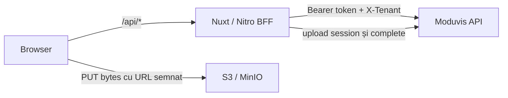
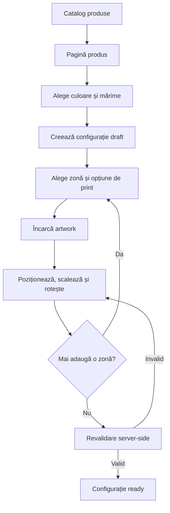
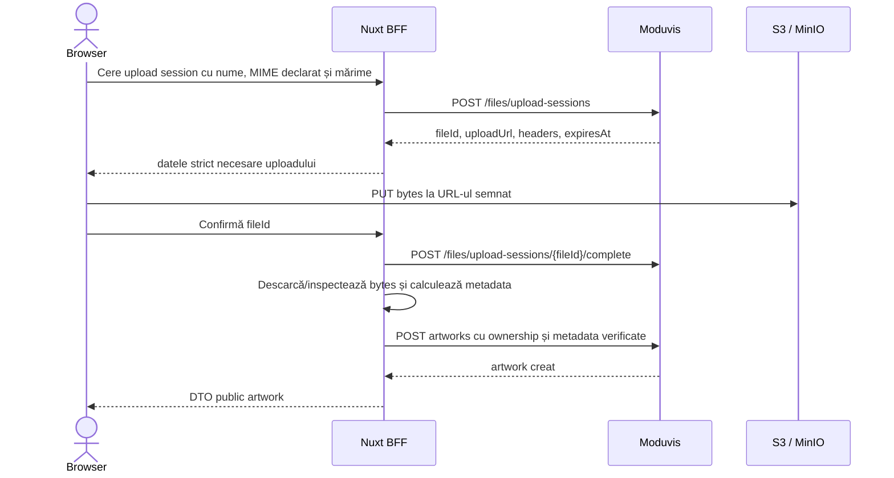

# Faza 1 — Frontend Clothing Customizer

## 1. Scopul documentului

Acest document descrie implementarea storefront-ului public pentru Faza 1 definită în [Faza 1 — Catalog și configurator de print în Moduvis](./Faza-1-Configurator-Produse-Moduvis.md). Schema extinsă și fazele ulterioare sunt descrise în [Schema e-commerce pentru produse blank personalizabile](./Schema-Ecommerce-Moduvis.md). Moduvis rămâne sursa de adevăr pentru catalog, relații, statusuri și workflow-uri, iar aplicația Nuxt oferă interfața publică și stratul server-side care protejează integrarea.

Aplicația este în repository-ul separat `clothing-customizer` și rulează la:

```text
https://clothing-customizer.stanciulescu.xyz
```

Tenantul Moduvis folosit în această fază este:

```text
e-comm
```

Implementarea se face incremental. O etapă se consideră închisă numai după ce criteriile ei de acceptare sunt verificate; nu se încearcă livrarea întregii faze într-un singur pas.

## 2. Obiectivul funcțional

La finalul Fazei 1, un vizitator anonim trebuie să poată:

1. vedea numai produsele active și publicate;
2. deschide un produs și vedea descrierea, prețul blank și imaginile lui;
3. selecta o combinație validă de culoare și mărime;
4. vedea mockup-ul potrivit culorii și perspectivei selectate;
5. alege una sau mai multe zone de print disponibile pe produs;
6. alege numai combinațiile format + metodă permise pentru fiecare zonă;
7. încărca o imagine proprie pentru fiecare zonă configurată;
8. deplasa, scala și roti imaginea numai în pași de `90°`;
9. vedea în timp real încadrarea, DPI-ul și prețul estimat;
10. salva configurația ca draft și o relua după refresh în aceeași sesiune;
11. finaliza configurația în status `ready`, după revalidarea server-side.

Faza 1 se termină la configurația pregătită. Nu include:

- conturi și autentificare client;
- generare de imagini cu AI;
- coș;
- checkout și Stripe;
- comenzi;
- livrare;
- producție;
- gestiune strictă sau rezervare tranzacțională de stoc.

## 3. Decizii arhitecturale

### 3.1. Browserul nu comunică direct cu Moduvis

Fluxul obligatoriu este:



Integration token-ul și headerul `X-Tenant` sunt adăugate exclusiv în Nitro. Ele nu intră în `runtimeConfig.public`, bundle-ul client, payloadurile SSR, local storage sau logurile din browser.

### 3.2. Nuxt este și frontend, și BFF

În acest document, „frontend” include două zone:

- `app/`: UI-ul Vue/Nuxt executat în browser și randat SSR;
- `server/`: endpointurile Nitro care citesc și modifică date în Moduvis.

BFF-ul nu este un proxy generic. Fiecare rută publică are:

- un scop funcțional precis;
- validare proprie pentru params, query și body;
- allowlist de câmpuri;
- verificări de ownership;
- mapare către un DTO public;
- normalizare a erorilor Moduvis.

Nu va exista o rută de forma `/api/moduvis/**` care să permită browserului să aleagă liber entitatea, filtrul sau payloadul trimis în backend.

### 3.3. Autoritatea datelor

| Responsabilitate | Strat autoritativ |
|---|---|
| Produse, variante, media și opțiuni disponibile | Moduvis |
| Relații, constrângeri simple și workflow-uri business | Moduvis |
| Identitatea vizitatorului anonim | Cookie securizat emis de Nitro |
| Ownership pentru artwork și configurații | Nitro, prin `session_key_hash` |
| Detectarea reală a tipului și dimensiunilor imaginii | Nitro |
| Transformările vizuale și feedbackul instant | Browser |
| Recalcularea DPI-ului și a prețului înainte de salvare | Nitro |
| Snapshotul de preț și validările finale | Nitro + workflow-urile Moduvis |

Validările din browser există pentru feedback imediat, dar nu sunt considerate o barieră de securitate.

### 3.4. Interfață custom

Nu se folosește interfața implicită Nuxt și nu se adoptă un template generic de e-commerce. Componentele vizuale, layoutul, tipografia, stările și motion-ul se construiesc pentru identitatea acestui produs.

Se pot folosi biblioteci tehnice fără identitate vizuală proprie, de exemplu pentru validare, gesturi, manipularea imaginilor sau teste. Nu introducem însă un kit vizual care să dicteze aspectul final fără o decizie explicită.

## 4. Traseul utilizatorului



Pe mobil, configuratorul trebuie să rămână utilizabil fără precizie de mouse. Controalele critice au ținte tactile suficiente, iar operațiile de transformare au și alternative prin butoane sau câmpuri controlate, nu doar gesturi pe canvas.

## 5. Rutele aplicației

### 5.1. Pagini publice

| Rută | Rol |
|---|---|
| `/` | Catalogul produselor publicate |
| `/produse/:slug` | Detaliile produsului și alegerea variantei |
| `/configuratii/:id` | Configuratorul pentru un draft existent |
| `/configuratii/:id/finalizata` | Confirmarea configurației `ready` |

ID-ul din URL nu oferă acces implicit. La fiecare request, serverul recitește configurația și compară `session_key_hash` cu sesiunea curentă.

### 5.2. Endpointuri publice BFF

Contractul inițial este:

```http
GET    /api/health
GET    /api/integration/status

GET    /api/catalog/products
GET    /api/catalog/products/:slug

POST   /api/configurations
GET    /api/configurations/:id
POST   /api/configurations/:id/prints
PUT    /api/configurations/:id/prints/:printId
DELETE /api/configurations/:id/prints/:printId
POST   /api/configurations/:id/finalize

POST   /api/artworks/upload-sessions
POST   /api/artworks/:fileId/complete
GET    /api/artworks/:id/download-url
```

`GET /api/integration/status` este numai pentru verificarea controlată a conectivității în etapa de fundație. În producție răspunde fără secrete și fără detalii interne:

```json
{
  "status": "ok",
  "dependencies": {
    "moduvis": "reachable"
  }
}
```

Endpointul poate raporta `unavailable`, dar nu returnează URL-ul intern, tokenul, tenantul, stack trace-ul sau răspunsul brut al backendului.

## 6. Contractele publice

DTO-urile publice se definesc în `shared/types`. Ele nu copiază automat schema Moduvis și nu expun câmpuri interne.

### 6.1. Rezumat produs

```ts
interface CatalogProductSummary {
  id: string
  slug: string
  name: string
  shortDescription: string | null
  basePrice: Money
  primaryImage: PublicImage | null
  badges: string[]
}

interface Money {
  amount: string
  currency: 'RON'
}
```

Sumele monetare circulă ca string decimal, nu ca rezultat intermediar bazat pe `Number` și virgulă mobilă.

### 6.2. Detaliu produs configurabil

```ts
interface ConfigurableProduct {
  id: string
  slug: string
  name: string
  shortDescription: string | null
  description: string | null
  material: string | null
  fabricWeightGsm: number | null
  fit: { id: string; slug: string; name: string }
  basePrice: Money
  variants: ProductVariant[]
  media: ProductMedia[]
  printAreas: PrintArea[]
}
```

Fiecare `PrintArea` conține numai opțiunile active ale acelei zone. `cost_price`, `session_key_hash`, cheile interne și metadatele administrative nu apar în DTO.

### 6.3. Configurația publică

```ts
interface PublicConfiguration {
  id: string
  code: string
  status: 'draft' | 'ready'
  product: ConfigurableProduct
  selectedVariantId: string
  prints: ConfigurationPrint[]
  quotedBasePrice: Money
  quotedPrintsPrice: Money
  quotedTotal: Money
  quotedAt: string
}
```

Browserul poate trimite numai intenția utilizatorului:

```ts
interface SavePrintInput {
  printOptionId: string
  artworkId: string
  offsetXPct: number
  offsetYPct: number
  scalePct: number
  rotationDeg: 0 | 90 | 180 | 270
}
```

Browserul nu trimite și nu poate suprascrie `print_area`, `slot_key`, `price_snapshot`, `effective_dpi`, `is_valid`, totalurile sau statusurile tehnice. Acestea sunt rezolvate sau recalculate server-side.

## 7. Citirea catalogului din Moduvis

### 7.1. Lista de produse

Nitro citește:

```http
GET /api/v1/data/products?filter[is_published]=true&filter[is_active]=true&sort=rank&page=1&limit=24
```

Pentru fiecare imagine expusă, Nitro obține un URL de download cu expirare scurtă. URL-ul semnat poate ajunge în browser; identificatorii interni de fișier se păstrează numai dacă sunt necesari pentru cereri ulterioare controlate.

### 7.2. Detaliul produsului

Nitro rezolvă produsul după slug și aplică din nou filtrele de publicare și activare. Apoi citește:

```http
GET /api/v1/data/products/{productId}/related/variants?filter[is_active]=true&limit=all&sort=sku
GET /api/v1/data/products/{productId}/related/media?filter[is_active]=true&limit=all&sort=rank
GET /api/v1/data/products/{productId}/related/print_areas?filter[is_active]=true&limit=all&sort=rank
GET /api/v1/data/product_print_areas/{areaId}/related/options?filter[is_active]=true&limit=all&sort=rank
```

Dacă slugul nu corespunde unui produs activ și publicat, BFF-ul răspunde cu `404`, indiferent dacă produsul există în Moduvis.

### 7.3. Reguli de prezentare

- Culorile și mărimile sunt derivate exclusiv din variantele active existente.
- UI-ul nu construiește produs cartezian culoare × mărime și nu inventează combinații inexistente.
- La alegerea culorii, imaginea se caută în ordinea:
  1. același produs + culoarea aleasă + vederea cerută;
  2. același produs + fără culoare + vederea cerută;
  3. imaginea principală a produsului;
  4. placeholder custom al aplicației.
- O zonă apare numai dacă este activă și are cel puțin o opțiune activă.
- Formatul și metoda nu se combină independent; UI-ul folosește exact înregistrările `product_print_options` primite de la BFF.

## 8. Sesiunea anonimă și ownership-ul

### 8.1. Cookie-ul de sesiune

La prima operație care necesită identitate, Nitro generează un secret aleatoriu cu entropie suficientă și îl salvează într-un cookie:

```text
HttpOnly
Secure în producție
SameSite=Lax
Path=/
```

Valoarea brută rămâne numai în cookie. Pentru Moduvis se calculează:

```text
session_key_hash = SHA-256(secret sesiune) în format hex lowercase, 64 caractere
```

Nu se folosește ID-ul configurației ca identitate și nu se acceptă un hash trimis explicit de browser.

### 8.2. Verificarea obligatorie

Înainte de orice `GET`, `PUT` sau `DELETE` pentru artwork, configurație sau print, Nitro:

1. citește înregistrarea din Moduvis;
2. extrage `cf_session_key_hash` al părintelui relevant;
3. calculează hashul sesiunii curente;
4. compară valorile în server;
5. continuă numai dacă sunt egale.

Pentru o resursă care nu aparține sesiunii, răspunsul public este `404`. Nu folosim `403`, pentru a nu confirma existența ID-ului către alt vizitator.

## 9. Uploadul și validarea artwork-ului

### 9.1. Fluxul de upload



### 9.2. Validări obligatorii

Nitro verifică:

- mărimea maximă acceptată;
- MIME-ul real, nu doar extensia sau headerul declarat;
- formatele permise: PNG, JPEG și WebP;
- lățimea și înălțimea în pixeli;
- prezența transparenței unde formatul o permite;
- SHA-256 al conținutului;
- existența unei upload session finalizate;
- ownership-ul înainte de reutilizarea unui artwork.

În Faza 1, `source_type` este întotdeauna rezolvat server-side la `user_upload`. Browserul nu poate cere `ai_generated`.

### 9.3. Erori prezentate utilizatorului

Mesajele trebuie să explice acțiunea posibilă, de exemplu:

- `Fișierul depășește limita de 50 MB.`
- `Formatul imaginii nu este acceptat. Folosește PNG, JPG sau WebP.`
- `Imaginea este prea mică pentru formatul ales. Alege un format mai mic sau încarcă o imagine cu rezoluție mai mare.`
- `Încărcarea a expirat. Încearcă din nou.`

Nu se afișează stack trace-uri, răspunsuri brute sau detalii de infrastructură.

## 10. Motorul configuratorului

### 10.1. Starea client

Starea configuratorului are o singură sursă coerentă și conține cel puțin:

```ts
interface ConfiguratorState {
  configurationId: string
  productId: string
  selectedVariantId: string
  selectedViewId: string
  activePrintAreaId: string | null
  printsByAreaId: Record<string, DraftPrintState>
  serverQuote: PublicQuote
  saveState: 'idle' | 'dirty' | 'saving' | 'saved' | 'error'
}
```

Datele de catalog nu sunt duplicate și modificate arbitrar în store. Se păstrează separat de selecțiile și transformările utilizatorului.

### 10.2. Coordonate

Zona de print este poziționată pe mockup prin procentele definite în `product_print_areas`:

```text
preview_x_pct
preview_y_pct
preview_width_pct
preview_height_pct
```

Transformările artwork-ului sunt salvate independent de rezoluția ecranului:

```text
offset_x_pct
offset_y_pct
scale_pct
rotation_deg
```

Canvasul poate avea orice dimensiune CSS, dar aceeași stare trebuie să producă aceeași compoziție pe mobil, desktop și în preview-ul final.

### 10.3. Rotație și DPI

Rotațiile permise sunt exclusiv:

```text
0°, 90°, 180°, 270°
```

Butonul de rotație aplică:

```text
(rotation_deg + 90) % 360
```

Pentru `90°` și `270°`, dimensiunile orientate se inversează înainte de calcul. Formula de bază este:

```text
effective_dpi = min(
  oriented_width_px / (physical_width_mm / 25.4),
  oriented_height_px / (physical_height_mm / 25.4)
)
```

Calculul efectiv include scalarea și porțiunea vizibilă rezultată din intersectarea artwork-ului cu masca zonei. Faza 1 nu oferă un crop editabil separat, deoarece schema Moduvis actuală nu are câmpuri persistente pentru crop. Funcțiile de geometrie și DPI sunt pure, fără acces la DOM, pentru a putea fi testate unitar și refolosite server-side.

### 10.4. Persistență

- Se creează configurația draft după alegerea variantei și acțiunea explicită `Începe personalizarea`.
- Modificările vizuale pot fi optimiste local, dar salvarea este debounced și are indicator clar.
- La schimbarea paginii sau refresh, configurația este recitită din BFF și reconstruită din datele persistate.
- Maximum un `configuration_print` poate exista pentru fiecare zonă.
- Schimbarea variantei după adăugarea printurilor cere confirmare dacă poate invalida mockup-ul sau opțiunile.
- O configurație `ready` devine read-only în interfața Fazei 1.

## 11. Calculul prețului

Prețul afișat este:

```text
quoted_total = product.base_price + suma product_print_options.sale_price
```

Reguli:

1. Browserul poate calcula o estimare pentru feedback instant.
2. Nitro recitește produsul, varianta și toate opțiunile înainte de salvarea unui print și înainte de finalizare.
3. Nitro folosește aritmetică decimală, nu operații cu virgulă mobilă pentru bani.
4. Workflow-ul Moduvis setează `price_snapshot` al printului.
5. La finalizare, Nitro recalculează și trimite `quoted_base_price`, `quoted_prints_price`, `quoted_total` și `quoted_at`.
6. Răspunsul serverului înlocuiește întotdeauna estimarea locală.

`cost_price` nu este citit în DTO-urile publice și nu este logat.

## 12. Direcția vizuală și sistemul UI

Direcția vizuală se definește înainte de implementarea componentelor finale. Sunt necesare cel puțin:

- numele comercial afișat;
- logo sau decizia explicită de wordmark temporar;
- 2–4 referințe vizuale relevante;
- tonul brandului;
- preferințe sau restricții de culoare;
- tipul fotografiei de produs disponibile.

Sistemul custom va avea:

- tokens CSS pentru culori, spațiere, raze, umbre, tipografie și motion;
- reset CSS propriu;
- primitive accesibile: `AppButton`, `AppIconButton`, `AppField`, `AppDialog`, `AppDrawer`, `AppToast`, `AppSkeleton`;
- componente de layout: header, footer, container și navigație;
- stări coerente de loading, empty, eroare, offline și salvare;
- focus vizibil și navigare din tastatură;
- suport pentru `prefers-reduced-motion`;
- responsive real de la mobil la desktop.

Configuratorul este elementul central al identității. Pe desktop poate folosi layout cu preview mare și panou lateral; pe mobil, preview-ul rămâne vizibil, iar opțiunile sunt grupate într-un drawer sau în pași scurți.

## 13. Structura țintă a repository-ului

```text
app/
├── assets/css/
│   ├── reset.css
│   ├── tokens.css
│   └── main.css
├── components/
│   ├── base/
│   ├── layout/
│   ├── catalog/
│   └── configurator/
├── composables/
│   ├── useCatalog.ts
│   ├── useConfiguration.ts
│   ├── useConfigurator.ts
│   └── useArtworkUpload.ts
├── layouts/
├── pages/
│   ├── index.vue
│   ├── produse/[slug].vue
│   └── configuratii/[id]/
├── types/
└── utils/
    ├── geometry.ts
    ├── money.ts
    └── media.ts

server/
├── api/
│   ├── health.get.ts
│   ├── integration/status.get.ts
│   ├── catalog/
│   ├── artworks/
│   └── configurations/
├── services/
│   ├── moduvis/
│   ├── catalog/
│   ├── artwork/
│   └── configuration/
├── schemas/
├── utils/
│   ├── anonymous-session.ts
│   ├── ownership.ts
│   ├── image-metadata.ts
│   └── public-error.ts
└── middleware/

shared/
├── schemas/
└── types/

tests/
├── unit/
├── integration/
└── e2e/
```

Directoarele și abstracțiile se creează când există prima utilizare reală. Nu se adaugă fișiere goale doar pentru a reproduce arborele de mai sus.

## 14. Etapele exacte de implementare

### Etapa 0 — Inițializare și infrastructură

Status: **finalizată**.

Livrabile existente:

- proiect Nuxt separat și repository GitHub;
- runtime config privat pentru Moduvis;
- Dockerfile multi-stage;
- Compose conectat la `moduvis-web` și `moduvis-internal`;
- router Traefik dedicat cu prioritate peste ruta generică Moduvis;
- HTTPS și healthcheck funcționale pe domeniul public;
- aplicație goală, fără UI implicit Nuxt.

Limită: răspunsul `ok` de la `/api/health` confirmă infrastructura Nuxt, dar nu confirmă încă tokenul sau accesul la datele tenantului.

### Etapa 1 — Fundația BFF și verificarea Moduvis

Scop: stabilim conexiunea reală și regulile de bază înainte de UI.

Livrabile:

1. tiparea și validarea runtime config la pornire;
2. client Moduvis server-only;
3. injectarea `Authorization: Bearer` și `X-Tenant: e-comm`;
4. timeout și tratare controlată pentru erori de rețea;
5. normalizarea răspunsurilor și erorilor Moduvis;
6. helper pentru query params și filtre, fără concatenare manuală nesigură;
7. endpointul `GET /api/integration/status`;
8. primul test real read-only pe o entitate de catalog;
9. teste pentru lipsa tokenului, token invalid, tenant invalid și backend indisponibil.

Criterii de acceptare:

- statusul integrării este `ok` pe VPS;
- tokenul nu apare în răspuns, log sau bundle;
- o eroare Moduvis devine un răspuns public stabil, fără stack trace;
- `pnpm typecheck`, testele etapei și `pnpm build` trec.

Checkpoint: după această etapă se verifică manual conectivitatea în producție înainte de catalog.

### Etapa 2 — Contractul catalogului

Scop: obținem date publice curate înainte de a construi designul paginilor.

Livrabile:

1. DTO-urile `Money`, `PublicImage`, `CatalogProductSummary` și `ConfigurableProduct`;
2. `GET /api/catalog/products`;
3. `GET /api/catalog/products/:slug`;
4. mapări explicite Moduvis → DTO;
5. filtrare defensivă pentru active/publicate;
6. rezolvarea URL-urilor semnate pentru imagini;
7. fallbackul media culoare → comun → imagine principală;
8. teste de mapping, filtrare și câmpuri interzise.

Criterii de acceptare:

- un produs nepublicat produce `404` și nu apare în listă;
- răspunsul nu conține `cost_price`, hashuri sau câmpuri Moduvis brute;
- variantele și opțiunile inactive nu apar;
- combinațiile selectabile provin numai din variante reale;
- endpointurile sunt testabile fără componente Vue.

Checkpoint: se inspectează JSON-ul public pentru primul produs real din tenant.

### Etapa 3 — Direcția vizuală și shell-ul aplicației

Scop: definim personalitatea produsului înainte de a multiplica componentele.

Livrabile:

1. moodboard/referințe și o direcție vizuală aprobată;
2. tokens, reset, fonturi și reguli responsive;
3. primitivele strict necesare primei pagini;
4. header și footer;
5. loading, empty, 404 și eroare generică;
6. bazele SEO: title template, description, canonical și metadata socială;
7. favicon și identitate temporară sau finală.

Criterii de acceptare:

- nu există elemente vizuale din starterul Nuxt;
- shell-ul este coerent la `360 px`, tabletă și desktop;
- navigarea din tastatură și focusul sunt vizibile;
- direcția vizuală este aprobată înainte de implementarea catalogului complet.

Checkpoint: această etapă necesită input de brand; deciziile nu se inventează în cod.

### Etapa 4 — Catalog și pagină produs

Scop: utilizatorul poate explora oferta și alege o variantă validă.

Livrabile:

1. grila catalogului;
2. card de produs custom;
3. stări loading, empty și error;
4. pagina de detaliu;
5. galerie și schimbarea imaginii după culoare;
6. selector culoare;
7. selector mărime dependent de culoare și variante;
8. prezentarea prețului de bază și a caracteristicilor;
9. CTA `Începe personalizarea`;
10. metadata SEO per produs.

Criterii de acceptare:

- nu se poate selecta o combinație culoare–mărime inexistentă;
- schimbarea culorii schimbă media după regula de fallback;
- pagina unui produs inactiv/nepublicat răspunde cu `404`;
- starea selecției este accesibilă și utilizabilă pe touch.

Checkpoint: se validează fluxul complet numai cu citiri, fără creare de configurație.

### Etapa 5 — Sesiune anonimă și draftul configurației

Scop: introducem mutații numai după ce citirea catalogului este stabilă.

Livrabile:

1. cookie anonim securizat;
2. hashul SHA-256 server-side;
3. rezolvarea UUID-urilor statusurilor `draft` și `ready` după slug;
4. `POST /api/configurations` cu allowlist;
5. `GET /api/configurations/:id` cu ownership;
6. redirect către configurator după crearea draftului;
7. reluarea draftului după refresh;
8. răspuns `404` pentru configurația altei sesiuni.

Criterii de acceptare:

- secretul sesiunii nu este persistat brut în Moduvis;
- configurația pornește cu varianta selectată și status `draft`;
- un browser separat nu poate citi configurația după ID;
- refresh-ul reconstruiește starea din server.

Checkpoint: se testează ownership-ul cu două sesiuni de browser diferite.

### Etapa 6 — UI-ul de bază al configuratorului

Scop: construim motorul vizual fără upload sau salvarea printurilor.

Livrabile:

1. layout desktop și mobil;
2. schimbarea vederii față/spate;
3. afișarea zonelor active peste mockup;
4. alegerea zonei și a opțiunii de print;
5. modelul de stare determinist;
6. funcțiile pure de geometrie;
7. deplasare, scalare și rotație în pași de `90°` cu un artwork fixture local;
8. calculul DPI și mesajele de încadrare;
9. sumarul estimativ de preț.

Criterii de acceptare:

- aceeași stare produce același preview indiferent de viewport;
- nu se pot alege format/metodă în afara `product_print_options`;
- artwork-ul nu poate fi pierdut în afara controalelor fără posibilitate de reset;
- geometria și DPI-ul sunt acoperite de teste unitare;
- `prefers-reduced-motion` este respectat.

Checkpoint: se aprobă experiența configuratorului cu fixture înainte de integrarea uploadului real.

### Etapa 7 — Uploadul real de artwork

Scop: înlocuim fixture-ul cu fișierele utilizatorului.

Livrabile:

1. creare upload session;
2. upload direct la storage cu URL semnat;
3. progres, anulare și retry;
4. confirmarea uploadului;
5. inspecția server-side a imaginii;
6. crearea `artworks` cu status și `source_type` rezolvate server-side;
7. DTO public cu preview/download URL scurt;
8. verificare ownership pentru toate operațiile artwork;
9. mesaje pentru MIME, mărime, dimensiuni și expirare.

Criterii de acceptare:

- integration token-ul nu participă la requestul browser → storage;
- extensia redenumită nu păcălește verificarea MIME;
- metadata salvată corespunde bytes-ilor reali;
- artwork-ul unei alte sesiuni nu poate fi citit sau atașat;
- PNG, JPEG și WebP valide parcurg fluxul complet.

Checkpoint: se testează separat fișier valid, format invalid, fișier prea mare și upload expirat.

### Etapa 8 — Salvarea printurilor

Scop: legăm starea vizuală de `configuration_prints` și workflow-urile Moduvis.

Livrabile:

1. create/update/delete print prin BFF;
2. validarea payloadului cu allowlist;
3. recitirea configurației, variantei, zonei, opțiunii și artwork-ului;
4. verificarea că toate aparțin aceluiași produs și aceleiași sesiuni;
5. recalcularea DPI-ului server-side;
6. maparea erorilor workflow în mesaje de UI;
7. salvare debounced cu indicator `Se salvează` / `Salvat` / `Eroare`;
8. prevenirea celui de-al doilea print în aceeași zonă;
9. recalcularea quote-ului după fiecare mutație.

Criterii de acceptare:

- browserul nu poate dicta zona, prețul, DPI-ul sau validitatea;
- rotația `25°` și DPI-ul insuficient sunt respinse;
- același slot nu poate exista de două ori;
- refresh-ul reproduce toate transformările persistate;
- o eroare de salvare nu este prezentată ca succes.

Checkpoint: se verifică explicit workflow-ul `validate_configuration_print`, marcat pentru retestare în documentația Moduvis.

### Etapa 9 — Finalizarea configurației

Scop: trecem din `draft` în `ready` numai după o revalidare completă.

Livrabile:

1. `POST /api/configurations/:id/finalize`;
2. recitirea tuturor printurilor și artwork-urilor;
3. confirmarea că toate artwork-urile au status `ready`;
4. recitirea produsului și opțiunilor active;
5. recalcularea decimală a prețurilor;
6. trimiterea totalurilor și `quoted_at` către Moduvis;
7. schimbarea statusului la `ready`;
8. ecran de confirmare read-only;
9. tratarea cazului în care datele s-au schimbat în timpul configurării.

Criterii de acceptare:

- configurația fără print nu poate fi finalizată;
- artwork-ul neready, produsul nepublicat sau opțiunea dezactivată blochează finalizarea;
- totalul final provine din date proaspăt citite;
- workflow-ul `validate_configuration_ready` acceptă configurația validă și respinge cazurile documentate;
- după succes, interfața nu mai permite modificarea draftului.

Checkpoint: workflow-ul Moduvis marcat pentru retestare trebuie validat înainte de închiderea etapei.

### Etapa 10 — Hardening și lansarea completă a Fazei 1

Livrabile:

1. teste unitare pentru bani, media fallback, geometrie, mascarea zonei și DPI;
2. teste de integrare pentru toate endpointurile BFF;
3. teste E2E pentru catalog → produs → upload → configurare → ready;
4. test E2E de ownership cu două sesiuni;
5. rate limiting pentru upload și mutații;
6. limite pentru body și timeouturi;
7. audit pentru tokenuri, URL-uri semnate, hashuri și date interne în loguri;
8. verificări Lighthouse orientative pentru performanță și accesibilitate;
9. imagini responsive și lazy loading în afara conținutului critic;
10. checklist de deploy și rollback;
11. monitorizare pentru health, integrare și erori BFF.

Criterii de acceptare:

- toate criteriile din secțiunea 16 sunt demonstrate;
- buildul de producție și containerul sunt verificate;
- deploy-ul pe VPS nu necesită expunerea secretelor în Git;
- versiunea anterioară poate fi repornită dacă noul container eșuează.

## 15. Strategia de testare

### 15.1. Teste unitare

Se testează fără rețea:

- mapările Moduvis → DTO;
- calculul monetar decimal;
- alegerea variantei;
- fallbackul media;
- transformările și limitele geometrice;
- intersecția cu masca zonei și dimensiunile orientate;
- DPI-ul pentru toate cele patru rotații;
- allowlisturile de payload;
- maparea erorilor publice.

### 15.2. Teste de integrare BFF

Moduvis este mockuit la limita clientului HTTP. Se verifică:

- headerele private injectate;
- filtrele obligatorii pentru active/publicate;
- timeouts și răspunsuri invalide;
- ownership-ul înainte de mutații;
- imposibilitatea de a trimite câmpuri protejate;
- recitirea prețurilor înainte de salvare și finalizare.

### 15.3. Teste E2E

Scenariul principal:

1. deschide catalogul;
2. alege produsul publicat;
3. alege o variantă validă;
4. creează draftul;
5. încarcă artwork pentru față;
6. alege format și metodă;
7. mută, scalează și rotește;
8. adaugă alt artwork pe spate;
9. face refresh și verifică restaurarea;
10. finalizează;
11. verifică statusul și totalul read-only.

Scenariile negative minime includ produs nepublicat, variantă inactivă, artwork străin, MIME fals, DPI insuficient, rotație invalidă, opțiune dezactivată după deschiderea paginii și preț fals trimis manual.

## 16. Criterii finale de acceptare

Faza 1 frontend este gata când:

- infrastructura răspunde cu HTTPS și containerul este healthy;
- conectivitatea Moduvis este verificată separat de healthcheck-ul Nuxt;
- integration token-ul nu apare în browser, bundle sau logurile client;
- un produs nepublicat nu apare și nu poate fi accesat după slug;
- produsul afișează numai variante, media, zone și opțiuni active;
- selectorul nu permite combinații culoare–mărime inexistente;
- schimbarea culorii selectează mockup-ul corect sau fallbackul documentat;
- A3 sau orice alt format apare numai unde există o opțiune activă;
- utilizatorul poate încărca artwork-uri diferite pentru față și spate;
- MIME-ul și metadata imaginii sunt verificate din conținut;
- imaginea altei sesiuni nu poate fi citită sau atașată;
- aceeași zonă nu poate primi două printuri în aceeași configurație;
- rotațiile arbitrare sunt imposibile, iar DPI-ul insuficient este respins clar;
- browserul nu poate dicta prețul, zona calculată, validitatea sau statusul final;
- totalul este `base_price + suma price_snapshot` și este recalculat server-side;
- refresh-ul reîncarcă draftul pentru aceeași sesiune;
- configurația validă poate ajunge în `ready`, iar una invalidă nu;
- experiența este coerentă pe mobil, tabletă și desktop;
- interfața are identitate proprie și nu arată ca un starter Nuxt;
- testele unitare, de integrare și traseul E2E principal trec;
- deploy-ul pe VPS și rollback-ul sunt documentate și verificate.

## 17. Ordinea imediată de lucru

Următorul increment este numai **Etapa 1 — Fundația BFF și verificarea Moduvis**.

Nu construim încă pagina de catalog sau configuratorul. La sfârșitul incrementului trebuie să avem dovada că aplicația de pe VPS poate citi în siguranță o resursă de catalog din tenantul `e-comm`, fără să expună integration token-ul. Abia apoi continuăm cu DTO-urile și contractul catalogului din Etapa 2.
