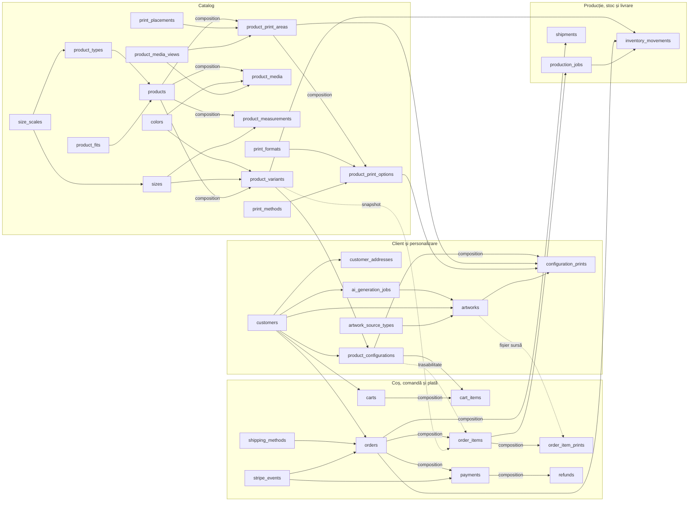
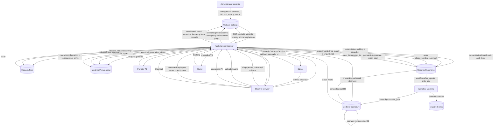

# Schema e-commerce pentru produse blank personalizabile

Document de implementare pentru magazinul Nuxt care folosește Moduvis drept backend operațional. Schema acoperă catalogul blank, combinațiile culoare–mărime, regulile de print specifice fiecărui produs, imaginile încărcate sau generate cu AI, configurațiile clientului, coșul, comenzile, Stripe, producția, stocul și livrarea.

## 1. Convenții Moduvis folosite în document

### Module

Se creează următoarele module, în această ordine:

| Rank | Nume | Slug | Icon | Activ |
|---:|---|---|---|---|
|x  1 | Catalog magazin | `store_catalog` | `i-lucide-shirt` | Da |
|x  2 | Clienți și personalizări | `store_customization` | `i-lucide-palette` | Da |
|x  3 | Comenzi și plăți | `store_commerce` | `i-lucide-shopping-cart` | Da |
|x 4 | Producție și livrare | `store_operations` | `i-lucide-package-check` | Da |

### Reguli generale pentru entități

- Slugurile de entitate de mai jos se introduc exact cum sunt scrise. Moduvis creează automat tabela `ent_<slug>`.
- Pentru fiecare câmp, Moduvis creează automat coloana `cf_<slug>`. În API se trimit slugurile logice; în răspunsurile de date apar coloanele `cf_...`.
- Nu se creează manual câmpurile sistem: `id`, `date_created`, `date_updated`, `id_profile`.
- Fiecare entitate primește automat tab-ul `General`.
- Tipurile valide actuale sunt: `varchar`, `text`, `integer`, `numeric`, `boolean`, `datetime`, `uuid`.
- Pentru bani folosim `numeric/currency`. În PostgreSQL acesta devine `DECIMAL(15,2)`.
- Pentru relații folosim `uuid/relation`; pentru fișiere folosim `uuid/file`.
- `composition` înseamnă că înregistrarea copil nu există fără părinte, relația este obligatorie, iar ștergerea agregatului poate șterge copiii.
- `reference` înseamnă o legătură către o înregistrare reutilizabilă sau istorică. Ștergerea țintei este blocată cât timp există referințe.
- O entitate Moduvis poate avea maximum un părinte `composition`. Schema de mai jos respectă regula.
- Moduvis permite momentan un singur fișier pentru fiecare câmp `file`. Galeriile sunt modelate prin mai multe înregistrări `product_media`.

### Notație pentru configurarea câmpurilor

În toate tabelele, configurația implicită este:

```text
is_required=false
is_unique=false
is_filterable=false
is_sortable=true
visible_in_table=true
visible_in_form=true
is_readonly=false
options=[]
tab=General
```

Abaterile sunt notate astfel:

- `R` — obligatoriu;
- `U` — unic;
- `F` — filtrabil;
- `S-` — nesortabil;
- `T-` — ascuns în tabel;
- `V-` — ascuns în formular;
- `RO` — read-only în UI-ul Moduvis;
- `D=...` — valoare implicită;
- `VR=...` — `validation_rules`;
- `REL=entitate.câmp (kind)` — ținta, câmpul de afișare și tipul relației.

`RO` dezactivează editarea în UI, dar nu este o barieră de securitate pentru API. Permisiunile profilului și validarea din serverul Nuxt rămân obligatorii.

### Entități de status în loc de select

Versiunea actuală Moduvis nu are `ui_type=select` în DTO-ul de câmp. Pentru stările critice folosim entități lookup și relații. Astfel, în UI se afișează un selector de relație și nu se pot introduce statusuri arbitrare.

Toate entitățile de status au aceeași structură:

| Slug câmp | Etichetă | Tip | Configurație | Observații |
|---|---|---|---|---|
| `slug` | Slug | `varchar/text` | `R, U, F` | `VR={"pattern":"^[a-z][a-z0-9_]{1,50}$"}` |
| `name` | Nume | `varchar/text` | `R, U, F` | Câmp de afișare pentru relații |
| `rank` | Ordine | `integer/number` | `R, F, D=1` | `VR={"min":1}` |
| `is_final` | Stare finală | `boolean/checkbox` | `R, F, D=false` | — |
| `is_active` | Activ | `boolean/checkbox` | `R, F, D=true` | — |

Entitățile și valorile inițiale sunt:

| Modul | Nume entitate | Slug entitate | Singular / plural | Valori inițiale `slug → name` |
|---|---|---|---|---|
| Personalizări | Status generare AI | `ai_generation_statuses` | Status generare / Statusuri generare | `queued→În așteptare`, `running→În curs`, `completed→Finalizat`, `failed→Eșuat`, `cancelled→Anulat` |
| x Personalizări | Status artwork | `artwork_statuses` | Status artwork / Statusuri artwork | `uploaded→Încărcat`, `validating→În validare`, `ready→Pregătit`, `rejected→Respins` |
| Personalizări | Status configurație | `configuration_statuses` | Status configurație / Statusuri configurație | `draft→Ciornă`, `ready→Pregătită`, `in_cart→În coș`, `ordered→Comandată`|
| Comenzi | Status coș | `cart_statuses` | Status coș / Statusuri coș | `active→Activ`, `checkout→În checkout`, `converted→Convertit`, `abandoned→Abandonat`, `expired→Expirat` |
| Comenzi | Status comandă | `order_statuses` | Status comandă / Statusuri comandă | `building→În construire`, `pending_payment→Așteaptă plata`, `paid→Plătită`, `in_production→În producție`, `ready_to_ship→Pregătită de livrare`, `shipped→Expediată`, `completed→Finalizată`, `cancelled→Anulată`, `refunded→Rambursată` |
| Comenzi | Status plată | `payment_statuses` | Status plată / Statusuri plată | `created→Creată`, `processing→În procesare`, `succeeded→Reușită`, `failed→Eșuată`, `cancelled→Anulată`, `partially_refunded→Rambursată parțial`, `refunded→Rambursată integral` |
| Operațiuni | Status producție | `production_statuses` | Status producție / Statusuri producție | `queued→În așteptare`, `artwork_review→Verificare grafică`, `approved→Aprobat`, `printing→La print`, `quality_check→Control calitate`, `completed→Finalizat`, `rejected→Respins` |
| Operațiuni | Status livrare | `shipment_statuses` | Status livrare / Statusuri livrare | `pending→În așteptare`, `label_created→AWB creat`, `in_transit→În tranzit`, `delivered→Livrat`, `returned→Returnat`, `failed→Eșuat` |

Pentru valorile terminale se setează `is_final=true`: generare `completed/failed/cancelled`, artwork `rejected/archived`, configurație `ordered/abandoned`, coș `converted/abandoned/expired`, comandă `completed/cancelled/refunded`, plată `succeeded/cancelled/refunded`, producție `completed/rejected`, livrare `delivered/returned/failed`.

### Catalogul tipurilor de sursă artwork

Se creează entitatea lookup `artwork_source_types` în modulul `store_customization`. Metadate: nume `Tipuri sursă artwork`, singular `Tip sursă artwork`, plural `Tipuri sursă artwork`, icon `i-lucide-file-input`, rank `4`.

| Slug câmp | Etichetă | Tip | Configurație | Observații |
|---|---|---|---|---|
| `slug` | Slug | `varchar/text` | `R, U, F` | `VR={"pattern":"^[a-z][a-z0-9_]{1,50}$"}` |
| `name` | Nume | `varchar/text` | `R, U, F` | Câmp de afișare pentru relații |
| `description` | Descriere | `text/textarea` | `T-` | — |
| `rank` | Ordine | `integer/number` | `R, F, D=1` | `VR={"min":1}` |
| `is_active` | Activ | `boolean/checkbox` | `R, F, D=true` | — |

Valori inițiale:

| Rank | Slug | Nume | Descriere |
|---:|---|---|---|
| 1 | `user_upload` | Încărcată de utilizator | Imagine încărcată direct de client |
| 2 | `ai_generated` | Generată cu AI | Imagine rezultată din fluxul de generare AI |

Este un catalog independent. Relația din `artworks` este `reference`, nu `composition`. Serverul Nuxt stabilește valoarea din flux și trimite UUID-ul tipului; browserul nu alege liber sursa.

## 2. Modulul `store_customization`

Înaintea entităților de mai jos se creează lookup-urile `ai_generation_statuses`, `artwork_statuses`, `configuration_statuses` și `artwork_source_types` descrise în secțiunea 1.

### 2.1. Clienți — `customers`

Clienții magazinului nu sunt utilizatori/profiluri Moduvis. Toate requesturile storefrontului folosesc profilul integration token-ului, deci identitatea clientului trebuie stocată explicit. Metadate: nume `Clienți magazin`, singular `Client`, plural `Clienți`, icon `i-lucide-users`, rank `5`.

| Slug câmp | Etichetă | Tip | Configurație | Observații |
|---|---|---|---|---|
| `email` | Email | `varchar/email` | `R, U, F` | Se normalizează lowercase în Nuxt; display pentru relații |
| `auth_subject` | ID autentificare externă | `varchar/text` | `U, F, T-` | ID-ul stabil din sistemul de autentificare Nuxt; nullable pentru guest |
| `first_name` | Prenume | `varchar/text` | `F` | — |
| `last_name` | Nume | `varchar/text` | `F` | — |
| `phone` | Telefon | `varchar/phone` | `F` | — |
| `marketing_consent` | Acord marketing | `boolean/checkbox` | `R, F, D=false` | — |
| `marketing_consent_at` | Data acordului | `datetime/datetimepicker` | `T-` | Setat de Nuxt |
| `is_active` | Activ | `boolean/checkbox` | `R, F, D=true` | — |

### 2.2. Adrese client — `customer_addresses`

Metadate: nume `Adrese clienți`, singular `Adresă client`, plural `Adrese clienți`, icon `i-lucide-map-pin`, rank `6`.

| Slug câmp | Etichetă | Tip | Configurație | Observații |
|---|---|---|---|---|
| `customer` | Client | `uuid/relation` | `R, F` | `REL=customers.email (composition)` |
| `label` | Etichetă | `varchar/text` | `R, F` | Ex. `Acasă`, display pentru relații |
| `recipient_name` | Destinatar | `varchar/text` | `R, F` | — |
| `phone` | Telefon | `varchar/phone` | `R` | — |
| `country_code` | Cod țară | `varchar/text` | `R, F, D=RO` | `VR={"pattern":"^[A-Z]{2}$","min_length":2,"max_length":2}` |
| `county` | Județ | `varchar/text` | `R, F` | — |
| `city` | Localitate | `varchar/text` | `R, F` | — |
| `postal_code` | Cod poștal | `varchar/text` | `R` | — |
| `address_line1` | Adresă | `varchar/text` | `R` | Stradă, număr |
| `address_line2` | Detalii adresă | `varchar/text` | — | Bloc, scară, etaj, apartament |
| `is_default_shipping` | Implicită pentru livrare | `boolean/checkbox` | `R, F, D=false` | Unicitatea per client este validată în Nuxt |
| `is_default_billing` | Implicită pentru facturare | `boolean/checkbox` | `R, F, D=false` | — |
| `is_active` | Activ | `boolean/checkbox` | `R, F, D=true` | — |

### 2.3. Cereri de generare AI — `ai_generation_jobs`

Metadate: nume `Generări AI`, singular `Generare AI`, plural `Generări AI`, icon `i-lucide-sparkles`, rank `7`.

| Slug câmp | Etichetă | Tip | Configurație | Observații |
|---|---|---|---|---|
| `request_label` | Denumire cerere | `varchar/text` | `R, F` | Display pentru relații; setat de Nuxt |
| `customer` | Client | `uuid/relation` | `F` | `REL=customers.email (reference)`; nullable pentru guest |
| `session_key_hash` | Hash sesiune anonimă | `varchar/text` | `F, T-` | `VR={"pattern":"^[a-f0-9]{64}$","min_length":64,"max_length":64}` |
| `status` | Status | `uuid/relation` | `R, F` | `REL=ai_generation_statuses.name (reference)` |
| `prompt` | Prompt | `text/textarea` | `R, T-` | Date personale interzise prin politica aplicației |
| `negative_prompt` | Prompt negativ | `text/textarea` | `T-` | — |
| `provider` | Furnizor AI | `varchar/text` | `R, F` | Ex. `openai` |
| `model` | Model | `varchar/text` | `R, F` | — |
| `provider_job_id` | ID job furnizor | `varchar/text` | `U, F` | Nullable până la trimitere |
| `provider_cost` | Cost furnizor AI | `numeric/currency` | `T-, RO` | Cost intern; nullable până la finalizare |
| `customer_price` | Preț taxat clientului | `numeric/currency` | `T-, RO` | Poate fi `0.00` dacă generarea este inclusă |
| `error_message` | Eroare | `text/textarea` | `T-` | — |
| `completed_at` | Finalizat la | `datetime/datetimepicker` | `F, T-` | — |

### 2.4. Imagini client — `artworks`

Un artwork este imaginea aleasă de client, indiferent dacă provine din upload sau AI. Metadate: nume `Imagini client`, singular `Imagine client`, plural `Imagini client`, icon `i-lucide-image`, rank `8`.

| Slug câmp | Etichetă | Tip | Configurație | Observații |
|---|---|---|---|---|
| `name` | Nume | `varchar/text` | `R, F` | Display pentru relații |
| `customer` | Client | `uuid/relation` | `F` | `REL=customers.email (reference)`; nullable pentru guest |
| `session_key_hash` | Hash sesiune anonimă | `varchar/text` | `F, T-` | `VR={"pattern":"^[a-f0-9]{64}$","min_length":64,"max_length":64}` |
| `generation_job` | Generare AI sursă | `uuid/relation` | `F, T-` | `REL=ai_generation_jobs.request_label (reference)`; null pentru upload |
| `status` | Status | `uuid/relation` | `R, F` | `REL=artwork_statuses.name (reference)` |
| `source_type` | Tip sursă | `uuid/relation` | `R, F` | `REL=artwork_source_types.name (reference)` |
| `original_file` | Fișier original | `uuid/file` | `R, S-` | `VR={"allowed_mime_types":["image/png","image/jpeg","image/webp"],"max_file_size_bytes":50000000,"max_files":1}` |
| `print_ready_file` | Fișier pregătit de print | `uuid/file` | `S-, T-` | `VR={"allowed_mime_types":["image/png","application/pdf"],"max_file_size_bytes":100000000,"max_files":1}` |
| `preview_file` | Preview optimizat | `uuid/file` | `S-, T-` | `VR={"allowed_mime_types":["image/png","image/jpeg","image/webp"],"max_file_size_bytes":15000000,"max_files":1}` |
| `width_px` | Lățime (px) | `integer/number` | `RO` | `VR={"min":1}` |
| `height_px` | Înălțime (px) | `integer/number` | `RO` | `VR={"min":1}` |
| `dpi` | DPI detectat | `numeric/number` | `RO` | `VR={"min":1}` |
| `mime_type` | Tip MIME | `varchar/text` | `RO, T-` | — |
| `has_transparency` | Are transparență | `boolean/checkbox` | `R, D=false, RO` | — |
| `sha256` | SHA-256 | `varchar/text` | `F, T-, RO` | `VR={"pattern":"^[a-f0-9]{64}$"}` |
| `validation_message` | Mesaj validare | `text/textarea` | `T-, RO` | — |
| `is_locked` | Blocat pentru comandă | `boolean/checkbox` | `R, F, D=false, RO` | Devine `true` după snapshotul comenzii |

### 2.5. Configurații produs — `product_configurations`

Metadate: nume `Configurații produs`, singular `Configurație produs`, plural `Configurații produs`, icon `i-lucide-wand-sparkles`, rank `9`.

| Slug câmp | Etichetă | Tip | Configurație | Observații |
|---|---|---|---|---|
| `configuration_code` | Număr configurație | `varchar/text` | `U, RO` | Secvență: `key=store_configuration`, `scope=entity`, `reset=none`, `format={prefix}{number}`, `prefix=CFG-`, `padding=8`, `start_value=1` |
| `customer` | Client | `uuid/relation` | `F` | `REL=customers.email (reference)`; nullable pentru guest |
| `session_key_hash` | Hash sesiune anonimă | `varchar/text` | `F, T-` | Hash SHA-256, niciodată tokenul brut |
| `variant` | Variantă produs | `uuid/relation` | `R, F` | `REL=product_variants.sku (reference)` |
| `status` | Status | `uuid/relation` | `R, F` | `REL=configuration_statuses.name (reference)` |
| `preview_file` | Preview configurație | `uuid/file` | `S-` | Imagine compozită pentru coș și comandă |
| `quoted_base_price` | Preț blank ofertat | `numeric/currency` | `R, T-, RO` | `VR={"min":0,"currency_code":"RON"}` |
| `quoted_prints_price` | Preț printuri ofertat | `numeric/currency` | `R, T-, RO` | `VR={"min":0,"currency_code":"RON"}` |
| `quoted_total` | Total unitar ofertat | `numeric/currency` | `R, F, RO` | Recalculat de Nuxt, nu primit de la browser |
| `currency` | Monedă | `varchar/text` | `R, F, D=RON` | `VR={"pattern":"^[A-Z]{3}$"}` |
| `quoted_at` | Ofertat la | `datetime/datetimepicker` | `R, F, RO` | — |
| `expires_at` | Oferta expiră la | `datetime/datetimepicker` | `F, RO` | — |

În builder, `configuration_code` se configurează din secțiunea **Generare automată** a formularului de câmp. Se activează secvența și se completează manifestul din tabel; preview-ul așteptat pentru prima valoare este `CFG-00000001`.

### 2.6. Printuri configurație — `configuration_prints`

Metadate: nume `Printuri configurație`, singular `Print configurație`, plural `Printuri configurație`, icon `i-lucide-layers`, rank `10`.

| Slug câmp | Etichetă | Tip | Configurație | Observații |
|---|---|---|---|---|
| `configuration` | Configurație | `uuid/relation` | `R, F` | `REL=product_configurations.configuration_code (composition)` |
| `print_option` | Opțiune de print | `uuid/relation` | `R, F` | `REL=product_print_options.name (reference)` |
| `artwork` | Imagine | `uuid/relation` | `R, F` | `REL=artworks.name (reference)` |
| `print_area` | Zonă efectivă | `uuid/relation` | `T-, RO` | `REL=product_print_areas.name (reference)`; completat din opțiune de workflow; nu bifa `Required` |
| `slot_key` | Cheie configurație–zonă | `varchar/text` | `U, T-, RO` | `${configurationId}:${printAreaId}`; completat de workflow; nu bifa `Required` |
| `price_snapshot` | Preț print | `numeric/currency` | `T-, RO` | `VR={"min":0,"currency_code":"RON"}`; completat de workflow; nu bifa `Required` |
| `offset_x_pct` | Deplasare X (%) | `numeric/number` | `R, T-, D=0` | — |
| `offset_y_pct` | Deplasare Y (%) | `numeric/number` | `R, T-, D=0` | — |
| `scale_pct` | Scalare (%) | `numeric/number` | `R, T-, D=100` | `VR={"min":1,"max":500}` |
| `rotation_deg` | Rotație (grade) | `integer/number` | `R, T-, D=0` | `VR={"min":0,"max":270}`; valori permise exclusiv: `0`, `90`, `180`, `270` |
| `effective_dpi` | DPI efectiv | `numeric/number` | `R, T-, RO` | `VR={"min":1}`; calculat de serverul Nuxt și validat de workflow |
| `preview_file` | Preview print | `uuid/file` | `S-, T-` | — |
| `is_valid` | Valid pentru print | `boolean/checkbox` | `R, F, D=false, RO` | — |
| `validation_message` | Mesaj validare | `text/textarea` | `T-, RO` | — |

Regula „maximum un print per zonă într-o configurație” este impusă prin `slot_key` unic. Workflow-ul copiază mai întâi `print_option.print_area` în `print_area`, apoi generează cheia; Nuxt poate verifica anticipat doar pentru UX.

Rotația nu este valoare liberă și nu folosește o entitate-catalog. Frontendul oferă numai un buton „Rotește 90°”, care aplică `(rotation_deg + 90) % 360`; nu afișează slider sau input numeric. Preview-ul și randarea de producție rotesc printul în jurul centrului. La `90°` și `270°`, lățimea și înălțimea artwork-ului se inversează înainte de verificarea încadrării și calculul DPI. Serverul Nuxt și workflow-ul de validare acceptă exclusiv `0`, `90`, `180`, `270` și întorc mesajul `Rotația printului poate fi doar 0°, 90°, 180° sau 270°.` pentru orice altă valoare.

## 3. Modulul `store_commerce`

Înaintea entităților de mai jos se creează lookup-urile `cart_statuses`, `order_statuses` și `payment_statuses` descrise în secțiunea 1.

### 3.1. Metode de livrare — `shipping_methods`

Metadate: nume `Metode de livrare`, singular `Metodă de livrare`, plural `Metode de livrare`, icon `i-lucide-truck`, rank `4`.

| Slug câmp | Etichetă | Tip | Configurație | Observații |
|---|---|---|---|---|
| `slug` | Slug | `varchar/text` | `R, U, F` | Ex. `courier_standard` |
| `name` | Nume | `varchar/text` | `R, U, F` | Display pentru relații |
| `carrier` | Curier | `varchar/text` | `R, F` | Ex. `Sameday` |
| `service_code` | Cod serviciu | `varchar/text` | `F, T-` | Codul folosit în integrarea curierului |
| `price` | Preț livrare | `numeric/currency` | `R, F` | `VR={"min":0,"currency_code":"RON"}` |
| `free_shipping_threshold` | Prag livrare gratuită | `numeric/currency` | `T-` | Nullable dacă nu există prag |
| `estimated_days_min` | Zile minime estimate | `integer/number` | `R, D=1` | `VR={"min":0}` |
| `estimated_days_max` | Zile maxime estimate | `integer/number` | `R, D=3` | `VR={"min":0}` |
| `rank` | Ordine | `integer/number` | `R, F, D=1` | — |
| `is_active` | Activ | `boolean/checkbox` | `R, F, D=true` | — |

### 3.2. Coșuri — `carts`

Metadate: nume `Coșuri`, singular `Coș`, plural `Coșuri`, icon `i-lucide-shopping-cart`, rank `5`.

| Slug câmp | Etichetă | Tip | Configurație | Observații |
|---|---|---|---|---|
| `cart_code` | Număr coș | `varchar/text` | `U, RO` | Secvență: `key=store_cart`, `scope=entity`, `reset=none`, `format={prefix}{number}`, `prefix=CART-`, `padding=8`, `start_value=1` |
| `customer` | Client | `uuid/relation` | `F` | `REL=customers.email (reference)`; nullable pentru guest |
| `session_key_hash` | Hash sesiune anonimă | `varchar/text` | `F, T-` | `VR={"pattern":"^[a-f0-9]{64}$","min_length":64,"max_length":64}` |
| `status` | Status | `uuid/relation` | `R, F` | `REL=cart_statuses.name (reference)` |
| `currency` | Monedă | `varchar/text` | `R, F, D=RON` | `VR={"pattern":"^[A-Z]{3}$"}` |
| `expires_at` | Expiră la | `datetime/datetimepicker` | `F` | — |

### 3.3. Articole coș — `cart_items`

Metadate: nume `Articole coș`, singular `Articol coș`, plural `Articole coș`, icon `i-lucide-shopping-bag`, rank `6`.

| Slug câmp | Etichetă | Tip | Configurație | Observații |
|---|---|---|---|---|
| `cart` | Coș | `uuid/relation` | `R, F` | `REL=carts.cart_code (composition)` |
| `configuration` | Configurație | `uuid/relation` | `R, F` | `REL=product_configurations.configuration_code (reference)` |
| `quantity` | Cantitate | `integer/number` | `R, D=1` | `VR={"min":1,"max":100}` |
| `quoted_unit_price` | Preț unitar ofertat | `numeric/currency` | `R, RO` | `VR={"min":0,"currency_code":"RON"}` |
| `quoted_line_total` | Total linie ofertat | `numeric/currency` | `R, RO` | Recalculat de Nuxt |
| `quoted_at` | Ofertat la | `datetime/datetimepicker` | `R, T-, RO` | — |

### 3.4. Comenzi — `orders`

Metadate: nume `Comenzi`, singular `Comandă`, plural `Comenzi`, icon `i-lucide-receipt-text`, rank `7`.

| Slug câmp | Etichetă | Tip | Configurație | Observații |
|---|---|---|---|---|
| `order_number` | Număr comandă | `varchar/text` | `U, F, RO` | Secvență: `key=store_order`, `scope=entity`, `reset=yearly`, `format={prefix}{year}-{number}`, `prefix=CMD-`, `padding=6`, `start_value=1` |
| `idempotency_key` | Cheie idempotency | `varchar/text` | `R, U, F, T-` | Generată de Nuxt înaintea comenzii |
| `customer` | Client | `uuid/relation` | `F` | `REL=customers.email (reference)`; nullable pentru guest |
| `status` | Status | `uuid/relation` | `R, F` | `REL=order_statuses.name (reference)` |
| `customer_email` | Email client | `varchar/email` | `R, F` | Snapshot |
| `customer_phone` | Telefon client | `varchar/phone` | `R, F` | Snapshot |
| `shipping_method` | Metodă de livrare | `uuid/relation` | `R, F` | `REL=shipping_methods.name (reference)` |
| `shipping_method_name` | Metodă livrare snapshot | `varchar/text` | `R, RO` | Nu se modifică dacă metoda este redenumită |
| `currency` | Monedă | `varchar/text` | `R, F, D=RON` | `VR={"pattern":"^[A-Z]{3}$"}` |
| `subtotal` | Subtotal | `numeric/currency` | `R, RO` | `VR={"min":0,"currency_code":"RON"}` |
| `shipping_amount` | Livrare | `numeric/currency` | `R, RO, D=0.00` | `VR={"min":0,"currency_code":"RON"}` |
| `tax_amount` | Taxe incluse | `numeric/currency` | `R, RO, D=0.00` | `VR={"min":0,"currency_code":"RON"}` |
| `discount_amount` | Discount | `numeric/currency` | `R, RO, D=0.00` | `VR={"min":0,"currency_code":"RON"}` |
| `total` | Total comandă | `numeric/currency` | `R, F, RO` | Autoritar pentru Stripe |
| `shipping_recipient_name` | Destinatar | `varchar/text` | `R` | Snapshot |
| `shipping_phone` | Telefon livrare | `varchar/phone` | `R` | Snapshot |
| `shipping_country_code` | Țară livrare | `varchar/text` | `R, D=RO` | `VR={"pattern":"^[A-Z]{2}$"}` |
| `shipping_county` | Județ livrare | `varchar/text` | `R, F` | — |
| `shipping_city` | Localitate livrare | `varchar/text` | `R, F` | — |
| `shipping_postal_code` | Cod poștal livrare | `varchar/text` | `R` | — |
| `shipping_address_line1` | Adresă livrare | `varchar/text` | `R` | — |
| `shipping_address_line2` | Detalii adresă livrare | `varchar/text` | — | — |
| `billing_same_as_shipping` | Facturare identică | `boolean/checkbox` | `R, D=true` | — |
| `billing_type` | Tip facturare | `varchar/text` | `R, F, D=person` | `VR={"pattern":"^(person\|company)$"}` |
| `billing_name` | Nume facturare | `varchar/text` | `R` | Persoană sau denumire afișată |
| `billing_company_name` | Denumire firmă | `varchar/text` | — | — |
| `billing_tax_id` | CUI/CIF | `varchar/text` | `F` | — |
| `billing_registration_number` | Nr. Registrul Comerțului | `varchar/text` | `T-` | — |
| `billing_country_code` | Țară facturare | `varchar/text` | `R, D=RO` | `VR={"pattern":"^[A-Z]{2}$"}` |
| `billing_county` | Județ facturare | `varchar/text` | `R` | — |
| `billing_city` | Localitate facturare | `varchar/text` | `R` | — |
| `billing_postal_code` | Cod poștal facturare | `varchar/text` | `R` | — |
| `billing_address_line1` | Adresă facturare | `varchar/text` | `R` | — |
| `billing_address_line2` | Detalii adresă facturare | `varchar/text` | — | — |
| `customer_note` | Observații client | `text/textarea` | `T-` | — |
| `paid_at` | Plătită la | `datetime/datetimepicker` | `F, RO` | Setat numai după webhook Stripe valid |
| `cancelled_at` | Anulată la | `datetime/datetimepicker` | `F, RO` | — |

Adresa din comandă este snapshot și nu se recitește din `customer_addresses`. Astfel, o modificare ulterioară a profilului nu schimbă o comandă istorică.

### 3.5. Articole comandă — `order_items`

Metadate: nume `Articole comandă`, singular `Articol comandă`, plural `Articole comandă`, icon `i-lucide-package`, rank `8`.

| Slug câmp | Etichetă | Tip | Configurație | Observații |
|---|---|---|---|---|
| `order` | Comandă | `uuid/relation` | `R, F` | `REL=orders.order_number (composition)` |
| `source_configuration` | Configurație sursă | `uuid/relation` | `F, T-` | `REL=product_configurations.configuration_code (reference)` |
| `source_product` | Produs sursă | `uuid/relation` | `F, T-` | `REL=products.name (reference)` |
| `source_variant` | Variantă sursă | `uuid/relation` | `F, T-` | `REL=product_variants.sku (reference)` |
| `line_label` | Descriere articol | `varchar/text` | `R, F, RO` | Display pentru relații |
| `product_name` | Nume produs | `varchar/text` | `R, RO` | Snapshot |
| `sku` | SKU | `varchar/text` | `R, F, RO` | Snapshot |
| `color_name` | Culoare | `varchar/text` | `R, F, RO` | Snapshot |
| `size_label` | Mărime | `varchar/text` | `R, F, RO` | Snapshot |
| `fit` | Croială | `varchar/text` | `RO` | Snapshot |
| `fabric_weight_gsm` | Gramaj (g/m²) | `integer/number` | `RO` | Snapshot |
| `material` | Material | `varchar/text` | `RO` | Snapshot |
| `base_price` | Preț blank | `numeric/currency` | `R, RO` | Snapshot |
| `prints_price` | Preț printuri | `numeric/currency` | `R, RO` | Snapshot |
| `unit_price` | Preț unitar | `numeric/currency` | `R, RO` | `base_price + prints_price` |
| `quantity` | Cantitate | `integer/number` | `R, RO` | `VR={"min":1}` |
| `line_total` | Total linie | `numeric/currency` | `R, RO` | `unit_price × quantity` |
| `preview_file` | Preview final | `uuid/file` | `S-, RO` | Copie/snapshot folosită în comandă |

### 3.6. Printuri articol comandă — `order_item_prints`

Aceste înregistrări sunt snapshoturi imuabile de producție. Metadate: nume `Printuri articole comandă`, singular `Print articol comandă`, plural `Printuri articole comandă`, icon `i-lucide-layers-3`, rank `9`.

| Slug câmp | Etichetă | Tip | Configurație | Observații |
|---|---|---|---|---|
| `order_item` | Articol comandă | `uuid/relation` | `R, F` | `REL=order_items.line_label (composition)` |
| `source_artwork` | Artwork sursă | `uuid/relation` | `F, T-` | `REL=artworks.name (reference)` |
| `placement_name` | Poziție | `varchar/text` | `R, F, RO` | Snapshot |
| `format_name` | Format | `varchar/text` | `R, RO` | Snapshot |
| `method_name` | Metodă | `varchar/text` | `R, RO` | Snapshot |
| `width_mm` | Lățime (mm) | `numeric/number` | `R, RO` | Snapshot |
| `height_mm` | Înălțime (mm) | `numeric/number` | `R, RO` | Snapshot |
| `price` | Preț print | `numeric/currency` | `R, RO` | Snapshot |
| `offset_x_pct` | Deplasare X (%) | `numeric/number` | `R, T-, RO` | Snapshot |
| `offset_y_pct` | Deplasare Y (%) | `numeric/number` | `R, T-, RO` | Snapshot |
| `scale_pct` | Scalare (%) | `numeric/number` | `R, T-, RO` | Snapshot |
| `rotation_deg` | Rotație (grade) | `integer/number` | `R, T-, RO` | Snapshot al uneia dintre valorile `0`, `90`, `180`, `270` |
| `original_file` | Fișier original snapshot | `uuid/file` | `S-, T-, RO` | — |
| `production_file` | Fișier de producție | `uuid/file` | `R, S-, RO` | PNG/PDF la dimensiunea fizică finală |
| `preview_file` | Preview | `uuid/file` | `S-, RO` | — |
| `is_approved` | Aprobat pentru print | `boolean/checkbox` | `R, F, D=false, RO` | — |

### 3.7. Plăți — `payments`

O comandă poate avea mai multe încercări de plată. Metadate: nume `Plăți magazin`, singular `Plată`, plural `Plăți`, icon `i-lucide-credit-card`, rank `10`.

| Slug câmp | Etichetă | Tip | Configurație | Observații |
|---|---|---|---|---|
| `order` | Comandă | `uuid/relation` | `R, F` | `REL=orders.order_number (composition)` |
| `status` | Status | `uuid/relation` | `R, F` | `REL=payment_statuses.name (reference)` |
| `provider_reference` | Referință plată | `varchar/text` | `R, F` | Display pentru relații; inițial cheia locală |
| `provider` | Furnizor | `varchar/text` | `R, F, D=stripe` | `VR={"pattern":"^stripe$"}` |
| `stripe_checkout_session_id` | Stripe Checkout Session | `varchar/text` | `U, F` | Nullable până la crearea sesiunii |
| `stripe_payment_intent_id` | Stripe Payment Intent | `varchar/text` | `U, F` | Nullable până la primire |
| `amount` | Sumă | `numeric/currency` | `R, RO` | Trebuie să corespundă comenzii |
| `currency` | Monedă | `varchar/text` | `R, F, D=RON` | — |
| `refunded_amount` | Sumă rambursată | `numeric/currency` | `R, D=0.00, RO` | — |
| `failure_message` | Mesaj eroare | `text/textarea` | `T-, RO` | — |
| `paid_at` | Plătită la | `datetime/datetimepicker` | `F, RO` | — |

### 3.8. Rambursări — `refunds`

Metadate: nume `Rambursări`, singular `Rambursare`, plural `Rambursări`, icon `i-lucide-undo-2`, rank `11`.

| Slug câmp | Etichetă | Tip | Configurație | Observații |
|---|---|---|---|---|
| `payment` | Plată | `uuid/relation` | `R, F` | `REL=payments.provider_reference (composition)` |
| `stripe_refund_id` | ID rambursare Stripe | `varchar/text` | `R, U, F` | — |
| `status` | Status | `varchar/text` | `R, F` | `VR={"pattern":"^(pending\|succeeded\|failed\|cancelled)$"}` |
| `amount` | Sumă rambursată | `numeric/currency` | `R, RO` | `VR={"min":0,"currency_code":"RON"}` |
| `reason` | Motiv | `varchar/text` | `F` | — |
| `failure_message` | Eroare | `text/textarea` | `T-, RO` | — |
| `processed_at` | Procesată la | `datetime/datetimepicker` | `F, RO` | — |

### 3.9. Evenimente Stripe — `stripe_events`

Asigură procesarea idempotentă a webhookurilor. Metadate: nume `Evenimente Stripe`, singular `Eveniment Stripe`, plural `Evenimente Stripe`, icon `i-lucide-webhook`, rank `12`.

| Slug câmp | Etichetă | Tip | Configurație | Observații |
|---|---|---|---|---|
| `stripe_event_id` | ID eveniment Stripe | `varchar/text` | `R, U, F` | Display pentru relații și cheie de idempotency |
| `event_type` | Tip eveniment | `varchar/text` | `R, F` | — |
| `order` | Comandă | `uuid/relation` | `F` | `REL=orders.order_number (reference)` |
| `payment` | Plată | `uuid/relation` | `F` | `REL=payments.provider_reference (reference)` |
| `is_processed` | Procesat | `boolean/checkbox` | `R, F, D=false, RO` | — |
| `processed_at` | Procesat la | `datetime/datetimepicker` | `F, RO` | — |
| `processing_error` | Eroare procesare | `text/textarea` | `T-, RO` | — |

Nu se salvează date de card și nu se salvează payloadul Stripe complet fără o politică explicită de retenție și redactare.

## 4. Modulul `store_operations`

Înaintea entităților de mai jos se creează lookup-urile `production_statuses` și `shipment_statuses` descrise în secțiunea 1.

### 4.1. Joburi de producție — `production_jobs`

Se creează numai după ce comanda a fost confirmată ca plătită. Metadate: nume `Joburi de producție`, singular `Job de producție`, plural `Joburi de producție`, icon `i-lucide-factory`, rank `3`.

| Slug câmp | Etichetă | Tip | Configurație | Observații |
|---|---|---|---|---|
| `job_number` | Număr job | `varchar/text` | `U, F, RO` | Secvență: `key=store_production`, `scope=entity`, `reset=yearly`, `format={prefix}{year}-{number}`, `prefix=PRD-`, `padding=6`, `start_value=1` |
| `order_item` | Articol comandă | `uuid/relation` | `R, F` | `REL=order_items.line_label (reference)`; intenționat nu este composition |
| `status` | Status | `uuid/relation` | `R, F` | `REL=production_statuses.name (reference)` |
| `quantity` | Cantitate | `integer/number` | `R, RO` | Copiată din articolul comenzii |
| `assigned_to` | Responsabil | `varchar/text` | `F` | Nume/identificator operațional; ownerul Moduvis poate fi folosit separat |
| `priority` | Prioritate | `integer/number` | `R, F, D=100` | Valoare mai mică = prioritate mai mare |
| `production_notes` | Instrucțiuni producție | `text/textarea` | `T-` | — |
| `rejection_reason` | Motiv respingere | `text/textarea` | `T-` | — |
| `started_at` | Început la | `datetime/datetimepicker` | `F` | — |
| `completed_at` | Finalizat la | `datetime/datetimepicker` | `F` | — |

### 4.2. Livrări — `shipments`

O comandă poate avea mai multe livrări. Metadate: nume `Livrări`, singular `Livrare`, plural `Livrări`, icon `i-lucide-truck`, rank `4`.

| Slug câmp | Etichetă | Tip | Configurație | Observații |
|---|---|---|---|---|
| `shipment_code` | Număr livrare | `varchar/text` | `U, F, RO` | Secvență: `key=store_shipment`, `scope=entity`, `reset=yearly`, `format={prefix}{year}-{number}`, `prefix=SHP-`, `padding=6`, `start_value=1` |
| `order` | Comandă | `uuid/relation` | `R, F` | `REL=orders.order_number (composition)` |
| `status` | Status | `uuid/relation` | `R, F` | `REL=shipment_statuses.name (reference)` |
| `carrier` | Curier | `varchar/text` | `R, F` | — |
| `service_name` | Serviciu | `varchar/text` | — | — |
| `tracking_number` | Număr AWB | `varchar/text` | `U, F` | Nullable înainte de generare |
| `tracking_url` | Link urmărire | `varchar/text` | `T-` | — |
| `shipping_cost` | Cost livrare | `numeric/currency` | `T-` | Cost intern efectiv |
| `label_file` | Etichetă AWB | `uuid/file` | `S-, T-` | `VR={"allowed_mime_types":["application/pdf","image/png"],"max_file_size_bytes":10000000,"max_files":1}` |
| `shipped_at` | Expediată la | `datetime/datetimepicker` | `F` | — |
| `delivered_at` | Livrată la | `datetime/datetimepicker` | `F` | — |

### 4.3. Mișcări de stoc — `inventory_movements`

Jurnal append-only pentru auditul stocului. Metadate: nume `Mișcări de stoc`, singular `Mișcare de stoc`, plural `Mișcări de stoc`, icon `i-lucide-warehouse`, rank `5`.

| Slug câmp | Etichetă | Tip | Configurație | Observații |
|---|---|---|---|---|
| `variant` | Variantă | `uuid/relation` | `R, F` | `REL=product_variants.sku (reference)` |
| `order` | Comandă | `uuid/relation` | `F` | `REL=orders.order_number (reference)` |
| `production_job` | Job producție | `uuid/relation` | `F` | `REL=production_jobs.job_number (reference)` |
| `movement_type` | Tip mișcare | `varchar/text` | `R, F` | `VR={"pattern":"^(receive\|reserve\|release\|consume\|return\|adjustment)$"}` |
| `quantity_delta` | Modificare cantitate | `integer/number` | `R` | Pozitiv la intrare, negativ la ieșire; zero este respins în Nuxt |
| `stock_after` | Stoc după mișcare | `integer/number` | `R, RO` | Snapshot pentru audit |
| `external_reference` | Referință externă | `varchar/text` | `F` | Document furnizor, comandă etc. |
| `notes` | Observații | `text/textarea` | `T-` | — |

Înregistrările din `inventory_movements` nu se actualizează și nu se șterg. Corecțiile se fac printr-o nouă mișcare `adjustment`.

## 5. Relațiile complete

| Copil și câmp | Părinte | Kind | Cardinalitate | Motiv |
|---|---|---|---|---|
| `product_types.size_scale` | `size_scales` | reference | N:1 | Un sistem este reutilizat de mai multe tipuri |
| `sizes.size_scale` | `size_scales` | composition | N:1 | Mărimea aparține sistemului |
| `products.product_type` | `product_types` | reference | N:1 | Tip reutilizabil |
| `products.fit` | `product_fits` | reference | N:1 | Croială controlată și reutilizabilă |
| `product_variants.product` | `products` | composition | N:1 | Varianta nu există fără produs |
| `product_variants.color` | `colors` | reference | N:1 | Culoare reutilizabilă |
| `product_variants.size` | `sizes` | reference | N:1 | Mărime reutilizabilă |
| `product_measurements.product` | `products` | composition | N:1 | Tabelul de dimensiuni aparține produsului |
| `product_measurements.size` | `sizes` | reference | N:1 | Leagă rândul de mărime |
| `product_media.product` | `products` | composition | N:1 | Media aparține produsului |
| `product_media.color` | `colors` | reference | N:1 opțional | Imagine specifică unei culori |
| `product_media.view` | `product_media_views` | reference | N:1 | Perspectivă controlată a imaginii |
| `product_print_areas.product` | `products` | composition | N:1 | Zona aparține modelului blank concret |
| `product_print_areas.placement` | `print_placements` | reference | N:1 | Poziție reutilizabilă |
| `product_print_areas.mockup_view` | `product_media_views` | reference | N:1 | Perspectiva folosită în configurator |
| `product_print_options.print_area` | `product_print_areas` | composition | N:1 | Opțiunea nu există fără zonă |
| `product_print_options.print_format` | `print_formats` | reference | N:1 | Format fizic reutilizabil |
| `product_print_options.print_method` | `print_methods` | reference | N:1 | Tehnologie reutilizabilă |
| `customer_addresses.customer` | `customers` | composition | N:1 | Adresă salvată a clientului |
| `ai_generation_jobs.customer` | `customers` | reference | N:1 opțional | Guest sau client autentificat |
| `ai_generation_jobs.status` | `ai_generation_statuses` | reference | N:1 | Status controlat |
| `artworks.customer` | `customers` | reference | N:1 opțional | Imaginea poate aparține unui guest |
| `artworks.generation_job` | `ai_generation_jobs` | reference | N:1 opțional | Numai pentru sursa AI |
| `artworks.status` | `artwork_statuses` | reference | N:1 | Status controlat |
| `artworks.source_type` | `artwork_source_types` | reference | N:1 | Proveniență controlată: upload sau generare AI |
| `product_configurations.customer` | `customers` | reference | N:1 opțional | Configurație guest sau cont |
| `product_configurations.variant` | `product_variants` | reference | N:1 | Blank-ul exact ales |
| `product_configurations.status` | `configuration_statuses` | reference | N:1 | Status controlat |
| `configuration_prints.configuration` | `product_configurations` | composition | N:1 | Printul aparține configurației |
| `configuration_prints.print_area` | `product_print_areas` | reference | N:1 | Zona efectivă copiată din opțiune de workflow |
| `configuration_prints.print_option` | `product_print_options` | reference | N:1 | Regula și prețul selectat |
| `configuration_prints.artwork` | `artworks` | reference | N:1 | Fișier uploadat/generat |
| `carts.customer` | `customers` | reference | N:1 opțional | Coș guest sau cont |
| `carts.status` | `cart_statuses` | reference | N:1 | Status controlat |
| `cart_items.cart` | `carts` | composition | N:1 | Linia aparține coșului |
| `cart_items.configuration` | `product_configurations` | reference | 1:1 logic | Un design configurat este pus în coș |
| `orders.customer` | `customers` | reference | N:1 opțional | Comandă guest sau cont |
| `orders.shipping_method` | `shipping_methods` | reference | N:1 | Metoda aleasă; numele și prețul se copiază în comandă |
| `orders.status` | `order_statuses` | reference | N:1 | Status controlat |
| `order_items.order` | `orders` | composition | N:1 | Liniile sunt snapshotul comenzii |
| `order_items.source_configuration` | `product_configurations` | reference | N:1 opțional | Trasabilitate, nu sursă de preț |
| `order_items.source_product` | `products` | reference | N:1 opțional | Trasabilitate catalog |
| `order_items.source_variant` | `product_variants` | reference | N:1 opțional | Trasabilitate SKU |
| `order_item_prints.order_item` | `order_items` | composition | N:1 | Snapshotul printului aparține liniei |
| `order_item_prints.source_artwork` | `artworks` | reference | N:1 opțional | Trasabilitate artwork |
| `payments.order` | `orders` | composition | N:1 | Încercările de plată aparțin comenzii |
| `payments.status` | `payment_statuses` | reference | N:1 | Status controlat |
| `refunds.payment` | `payments` | composition | N:1 | Rambursările aparțin plății |
| `stripe_events.order` | `orders` | reference | N:1 opțional | Corelare webhook |
| `stripe_events.payment` | `payments` | reference | N:1 opțional | Corelare webhook |
| `production_jobs.order_item` | `order_items` | reference | 1:1 logic | Istoricul operațional blochează ștergerea comenzii |
| `production_jobs.status` | `production_statuses` | reference | N:1 | Status controlat |
| `shipments.order` | `orders` | composition | N:1 | O comandă poate fi expediată în mai multe colete |
| `shipments.status` | `shipment_statuses` | reference | N:1 | Status controlat |
| `inventory_movements.variant` | `product_variants` | reference | N:1 | Jurnalul SKU-ului |
| `inventory_movements.order` | `orders` | reference | N:1 opțional | Rezervare/consum pentru comandă |
| `inventory_movements.production_job` | `production_jobs` | reference | N:1 opțional | Consum în producție |

## 6. Flowchart relațional



## 7. Flowchart al circulației datelor




## 8. Modulul `store_catalog` — se creează primul

### 8.1. Sisteme de mărimi — `size_scales`

Metadate entitate: nume `Sisteme de mărimi`, singular `Sistem de mărimi`, plural `Sisteme de mărimi`, icon `i-lucide-ruler`, rank `1`.

| Slug câmp | Etichetă | Tip | Configurație | Observații |
|---|---|---|---|---|
| `slug` | Slug | `varchar/text` | `R, U, F` | Exemplu `clothing_letters` |
| `name` | Nume | `varchar/text` | `R, U, F` | Display pentru relații |
| `description` | Descriere | `text/textarea` | `T-` | — |
| `rank` | Ordine | `integer/number` | `R, F, D=1` | `VR={"min":1}` |
| `is_active` | Activ | `boolean/checkbox` | `R, F, D=true` | — |

Date inițiale: `clothing_letters`, `pants_inches`, `caps`.

### 8.2. Tipuri de produs — `product_types`

Metadate: nume `Tipuri de produs`, singular `Tip de produs`, plural `Tipuri de produs`, icon `i-lucide-tags`, rank `2`.

| Slug câmp | Etichetă | Tip | Configurație | Observații |
|---|---|---|---|---|
| `slug` | Slug | `varchar/text` | `R, U, F` | `tshirt`, `hoodie`, `cap`, `pants` |
| `name` | Nume | `varchar/text` | `R, U, F` | Display pentru relații |
| `size_scale` | Sistem de mărimi | `uuid/relation` | `R, F` | `REL=size_scales.name (reference)` |
| `description` | Descriere | `text/textarea` | `T-` | — |
| `rank` | Ordine | `integer/number` | `R, F, D=1` | `VR={"min":1}` |
| `is_active` | Activ | `boolean/checkbox` | `R, F, D=true` | — |

### 8.3. Mărimi — `sizes`

Metadate: nume `Mărimi`, singular `Mărime`, plural `Mărimi`, icon `i-lucide-scaling`, rank `3`.

| Slug câmp | Etichetă | Tip | Configurație | Observații |
|---|---|---|---|---|
| `size_scale` | Sistem de mărimi | `uuid/relation` | `R, F` | `REL=size_scales.name (composition)` |
| `slug` | Slug global | `varchar/text` | `R, U, F` | Exemplu `clothing_m`, nu doar `m` |
| `label` | Etichetă | `varchar/text` | `R, F` | Display pentru relații: `M`, `XL`, `32` |
| `rank` | Ordine | `integer/number` | `R, F, D=1` | `VR={"min":1}` |
| `is_active` | Activ | `boolean/checkbox` | `R, F, D=true` | — |

### 8.4. Culori — `colors`

Metadate: nume `Culori`, singular `Culoare`, plural `Culori`, icon `i-lucide-palette`, rank `4`.

| Slug câmp | Etichetă | Tip | Configurație | Observații |
|---|---|---|---|---|
| `slug` | Slug | `varchar/text` | `R, U, F` | Exemplu `black` |
| `name` | Nume | `varchar/text` | `R, U, F` | Display pentru relații |
| `hex_code` | Cod HEX | `varchar/text` | `R` | `VR={"pattern":"^#[0-9A-Fa-f]{6}$"}` |
| `swatch_image` | Imagine mostră | `uuid/file` | `S-, T-` | `VR={"allowed_mime_types":["image/png","image/jpeg","image/webp"],"max_file_size_bytes":5000000,"max_files":1}` |
| `rank` | Ordine | `integer/number` | `R, F, D=1` | `VR={"min":1}` |
| `is_active` | Activ | `boolean/checkbox` | `R, F, D=true` | — |

### 8.5. Metode de print — `print_methods`

Metadate: nume `Metode de print`, singular `Metodă de print`, plural `Metode de print`, icon `i-lucide-printer`, rank `5`.

| Slug câmp | Etichetă | Tip | Configurație | Observații |
|---|---|---|---|---|
| `slug` | Slug | `varchar/text` | `R, U, F` | `dtf`, `dtg`, `embroidery` |
| `name` | Nume | `varchar/text` | `R, U, F` | Display pentru relații |
| `description` | Descriere | `text/textarea` | `T-` | — |
| `rank` | Ordine | `integer/number` | `R, F, D=1` | — |
| `is_active` | Activ | `boolean/checkbox` | `R, F, D=true` | — |

### 8.6. Poziții de print — `print_placements`

Metadate: nume `Poziții de print`, singular `Poziție de print`, plural `Poziții de print`, icon `i-lucide-move`, rank `6`.

| Slug câmp | Etichetă | Tip | Configurație | Observații |
|---|---|---|---|---|
| `slug` | Slug | `varchar/text` | `R, U, F` | `front`, `back`, `left_chest`, `left_leg`, `cap_front` |
| `name` | Nume | `varchar/text` | `R, U, F` | Display pentru relații |
| `description` | Descriere | `text/textarea` | `T-` | — |
| `rank` | Ordine | `integer/number` | `R, F, D=1` | — |
| `is_active` | Activ | `boolean/checkbox` | `R, F, D=true` | — |

### 8.7. Formate de print — `print_formats`

Metadate: nume `Formate de print`, singular `Format de print`, plural `Formate de print`, icon `i-lucide-frame`, rank `7`.

| Slug câmp | Etichetă | Tip | Configurație | Observații |
|---|---|---|---|---|
| `slug` | Slug | `varchar/text` | `R, U, F` | `a4`, `a3`, `cap_10x5` |
| `name` | Nume | `varchar/text` | `R, U, F` | Display pentru relații |
| `width_mm` | Lățime (mm) | `numeric/number` | `R` | `VR={"min":1}` |
| `height_mm` | Înălțime (mm) | `numeric/number` | `R` | `VR={"min":1}` |
| `description` | Descriere | `text/textarea` | `T-` | — |
| `rank` | Ordine | `integer/number` | `R, F, D=1` | — |
| `is_active` | Activ | `boolean/checkbox` | `R, F, D=true` | — |

### 8.8. Croieli produs — `product_fits`

Metadate: nume `Croieli produs`, singular `Croială produs`, plural `Croieli produs`, icon `i-lucide-shapes`, rank `8`.

| Slug câmp | Etichetă | Tip | Configurație | Observații |
|---|---|---|---|---|
| `slug` | Slug | `varchar/text` | `R, U, F` | `regular`, `oversized`, `slim_fit`, `relaxed_fit`, `boxy_fit` |
| `name` | Nume | `varchar/text` | `R, U, F` | Display pentru relații |
| `description` | Descriere | `text/textarea` | `T-` | — |
| `rank` | Ordine | `integer/number` | `R, F, D=1` | `VR={"min":1}` |
| `is_active` | Activ | `boolean/checkbox` | `R, F, D=true` | — |

Valori inițiale recomandate: `regular→Regular` și `oversized→Oversized`. Restul se adaugă numai când există produse reale care le folosesc.

### 8.9. Produse — `products`

Un produs este un model blank concret, de exemplu „Tricou Regular 120g” sau „Tricou Oversized 280g”. Metadate: nume `Produse`, singular `Produs`, plural `Produse`, icon `i-lucide-shirt`, rank `9`.

| Slug câmp | Etichetă | Tip | Configurație | Observații |
|---|---|---|---|---|
| `product_type` | Tip produs | `uuid/relation` | `R, F` | `REL=product_types.name (reference)` |
| `slug` | Slug URL | `varchar/text` | `R, U, F` | `VR={"pattern":"^[a-z0-9]+(?:-[a-z0-9]+)*$","max_length":100}` |
| `name` | Nume | `varchar/text` | `R, F` | Display pentru relații |
| `short_description` | Descriere scurtă | `varchar/text` | — | Maximum 255 caractere |
| `description` | Descriere | `text/textarea` | `T-` | — |
| `fit` | Croială | `uuid/relation` | `R, F` | `REL=product_fits.name (reference)` |
| `fabric_weight_gsm` | Gramaj (g/m²) | `integer/number` | `F` | `VR={"min":1}` |
| `material` | Material | `varchar/text` | `F` | Exemplu `100% bumbac` |
| `base_price` | Preț blank | `numeric/currency` | `R, F` | `VR={"min":0,"currency_code":"RON"}` |
| `cost_price` | Cost blank | `numeric/currency` | `T-` | `VR={"min":0,"currency_code":"RON"}`; nu se expune browserului |
| `primary_image` | Imagine principală | `uuid/file` | `S-` | `VR={"allowed_mime_types":["image/png","image/jpeg","image/webp"],"max_file_size_bytes":15000000,"max_files":1}` |
| `seo_title` | Titlu SEO | `varchar/text` | `T-` | — |
| `seo_description` | Descriere SEO | `text/textarea` | `T-` | — |
| `is_published` | Publicat în magazin | `boolean/checkbox` | `R, F, D=false` | Frontendul filtrează `true` |
| `is_featured` | Recomandat | `boolean/checkbox` | `R, F, D=false` | — |
| `is_active` | Disponibil | `boolean/checkbox` | `R, F, D=true` | — |
| `rank` | Ordine | `integer/number` | `R, F, D=1` | — |

### 8.10. Variante produs — `product_variants`

Varianta este combinația SKU + culoare + mărime. Nu conține preț de vânzare. Metadate: nume `Variante produs`, singular `Variantă produs`, plural `Variante produs`, icon `i-lucide-boxes`, rank `10`.

| Slug câmp | Etichetă | Tip | Configurație | Observații |
|---|---|---|---|---|
| `product` | Produs | `uuid/relation` | `R, F` | `REL=products.name (composition)` |
| `color` | Culoare | `uuid/relation` | `R, F` | `REL=colors.name (reference)` |
| `size` | Mărime | `uuid/relation` | `R, F` | `REL=sizes.label (reference)` |
| `variant_key` | Cheie combinație | `varchar/text` | `U, T-, RO` | Completat de workflow cu `${productId}:${colorId}:${sizeId}`; nu bifa `Required` |
| `sku` | SKU intern | `varchar/text` | `R, U, F` | Display pentru relații |
| `supplier_sku` | SKU furnizor | `varchar/text` | `F` | — |
| `barcode` | Cod de bare | `varchar/text` | `U, F` | Nullable |
| `stock_quantity` | Stoc fizic | `integer/number` | `R, F, D=0, RO` | `VR={"min":0}`; modificat de fluxul de stoc |
| `reserved_quantity` | Stoc rezervat | `integer/number` | `R, F, D=0, RO` | `VR={"min":0}` |
| `low_stock_threshold` | Prag stoc minim | `integer/number` | `R, D=0` | `VR={"min":0}` |
| `is_active` | Activ | `boolean/checkbox` | `R, F, D=true` | — |

`variant_key` transformă combinația `product + color + size` într-o valoare unică simplă. Workflow-ul `validate_product_variant` o generează înainte de salvare, iar regula `U` blochează dublurile; Nuxt poate verifica anticipat doar pentru un mesaj mai rapid.

### 8.11. Dimensiuni produs — `product_measurements`

Metadate: nume `Dimensiuni produs`, singular `Dimensiune produs`, plural `Dimensiuni produs`, icon `i-lucide-ruler`, rank `11`.

| Slug câmp | Etichetă | Tip | Configurație | Observații |
|---|---|---|---|---|
| `product` | Produs | `uuid/relation` | `R, F` | `REL=products.name (composition)` |
| `size` | Mărime | `uuid/relation` | `R, F` | `REL=sizes.label (reference)` |
| `chest_width_cm` | Lățime piept (cm) | `numeric/number` | — | `VR={"min":0}` |
| `body_length_cm` | Lungime (cm) | `numeric/number` | — | `VR={"min":0}` |
| `shoulder_width_cm` | Umeri (cm) | `numeric/number` | — | `VR={"min":0}` |
| `sleeve_length_cm` | Mânecă (cm) | `numeric/number` | — | `VR={"min":0}` |
| `waist_width_cm` | Talie (cm) | `numeric/number` | — | `VR={"min":0}` |
| `inseam_cm` | Lungime interioară (cm) | `numeric/number` | — | `VR={"min":0}` |
| `notes` | Observații | `text/textarea` | `T-` | — |

### 8.12. Tipuri vedere produs — `product_media_views`

Metadate: nume `Tipuri vedere produs`, singular `Tip vedere produs`, plural `Tipuri vedere produs`, icon `i-lucide-eye`, rank `12`.

| Slug câmp | Etichetă | Tip | Configurație | Observații |
|---|---|---|---|---|
| `slug` | Slug | `varchar/text` | `R, U, F` | `front`, `back`, `left_side`, `right_side`, `detail`, `lifestyle` |
| `name` | Nume | `varchar/text` | `R, U, F` | Display pentru relații |
| `description` | Descriere | `text/textarea` | `T-` | — |
| `is_mockup` | Utilizabil în configurator | `boolean/checkbox` | `R, F, D=false` | `true` numai pentru perspectivele de configurare |
| `rank` | Ordine | `integer/number` | `R, F, D=1` | `VR={"min":1}` |
| `is_active` | Activ | `boolean/checkbox` | `R, F, D=true` | — |

Valori inițiale: `front→Față` și `back→Spate` cu `is_mockup=true`; `detail→Detaliu` și `lifestyle→Lifestyle` cu `is_mockup=false`.

### 8.13. Media produs — `product_media`

Metadate: nume `Media produs`, singular `Fișier media produs`, plural `Media produs`, icon `i-lucide-images`, rank `13`.

| Slug câmp | Etichetă | Tip | Configurație | Observații |
|---|---|---|---|---|
| `product` | Produs | `uuid/relation` | `R, F` | `REL=products.name (composition)` |
| `color` | Culoare | `uuid/relation` | `F` | `REL=colors.name (reference)`; nullable |
| `name` | Nume intern | `varchar/text` | `R, F` | Display pentru relații |
| `file` | Fișier | `uuid/file` | `R, S-` | `VR={"allowed_mime_types":["image/png","image/jpeg","image/webp"],"max_file_size_bytes":20000000,"max_files":1}` |
| `view` | Tip vedere | `uuid/relation` | `R, F` | `REL=product_media_views.name (reference)` |
| `alt_text` | Text alternativ | `varchar/text` | — | — |
| `rank` | Ordine | `integer/number` | `R, F, D=1` | — |
| `is_active` | Activ | `boolean/checkbox` | `R, F, D=true` | — |

### 8.14. Zone de print produs — `product_print_areas`

Zona definește suprafața fizică și coordonatele de preview pentru un anumit produs. Metadate: nume `Zone de print produs`, singular `Zonă de print`, plural `Zone de print`, icon `i-lucide-scan`, rank `14`.

| Slug câmp | Etichetă | Tip | Configurație | Observații |
|---|---|---|---|---|
| `product` | Produs | `uuid/relation` | `R, F` | `REL=products.name (composition)` |
| `placement` | Poziție | `uuid/relation` | `R, F` | `REL=print_placements.name (reference)` |
| `name` | Nume | `varchar/text` | `R, F` | Display pentru relații, ex. `Față — Tricou Regular` |
| `code` | Cod unic | `varchar/text` | `R, U, F` | Ex. `tshirt_regular_front` |
| `mockup_view` | Vedere mockup | `uuid/relation` | `R, F` | `REL=product_media_views.name (reference)`; trebuie să aibă `is_mockup=true` |
| `max_width_mm` | Lățime maximă (mm) | `numeric/number` | `R` | `VR={"min":1}` |
| `max_height_mm` | Înălțime maximă (mm) | `numeric/number` | `R` | `VR={"min":1}` |
| `preview_x_pct` | X preview (%) | `numeric/number` | `R, T-` | `VR={"min":0,"max":100}` |
| `preview_y_pct` | Y preview (%) | `numeric/number` | `R, T-` | `VR={"min":0,"max":100}` |
| `preview_width_pct` | Lățime preview (%) | `numeric/number` | `R, T-` | `VR={"min":0,"max":100}` |
| `preview_height_pct` | Înălțime preview (%) | `numeric/number` | `R, T-` | `VR={"min":0,"max":100}` |
| `rank` | Ordine | `integer/number` | `R, F, D=1` | — |
| `is_active` | Activ | `boolean/checkbox` | `R, F, D=true` | — |

### 8.15. Opțiuni de print produs — `product_print_options`

Doar opțiunile existente aici pot fi alese. O șapcă nu acceptă A3 dacă nu există o înregistrare activă pentru combinația respectivă. Metadate: nume `Opțiuni de print produs`, singular `Opțiune de print`, plural `Opțiuni de print`, icon `i-lucide-printer-check`, rank `15`.

| Slug câmp | Etichetă | Tip | Configurație | Observații |
|---|---|---|---|---|
| `print_area` | Zonă de print | `uuid/relation` | `R, F` | `REL=product_print_areas.name (composition)` |
| `print_format` | Format | `uuid/relation` | `R, F` | `REL=print_formats.name (reference)` |
| `print_method` | Metodă | `uuid/relation` | `R, F` | `REL=print_methods.name (reference)` |
| `name` | Nume opțiune | `varchar/text` | `R, F` | Display pentru relații |
| `code` | Cod unic | `varchar/text` | `R, U, F` | Ex. `regular_front_a3_dtf` |
| `sale_price` | Preț client | `numeric/currency` | `R, F` | `VR={"min":0,"currency_code":"RON"}` |
| `cost_price` | Cost intern | `numeric/currency` | `T-` | `VR={"min":0,"currency_code":"RON"}` |
| `min_dpi` | DPI minim | `integer/number` | `R, D=300` | `VR={"min":72,"max":1200}` |
| `rank` | Ordine | `integer/number` | `R, F, D=1` | — |
| `is_active` | Activ | `boolean/checkbox` | `R, F, D=true` | — |

## 9. Metadatele entităților lookup

Structura câmpurilor și valorile inițiale sunt în secțiunea 1. Metadatele de entitate care trebuie completate sunt:

| Modul | Rank | Nume | Slug | Icon |
|---|---:|---|---|---|
| `store_customization` | 1 | Statusuri generare AI | `ai_generation_statuses` | `i-lucide-loader-circle` |
| `store_customization` | 2 | Statusuri artwork | `artwork_statuses` | `i-lucide-image-check` |
| `store_customization` | 3 | Statusuri configurație | `configuration_statuses` | `i-lucide-list-checks` |
| `store_customization` | 4 | Tipuri sursă artwork | `artwork_source_types` | `i-lucide-file-input` |
| `store_commerce` | 1 | Statusuri coș | `cart_statuses` | `i-lucide-shopping-cart` |
| `store_commerce` | 2 | Statusuri comandă | `order_statuses` | `i-lucide-list-ordered` |
| `store_commerce` | 3 | Statusuri plată | `payment_statuses` | `i-lucide-circle-dollar-sign` |
| `store_operations` | 1 | Statusuri producție | `production_statuses` | `i-lucide-settings` |
| `store_operations` | 2 | Statusuri livrare | `shipment_statuses` | `i-lucide-truck` |

Pentru toate se folosește singularul și pluralul indicate în tabelele din secțiunea 1. Câmpul de afișare al relațiilor este întotdeauna `name`.

## 10. Tab-uri `related_collection` recomandate

Se creează după toate entitățile și câmpurile. În coloana „Relație copil” se selectează UUID-ul câmpului indicat. Valorile comune, dacă nu este precizat altceva, sunt:

```text
content_type=related_collection
default_view=table
allow_table=true
allow_cards=false
page_size=25
default_sort=rank sau -date_created, conform tabelului
quick_add_mode=none
```

| Entitate părinte | Nume tab | Slug tab / collectionSlug | Relație copil | View | Sort | Create / Update / Delete |
|---|---|---|---|---|---|---|
| `size_scales` | Mărimi | `sizes` | `sizes.size_scale` | table | `rank` | Da / Da / Da |
| `products` | Variante | `variants` | `product_variants.product` | table | `sku` | Da / Da / Da |
| `products` | Tabel dimensiuni | `measurements` | `product_measurements.product` | table | `date_created` | Da / Da / Da |
| `products` | Galerie | `media` | `product_media.product` | cards + table | `rank` | Da / Da / Da |
| `products` | Zone de print | `print_areas` | `product_print_areas.product` | table | `rank` | Da / Da / Da |
| `product_print_areas` | Opțiuni disponibile | `print_options` | `product_print_options.print_area` | table | `rank` | Da / Da / Da |
| `customers` | Adrese | `addresses` | `customer_addresses.customer` | table | `-date_created` | Da / Da / Da |
| `customers` | Imagini | `artworks` | `artworks.customer` | cards + table | `-date_created` | Da / Da / Da doar pentru drafturi |
| `customers` | Configurații | `configurations` | `product_configurations.customer` | table | `-date_created` | Da / Da / Nu după comandă |
| `customers` | Coșuri | `carts` | `carts.customer` | table | `-date_created` | Da / Da / Nu |
| `customers` | Comenzi | `orders` | `orders.customer` | table | `-date_created` | Nu / Nu / Nu |
| `ai_generation_jobs` | Rezultate | `outputs` | `artworks.generation_job` | cards + table | `-date_created` | Nu / Nu / Nu |
| `product_configurations` | Printuri | `prints` | `configuration_prints.configuration` | cards + table | `date_created` | Da / Da / Da doar înainte de comandă |
| `carts` | Articole | `items` | `cart_items.cart` | cards + table | `date_created` | Da / Da / Da |
| `orders` | Articole | `items` | `order_items.order` | cards + table | `date_created` | Nu / Nu / Nu |
| `orders` | Plăți | `payments` | `payments.order` | table | `-date_created` | Nu / Nu / Nu |
| `orders` | Livrări | `shipments` | `shipments.order` | table | `-date_created` | Da / Da / Nu |
| `orders` | Evenimente Stripe | `stripe_events` | `stripe_events.order` | table | `-date_created` | Nu / Nu / Nu |
| `order_items` | Printuri | `prints` | `order_item_prints.order_item` | cards + table | `date_created` | Nu / Nu / Nu |
| `order_items` | Producție | `production_jobs` | `production_jobs.order_item` | table | `-date_created` | Nu / Da / Nu |
| `payments` | Rambursări | `refunds` | `refunds.payment` | table | `-date_created` | Nu / Nu / Nu |
| `payments` | Evenimente Stripe | `stripe_events` | `stripe_events.payment` | table | `-date_created` | Nu / Nu / Nu |
| `product_variants` | Mișcări de stoc | `inventory_movements` | `inventory_movements.variant` | table | `-date_created` | Da / Nu / Nu |

Pentru view `cards`, se configurează `allow_cards=true`. Câmpurile recomandate pentru titlu sunt: `product_media.name`, `artworks.name`, `configuration_prints.print_option`, `cart_items.configuration`, `order_items.line_label`, `order_item_prints.placement_name`. UUID-urile câmpurilor se aleg din UI după ce schema este creată.

## 11. Ordinea exactă de creare

Ordinea evită relații către entități care încă nu există:

1. Creează cele patru module.
2. Creează cele opt entități lookup de status și `artwork_source_types`, cu toate câmpurile și datele inițiale.
3. Creează `size_scales`, `colors`, `product_fits`, `product_media_views`, `print_methods`, `print_placements`, `print_formats` și `shipping_methods`.
4. Creează `product_types`, apoi `sizes`.
5. Creează `products`, cu referințe la `product_types` și `product_fits`.
6. Creează `product_variants`, `product_measurements`, apoi `product_media` cu relația `view` către `product_media_views`.
7. Creează `product_print_areas`, apoi `product_print_options`.
8. Creează `customers`, apoi `customer_addresses`.
9. Creează `ai_generation_jobs`, apoi `artworks`; relația `source_type` se leagă la `artwork_source_types`.
10. Creează `product_configurations`, apoi `configuration_prints`.
11. Creează `carts`, apoi `cart_items`.
12. Creează `orders`, `order_items`, `order_item_prints`, `payments`, `refunds`, `stripe_events`.
13. Creează `production_jobs`, apoi `shipments`.
14. Creează `inventory_movements` ultima, deoarece referă variante, comenzi și joburi de producție.
15. Creează tab-urile `related_collection`.
16. Încarcă datele lookup și primul catalog real.
17. Configurează permisiunile profilului folosit de integration token.

## 12. Reguli de integritate implementate prin workflow-uri și Nuxt

Relațiile FK și validările simple sunt gestionate de Moduvis. Pentru faza 1, regulile de catalog și configurator sunt impuse și de workflow-urile automate Moduvis. Configurarea exactă a fiecărui nod, filtru, operator, mesaj și traseu este sursa de adevăr din [Faza 1 — secțiunea 8](./Faza-1-Configurator-Produse-Moduvis.md#8-reguli-business-de-creat-în-moduvis). Nuxt le prevalidează pentru UX și păstrează exclusiv regulile pe care motorul actual nu le poate exprima sau care țin de identitatea clientului.

Regulile complete, indiferent de stratul care le aplică, sunt:

1. `product_variants.size` trebuie să aparțină sistemului de mărimi configurat pe `product.product_type`.
2. Combinația `product + color + size` trebuie să fie unică.
3. `product_print_options.print_format` trebuie să încapă în `product_print_areas.max_width_mm/max_height_mm`, ținând cont de orientarea permisă.
4. Zona opțiunii de print trebuie să aparțină aceluiași produs ca varianta din configurație.
5. O configurație poate avea maximum un print pentru aceeași zonă de print.
6. `configuration_prints.rotation_deg` poate fi exclusiv `0`, `90`, `180` sau `270`; la `90`/`270` se inversează dimensiunile orientate folosite pentru încadrare și DPI.
7. Artwork-ul trebuie să aparțină clientului autentificat sau sesiunii anonime curente.
8. `artworks.source_type` trebuie să fie activ. Pentru `user_upload`, `generation_job` trebuie să fie null; pentru `ai_generated`, `generation_job` este obligatoriu și trebuie să aparțină aceleiași identități client/sesiune.
9. Pentru artwork, configurare și coș trebuie să existe exact una dintre identități: `customer` pentru utilizator autentificat sau `session_key_hash` pentru guest.
10. Un guest nu este asociat automat unui `customer` doar pentru că folosește aceeași adresă de email; asocierea cere autentificare sau verificarea emailului.
11. Clientul poate citi și modifica numai coșurile, artwork-urile și configurațiile care îi aparțin explicit. `id_profile` Moduvis nu diferențiază clienții storefrontului.
12. Niciun preț trimis de browser nu este acceptat. Nuxt recitește `products.base_price` și `product_print_options.sale_price` și calculează totalul cu aritmetică decimală.
13. Metoda de livrare trebuie să fie activă; costul se recalculează din `shipping_methods.price` și `free_shipping_threshold`.
14. La checkout se recalculează prețurile și se verifică din nou `is_active`, `is_published`, varianta, stocul și validitatea fișierelor.
15. O comandă plătită, articolele ei și printurile snapshot nu mai sunt editabile comercial. Corecțiile se fac prin rambursări și evenimente noi.
16. `stripe_events.stripe_event_id` se creează o singură dată. Dacă există deja, webhookul se consideră procesat idempotent.
17. Comanda devine `paid` numai după un webhook Stripe cu semnătură validă și după verificarea sumei, monedei și a ID-ului comenzii.
18. Suma rambursărilor nu poate depăși `payments.amount`, iar `refunded_amount` este suma derivată a rambursărilor reușite.
19. Jobul de producție se creează numai pentru o comandă `paid` și maximum o dată pentru fiecare `order_item`, dacă nu există o rerulare explicită.
20. `inventory_movements` este append-only; `stock_quantity` și `reserved_quantity` sunt proiecții actualizate din mișcări.
21. Datele sensibile sau interne (`cost_price`, hashuri de sesiune, prompturi, erori interne) nu se copiază în răspunsul către browser.

### Limită importantă privind stocul

API-ul CRUD generic efectuează apelurile separat. Un flux „verifică stocul → rezervă stocul” realizat în două requesturi nu este atomic și poate permite supravânzare sub concurență. Pentru primul produs, dacă lucrezi made-to-order sau ai stoc suficient, poți reconcilia optimist. Înainte de volum mare sau stoc strict, rezervarea trebuie mutată într-o singură operație tranzacțională Moduvis.

## 13. Fluxul de creare a comenzii fără endpoint nou în Moduvis

Serverul Nuxt folosește în continuare endpointurile generice, dar tratează comanda ca un agregat construit în etape:

1. Generează `idempotency_key` și caută o comandă existentă cu această cheie.
2. Creează `orders` cu status `building` și toate totalurile/adresele snapshot.
3. Creează fiecare `order_item`.
4. Creează fiecare `order_item_print`, inclusiv fișierul `production_file` înghețat.
5. Verifică faptul că suma liniilor corespunde cu `orders.subtotal` și `orders.total`.
6. Schimbă statusul comenzii în `pending_payment`.
7. Creează `payments` cu status `created`.
8. Creează Stripe Checkout Session și salvează identificatorul în `payments`.
9. Dacă un pas eșuează înainte de Stripe, comanda rămâne `building`; un job de reconciliere o poate relua sau anula.
10. După webhook, salvează `stripe_events`, actualizează plata și marchează comanda `paid`.

## 14. Endpointuri consumate de Nuxt

Exemplele presupun că integration token-ul și `X-Tenant` sunt injectate numai server-side.

```http
# Produse publicate
GET /api/v1/data/products?filter[is_published]=true&filter[is_active]=true&sort=rank&page=1&limit=24

# Produs după slug
GET /api/v1/data/products?filter[slug]=tricou-regular-120g&filter[is_published]=true&limit=1

# Metode de livrare
GET /api/v1/data/shipping_methods?filter[is_active]=true&sort=rank&limit=all

# Copiii produsului
GET /api/v1/data/products/{productId}/related/variants?filter[is_active]=true&limit=all
GET /api/v1/data/products/{productId}/related/measurements?limit=all
GET /api/v1/data/products/{productId}/related/media?filter[is_active]=true&sort=rank&limit=all
GET /api/v1/data/products/{productId}/related/print_areas?filter[is_active]=true&sort=rank&limit=all

# Opțiunile permise pentru fiecare zonă
GET /api/v1/data/product_print_areas/{areaId}/related/print_options?filter[is_active]=true&sort=rank&limit=all

# CRUD configurație/coș/comandă
POST /api/v1/data/product_configurations
POST /api/v1/data/configuration_prints
POST /api/v1/data/carts
POST /api/v1/data/cart_items
POST /api/v1/data/orders
POST /api/v1/data/order_items
POST /api/v1/data/order_item_prints
POST /api/v1/data/payments
PUT  /api/v1/data/orders/{orderId}
PUT  /api/v1/data/payments/{paymentId}
```

În exemplul media, parametrul corect este `filter[is_active]=true`; URL encoding-ul este realizat de `URLSearchParams` în implementarea Nuxt.

Pentru fișiere se folosesc endpointurile Moduvis de upload session și download URL cu scope-urile `files:write` și `files:read`.

## 15. Permisiuni recomandate pentru profilul integration token-ului

Tokenul Nuxt are scopes: `data:read`, `data:write`, `files:read`, `files:write`. Profilul asociat trebuie configurat separat:

- read `all` pe toate entitățile lookup și catalog;
- fără create/update/delete pe catalog pentru tokenul storefront;
- create/read/update pe `customers`, `customer_addresses`, `ai_generation_jobs`, `artworks`, `product_configurations`, `configuration_prints`, `carts`, `cart_items`;
- delete numai pe `customer_addresses`, `configuration_prints` și `cart_items`, iar Nuxt îl permite doar înainte de checkout;
- create/read/update, fără delete, pe `orders`, `order_items`, `order_item_prints`, `payments`, `refunds`, `stripe_events`;
- create/read/update, fără delete, pe `production_jobs` și `shipments` dacă acestea sunt gestionate prin același serviciu;
- create/read, fără update/delete, pe `inventory_movements`.

Ideal se folosesc două integration tokens cu profiluri/scopes distincte: unul read-only pentru catalog și unul privat pentru commerce, Stripe și fișiere. Ambele rămân exclusiv în runtime-ul serverului Nuxt.
